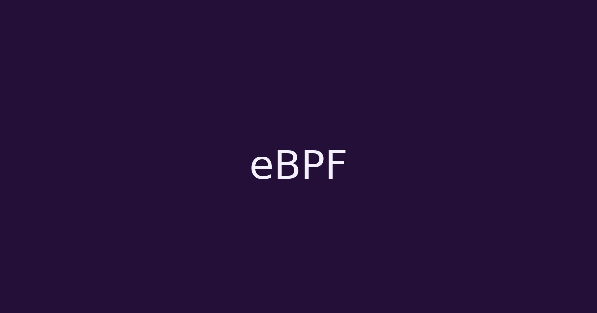

# RAZOR

  

    
Offensive security · Malware dev · Kernel research

    <h2 class="rz-hero__title">Writeups, cheatsheets y notas técnicas enfocadas en ofensiva.</h2>
    

      Contenido práctico, reproducible y orientado a técnica (Linux, eBPF, kernel, post-exploitation).
    

    

      <a class="md-button rz-btn rz-btn--primary" href="writeups/">Writeups</a>
      <a class="md-button rz-btn" href="cheatsheets/">Cheatsheets</a>
      <a class="md-button rz-btn" href="research/">Research</a>
      <a class="md-button rz-btn rz-btn--ghost" href="https://github.com/0x574R" target="_blank" rel="noopener">GitHub</a>
    

    

      

        
      

      <pre class="rz-terminal__body"><code>$ whoami
0x574R

$ cat focus.txt
Linux  •  eBPF  •  Kernel  •  Malware Dev  •  Red Team

$ ls -la
writeups/  cheatsheets/  research/
</code></pre>
    

  

  

    

      
    

  

---

## Últimos posts

  <a class="rz-article-card" href="research/ebpf-intro/" data-rz-reveal>
    

      Kernel
      2025-01-09
    

    

      
    

    
Introducción a eBPF

    
Introducción práctica a eBPF aplicado a observabilidad y seguridad.

    
Leer →

  </a>

  <a class="rz-article-card" href="cheatsheets/linux-privesc/" data-rz-reveal>
    

      Cheatsheet
      2025-01-08
    

    

      
    

    
Linux Privilege Escalation

    
Checklist con comandos clave y vectores comunes, lista para uso diario.

    
Leer →

  </a>

  <a class="rz-article-card" href="research/shellcode-basics/" data-rz-reveal>
    

      Malware Dev
      2025-01-07
    

    

      
    

    
Shellcode Basics

    
Fundamentos de shellcode, registros y syscalls en x86_64.

    
Leer →

  </a>

---

## Secciones

  <a class="rz-section-card" href="writeups/" data-rz-reveal>
    
Writeups

    
Resolución de máquinas CTF / HTB / Labs.

  </a>
  <a class="rz-section-card" href="cheatsheets/" data-rz-reveal>
    
Cheatsheets

    
Quick reference: Linux, Windows y tooling esencial.

  </a>
  <a class="rz-section-card" href="research/" data-rz-reveal>
    
Research

    
Kernel, malware dev y eBPF — notas y deep dives.

  </a>

