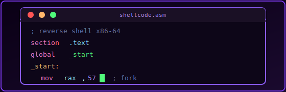
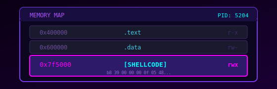
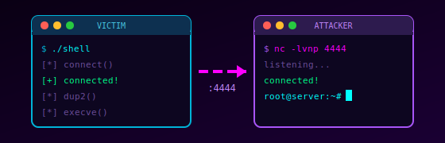

# RAZOR

  

    
Offensive Security Research

    

      Notas técnicas sobre seguridad ofensiva y desarrollo de malware en Linux.
    

    

      ⚠️ Todo el contenido es exclusivamente con fines educativos y de investigación.
    

    

      <a href="research/malware-dev/" class="md-button md-button--primary">Malware Dev</a>
    

  

---

## Secciones

<a href="research/malware-dev/" class="razor-card">
  
  Malware Development
  Shellcode, process injection, técnicas ofensivas
  

    Low-level
  

</a>

---

## Últimos posts

<a href="research/malware-dev/ptrace-injection/" class="razor-card">
  
  Process Injection via Ptrace
  Inyección de código en procesos Linux usando ptrace en ASM puro
  

    Assembly
    15 min
  

</a>

<a href="research/malware-dev/reverse-shell/" class="razor-card">
  
  Reverse TCP Shell
  Reverse shell TCP en ensamblador x86-64 usando únicamente syscalls
  

    Assembly
    5 min
  

</a>

