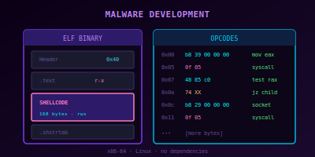
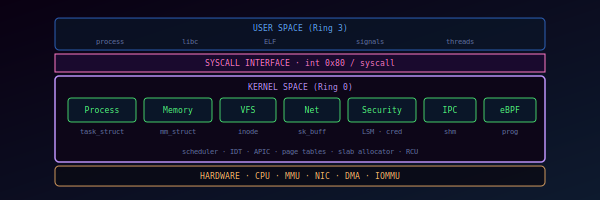
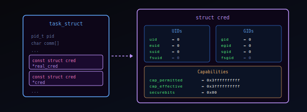
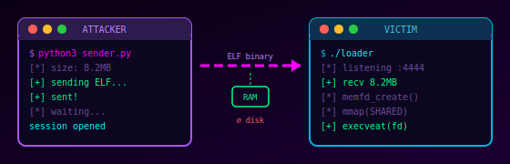
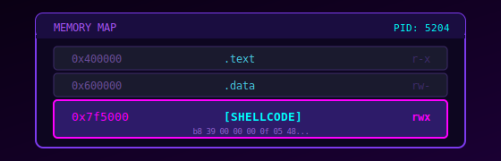
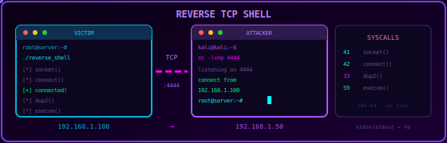

# RAZOR

  

    
Offensive Security

    

      Notas técnicas sobre seguridad ofensiva.
    

    

      Reconocimiento · Intrusión · Evasión · Exfiltración · Persistencia
    

  

---

★
Próximamente

  ELF Internals
  Estructura interna del formato ELF: headers, secciones, segmentos y su relevancia en técnicas ofensivas
  

    Kernel
    27 mayo
  

  Identificación de Procesos
  Cómo el kernel identifica y gestiona procesos: PID, TGID, namespaces y las estructuras involucradas
  

    Kernel
    3 junio
  

  DARKCLOAK: Novel Flow for Process Masquerading
  Pipeline completo de suplantación de identidad de procesos en Linux mediante manipulación directa de credenciales, argv, exe y namespaces
  

    Assembly
    17 junio
  

---

## Secciones

<a href="research/malware-dev/" class="razor-card">
  

    
  

  Malware Development
  Desarrollo y Explicación de Técnicas Ofensivas
  

    Low-level
  

</a>

<a href="research/kernel-theory/" class="razor-card">
  

    
  

  Kernel Theory
  Teoría del Kernel Linux desde una Perspectiva Ofensiva
  

    Kernel
  

</a>

---

## Últimos posts

<a href="research/kernel-theory/identity-model/" class="razor-card razor-card--featured">
  

    
  

  El Modelo de Identidad y Privilegios
  UIDs, GIDs, capabilities, transiciones y mecanismos de retención en struct cred
  

    Kernel
    ★ 45 min
  

</a>

<a href="research/malware-dev/fileless-loader/" class="razor-card">
  

    
  

  Fileless Loader
  Ejecución de un binario sin la necesidad de crear un fichero en el sistema de archivos, sin dependencias
  

    Assembly
    ★ 60 min
  

</a>

<a href="research/malware-dev/ptrace-injection/" class="razor-card">
  

    
  

  Process Injection via Ptrace
  Inyección de shellcode en procesos Linux usando Ptrace sin dependencias
  

    Assembly
    120 min
  

</a>

<a href="research/malware-dev/reverse-shell/" class="razor-card">
  

    
  

  Reverse TCP Shell
  Reverse TCP Shell sin dependencias
  

    Assembly
    5 min
  

</a>

