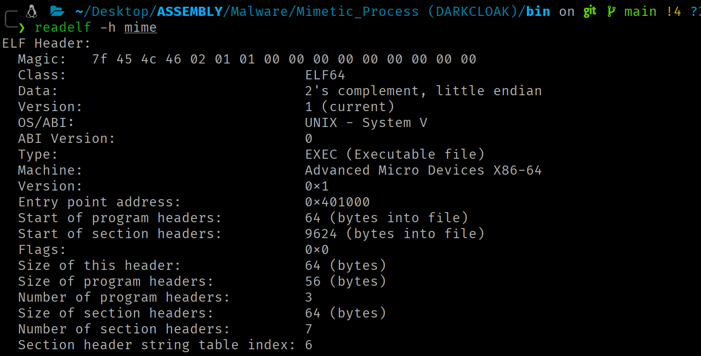
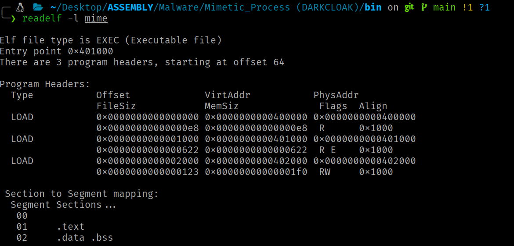
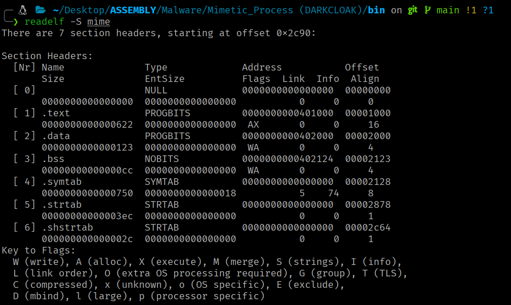

<div class="article-header">
<h1>ELF Internals</h1>
<span class="article-meta">27/05/2026 · 35 min</span>
</div>

TODO_INTRO

---

!!! info "Contexto"
    Este artículo cubre la estructura interna del formato binario nativo de Linux. Comprender cómo el kernel interpreta y carga un ELF es un requisito previo para cualquier técnica ofensiva que manipule binarios, inyecte código o implemente loaders personalizados.

## Introducción

El **Executable and Linkable Format (ELF)** es el formato binario nativo del ecosistema Linux. Todo binario ejecutable, biblioteca compartida y objeto reubicable en un sistema Linux es un fichero ELF.

## Dualidad segment/section

La arquitectura ELF presenta una dualidad fundamental, el mismo archivo puede describirse simultáneamente mediante dos vistas complementarias:

- La **vista de ejecución** organiza el contenido en **segments** (descritos por la Program Header Table). Los segments representan cómo el kernel mapea el binario en memoria virtual cuando se ejecuta el programa.
- La **vista de enlazado** organiza el contenido en **sections** (descritas por la Section Header Table). Las sections son unidades lógicas con semántica específica utilizadas por el linker durante el proceso de construcción del binario ELF y por herramientas de análisis estático.

    !!! note ""
        La Section Header Table es prescindible en tiempo de ejecución.

Ambas vistas, son formas de interpretar el mismo ELF en distintas fases del ciclo de vida del programa (construcción (linking) y ejecución (loading)).

## Layout físico del archivo

Un archivo ELF de 64 bits presenta el siguiente layout físico canónico:

```
Offset 0x00:     ELF Header (64 bytes)
Offset e_phoff:  Program Header Table (e_phnum × 56 bytes)
    [Contenido de los segments: datos, código, etc.]
Offset e_shoff:  Section Header Table (e_shnum × 64 bytes)
```

El ELF Header comienza invariablemente en el offset 0 del archivo. La Program Header Table suele ubicarse inmediatamente después del header (offset `0x40` en binarios de 64 bits), aunque la especificación no impone esta restricción. La Section Header Table se sitúa convencionalmente al final del archivo, pero igualmente puede residir en cualquier offset válido. Los contenidos reales (código, datos, tablas de símbolos) ocupan las regiones intermedias, referenciados mediante offsets desde las tablas de cabeceras.

## ELF Header

**El ELF Header es la primera estructura de todo archivo ELF y actúa como punto de entrada para la interpretación del binario completo.** Ocupa los primeros 64 bytes del archivo en la variante de 64 bits y proporciona al kernel, al linker y a las herramientas de análisis toda la información necesaria para localizar y decodificar el resto del contenido.

### Estructura de `Elf64_Ehdr`

```c
typedef struct elf64_hdr {
    unsigned char e_ident[EI_NIDENT];   /* ELF "magic number"                 */
    Elf64_Half    e_type;               /* Tipo de archivo                     */
    Elf64_Half    e_machine;            /* Arquitectura objetivo               */
    Elf64_Word    e_version;            /* Versión del formato ELF             */
    Elf64_Addr    e_entry;              /* Entry point virtual address         */
    Elf64_Off     e_phoff;              /* Program header table file offset    */
    Elf64_Off     e_shoff;              /* Section header table file offset    */
    Elf64_Word    e_flags;              /* Architecture-specific flags         */
    Elf64_Half    e_ehsize;             /* Tamaño de este header en bytes      */
    Elf64_Half    e_phentsize;          /* Tamaño de cada program header entry */
    Elf64_Half    e_phnum;              /* Número de program header entries    */
    Elf64_Half    e_shentsize;          /* Tamaño de cada section header entry */
    Elf64_Half    e_shnum;              /* Número de section header entries    */
    Elf64_Half    e_shstrndx;           /* Índice de la sección .shstrtab      */
} Elf64_Ehdr;
```

!!! note ""
    Los tipos de datos utilizados en la variante de 64 bits son: `Elf64_Half` = `__u16` (2 bytes), `Elf64_Word` = `__u32` (4 bytes), `Elf64_Addr` = `__u64` (8 bytes), `Elf64_Off` = `__u64` (8 bytes).

Para consultar los datos de la cabecera del fichero ELF:

```bash
readelf -h <program>
```



### Campos de la Estructura Relevantes

<div class="field-list" markdown>

- **`e_ident`**

    Los primeros 16 bytes codifican la identificación y las propiedades fundamentales del binario:

    | Índice | Constante | Valor x86-64 | Significado |
    |--------|-----------|--------------|-------------|
    | 0 | `EI_MAG0` | `0x7f` | Primer byte del magic number |
    | 1 | `EI_MAG1` | `0x45 ('E')` | Segundo byte del magic number |
    | 2 | `EI_MAG2` | `0x4c ('L')` | Tercer byte del magic number |
    | 3 | `EI_MAG3` | `0x46 ('F')` | Cuarto byte del magic number |
    | 4 | `EI_CLASS` | `2 (ELFCLASS64)` | Clase: 64 bits |
    | 5 | `EI_DATA` | `1 (ELFDATA2LSB)` | Endianness: little-endian |
    | 6 | `EI_VERSION` | `1 (EV_CURRENT)` | Versión del formato |
    | 7 | `EI_OSABI` | `0 (ELFOSABI_NONE)` | ABI del SO |
    | 8 | `EI_PAD` | `0` | Padding (bytes 8–15 a cero) |

    !!! note ""
        El kernel realiza las siguientes validaciones con los datos del ELF Header: magic bytes = `\177ELF` (`0x7f 0x45 0x4c 0x46`), `e_type` ∈ {`ET_EXEC`, `ET_DYN`}, `e_machine` compatible con la arquitectura (`EM_X86_64` = 62 en x86-64) y `e_phentsize` = 56. Si cualquier comprobación falla, retorna `-ENOEXEC`.

- **`e_type`**

    Naturaleza del archivo. `ET_REL` (1) = objeto reubicable (.o), `ET_EXEC` (2) = ejecutable con direcciones absolutas, `ET_DYN` (3) = shared object / PIE executable, `ET_CORE` (4) = core dump.

- **`e_machine`**

    Arquitectura. Para x86-64: `62` (`EM_X86_64`).

- **`e_entry`**

    Dirección virtual del punto de entrada (`_start`). En binarios no-PIE (`ET_EXEC`), es una dirección absoluta fija. En binarios PIE (`ET_DYN`), es un offset relativo a la base de carga, que el kernel suma a la dirección base establecida por ASLR.

- **`e_phoff`** y **`e_shoff`**

    Offsets en bytes de la PHT y la SHT dentro del archivo.

- **`e_phentsize`**

    Tamaño de cada entrada de la PHT (56 bytes para ELF64).

- **`e_shentsize`**

    Tamaño de cada entrada de la SHT (64 bytes para ELF64).

- **`e_phnum`**

    Número de entradas en la PHT.

- **`e_shnum`**

    Número de secciones en la SHT.

- **`e_shstrndx`**

    Índice de la sección `.shstrtab` (contiene los nombres de las secciones como cadenas terminadas en `\0`).

    ```asm
    ; .shstrtab

    00                                           
    2e 74 65 78 74 00                      ; ".text"               
    2e 64 61 74 61 00                      ; ".data"               
    2e 62 73 73 00                         ; ".bss"                
    2e 73 68 73 74 72 74 61 62 00          ; ".shstrtab"    
    ```

- **`e_flags`**

    Flags específicas de la arquitectura. En x86-64, es siempre `0`.

</div>

## Program Headers

Habiéndose establecido el ELF Header como punto de entrada interpretativo, la siguiente estructura crítica para la carga en memoria es la Program Header Table (PHT). Esta tabla describe los segments del binario, bloques contiguos de datos que el kernel mapea directamente al espacio de direcciones virtual del proceso.

### Estructura de `Elf64_Phdr`

Cada entrada de la PHT tiene 56 bytes:

```c
typedef struct elf64_phdr {
    Elf64_Word  p_type;     /* Tipo de segmento                        */
    Elf64_Word  p_flags;    /* Flags de permisos (RWX)                 */
    Elf64_Off   p_offset;   /* Offset del segmento en el archivo       */
    Elf64_Addr  p_vaddr;    /* Dirección virtual de carga              */
    Elf64_Addr  p_paddr;    /* Dirección física (sin uso en Linux)     */
    Elf64_Xword p_filesz;   /* Tamaño del segmento en el archivo       */
    Elf64_Xword p_memsz;    /* Tamaño del segmento en memoria          */
    Elf64_Xword p_align;    /* Alineamiento del segmento               */
} Elf64_Phdr;
```

!!! note ""
    La entrada N se localiza en: `e_phoff + (N × 56)`. En memoria (via `auxv`): `AT_PHDR + (N × AT_PHENT)`.

Para consultar los datos de la PHT del archivo ELF:

```bash
readelf -l <program>
```



### Campos de la Estructura Relevantes

<div class="field-list" markdown>

- **Tipos de segmentos (`p_type`)**

    - **`PT_LOAD`**

        Segmento cargable. Cada `PT_LOAD` define una región que el kernel mapea al espacio de direcciones virtuales del proceso mediante `mmap`. Un binario típico contiene dos o tres segments `PT_LOAD`: uno para código (RX), uno para datos (RW) y opcionalmente uno para constantes de solo lectura (R).

    - **`PT_DYNAMIC`**

        Apunta a la información necesaria para el enlazado dinámico. Normalmente contiene la sección `.dynamic`, formada por un array de estructuras `Elf64_Dyn`, que actúa como la tabla principal utilizada por el dynamic linker (generalmente `ld-linux.so`).

    - **`PT_INTERP`**

        Ruta del intérprete ELF (dynamic linker). El kernel lee esta ruta y carga al intérprete como un segundo binario ELF antes de transferir el control. Un ejecutable estáticamente enlazado carece de este segmento.

    - **`PT_PHDR`**

        Indica dónde se encuentra cargada en memoria la propia PHT. Esto permite al intérprete ELF localizar directamente la tabla de segmentos durante la carga dinámica del ejecutable, sin la necesidad de volver a leer el ELF Header desde el archivo en disco.

    - **`PT_NOTE`**

        Información auxiliar (notas).

    - **`PT_TLS`**

        Plantilla para Thread-Local Storage. Define el bloque de datos que cada thread recibe como copia privada.

- **Permisos (`p_flags`)**

    ```c
    #define PF_X  0x1   /* Ejecución  */
    #define PF_W  0x2   /* Escritura  */
    #define PF_R  0x4   /* Lectura    */
    ```

    El kernel traduce estas flags a protecciones de página (granularidad mínima):

    | Combinación ELF (`p_flags`) | Protección de páginas | Uso | Secciones relevantes |
    |---|---|---|---|
    | `PF_R` &#124; `PF_X` | `PROT_READ` &#124; `PROT_EXEC` | Código ejecutable | `.text` |
    | `PF_R` &#124; `PF_W` | `PROT_READ` &#124; `PROT_WRITE` | Datos modificables | `.data` y `.bss` |
    | `PF_R` | `PROT_READ` | Datos de solo lectura | `.rodata` |

</div>

#### Alineamiento y cálculo de rangos

El rango real de memoria de un segmento se redondea al siguiente múltiplo de `p_align`:

```c
end = (p_vaddr + p_memsz + (p_align - 1)) & ~(p_align - 1)
```

Las syscalls `mmap`, `munmap`, `mremap` y `mprotect` operan con la granularidad de una página. Cualquier operación sobre los mappings de un segmento debe usar rangos alineados.

## Carga de un binario ELF por el kernel

Cuando un proceso invoca a la syscall `execve`, el kernel no sabe de antemano qué formato tiene el binario a ejecutar. Linux soporta múltiples formatos binarios, cada uno vinculado a un handler en una lista enlazada. El kernel itera esa lista y pasa el archivo a cada handler hasta que uno lo acepta.

Para ELF, el handler es `load_elf_binary`. La función comienza validando el ELF Header (magic bytes, `e_type`, `e_machine`, `e_phentsize`). Si la validación falla, retorna `-ENOEXEC` y el kernel continúa probando el siguiente handler de la lista.

Superada la validación, el kernel itera la PHT buscando dos tipos de segmento:

- **Detección de `PT_INTERP`**<br>Si la PHT contiene un segmento `PT_INTERP`, el kernel lee la ruta del intérprete dinámico y lo mapea en el nuevo espacio de direcciones, junto con los segmentos del binario principal. Un binario estáticamente enlazado no tiene `PT_INTERP`, de modo que el kernel transfiere el control directamente a su entry point.

    !!! note ""
        `execve` no crea un proceso nuevo, sino que reemplaza la imagen del proceso que la invoca. El PID es el mismo. El kernel descarta el espacio de direcciones del proceso invocador y construye uno nuevo donde mapea los segmentos del binario a ejecutar.

- **Mapeado de segmentos `PT_LOAD`**<br>Cada segmento `PT_LOAD` en la PHT describe un rango de bytes del fichero ELF (`p_offset`, `p_filesz`), la dirección en memoria virtual donde deben colocarse esos bytes (`p_vaddr`) y los permisos de esa zona (`p_flags`). Si el segmento necesita más memoria de la que ocupa en el fichero (`p_memsz > p_filesz`), el kernel extiende la zona con memoria inicializada a cero, esa diferencia corresponde a la región `.bss`, las variables globales sin valor inicial.

    !!! note ""
        Cada `PT_LOAD` genera una o más VMAs en el `mm_struct` del proceso.

    El cálculo de la dirección depende del tipo de binario:

    - En `ET_EXEC` (no-PIE): `p_vaddr` es una dirección virtual absoluta. El kernel mapea el segmento exactamente en esa dirección. Cada ejecución produce el mismo layout de memoria.
    - En `ET_DYN` (PIE): el kernel selecciona una dirección base aleatoria (debido al ASLR) y suma `p_vaddr` como offset. Cada ejecución produce un layout diferente. La aleatorización dificulta ataques que dependen de conocer las direcciones de código o datos.

### Transferencia de control

Si el binario tiene intérprete, el kernel transfiere el control al entry point del intérprete, no al del programa. El intérprete procesa `PT_DYNAMIC` (resolviendo símbolos y aplicando reubicaciones), mapea las bibliotecas compartidas necesarias y finalmente salta al entry point real del programa (`AT_ENTRY`). Si no hay intérprete, el kernel salta directamente a `e_entry`.

## Auxiliary Vector

Tras mapear los segmentos, el kernel construye la pila inicial del proceso, colocando en ella `argc`, los punteros de `argv[]`, los punteros de `envp[]` y el auxiliary vector. El `auxv` es un array de pares clave-valor que transmite al espacio de usuario la información que el kernel conoce en el momento de la carga: la dirección de la PHT en memoria (`AT_PHDR`), el tamaño de cada entrada (`AT_PHENT`), el número de entradas (`AT_PHNUM`), el entry point del programa (`AT_ENTRY`) y la dirección base del intérprete (`AT_BASE`).

**Estos valores permiten al intérprete dinámico (y al propio proceso) localizar las estructuras del binario sin acceder al fichero en disco, sin ellos, el intérprete no tendría forma de localizar la PHT del programa que debe procesar.**

### Layout de la pila inicial del proceso

```
[ parte alta ]
+----------------------------------+
| cadenas de argv, envp, filename  |  bytes terminados en NULL
+----------------------------------+
| padding de alineamiento (16 B)   |
+----------------------------------+
| AT_NULL  (0x00, 0x00)            |  16 bytes NULL: terminador del auxv
| ...                              |
| AT_ENTRY (0x09, dirección)       |  16 bytes por entrada
| AT_PHNUM (0x05, valor)           |
| AT_PHENT (0x04, valor)           |
| AT_PHDR  (0x03, dirección)       |  inicio del auxv
+----------------------------------+
| NULL                             |  8 bytes NULL: terminador de envp[]
| envp[n-1]  (puntero)             |
| ...                              |
| envp[0]    (puntero)             |
+----------------------------------+
| NULL                             |  8 bytes NULL: terminador de argv[]
| argv[argc-1] (puntero)           |
| ...                              |
| argv[0]      (puntero)           |
+----------------------------------+
| argc                             |  8 bytes (unsigned long)
+----------------------------------+
↑ RSP apunta aquí en el entry point
```

Cada entrada del `auxv` consta de dos `unsigned long` consecutivos (16 bytes):

```c
typedef struct {
  uint64_t a_type;    /* AT_PHDR, AT_ENTRY, AT_RANDOM, etc. */
  uint64_t a_val;     /* valor asociado                      */
} Elf64_auxv_t;
```

El array termina cuando `a_type == AT_NULL`.

### Entradas relevantes

| `a_type` | Constante | Contenido |
|----------|-----------|-----------|
| 3 | `AT_PHDR` | Dirección en memoria de la PHT del ejecutable |
| 4 | `AT_PHENT` | Tamaño de cada `Elf64_Phdr` (56 bytes) |
| 5 | `AT_PHNUM` | Número de program headers |
| 6 | `AT_PAGESZ` | Tamaño de página del sistema (4096 bytes) |
| 7 | `AT_BASE` | Dirección base de carga del intérprete dinámico |
| 9 | `AT_ENTRY` | Entry point del ejecutable |
| 23 | `AT_SECURE` | `1` si el binario es `setuid/setgid` |
| 25 | `AT_RANDOM` | Puntero a 16 bytes aleatorios (seed del stack canary) |
| 33 | `AT_SYSINFO_EHDR` | Dirección del vDSO mapeado en el proceso |

!!! note ""
    El kernel genera exactamente una entrada por cada `a_type`, no hay duplicados. El `auxv` no es opcional, lo genera el kernel incondicionalmente para todo proceso ELF, estático o dinámico.

#### Introspección via `auxv`

Con los valores de `AT_PHDR`, `AT_PHENT` y `AT_PHNUM`, el proceso puede recorrer su propia PHT en memoria y localizar cualquier segmento.

En un binario PIE, las direcciones `p_vaddr` de cada segmento son offsets relativos a una base de carga que el kernel elige aleatoriamente (ASLR). El `auxv` no contiene esa base directamente, pero puede deducirse, ya que `AT_PHDR` indica dónde quedó la PHT en memoria tras la carga y `p_offset` del primer segmento indica a qué distancia del inicio del fichero se encontraba la PHT. Como el kernel mapea el fichero a partir de la base, la relación es `base = AT_PHDR - p_offset`. Con la base conocida, la dirección real de cualquier segmento se obtiene como `base + p_vaddr`. En binarios no-PIE (`ET_EXEC`), las direcciones `p_vaddr` son absolutas y este cálculo no es necesario.

Este mecanismo permite al código resolver el layout de memoria del proceso sin acceder a `/proc/self/maps`, evitando las syscalls `openat`/`read`/`close` que un monitor de seguridad podría detectar. Los datos del `auxv` ya están en el stack del proceso, por lo que acceder a ellos es una simple lectura de memoria, invisible para cualquier mecanismo de tracing a nivel de syscalls.

## Section Headers

Mientras que los segmentos definen la vista de ejecución, las secciones proporcionan la vista de enlazado y análisis. La SHT no es necesaria para la ejecución, pero es indispensable para linkers, debuggers y analizadores estáticos.

### Estructura de `Elf64_Shdr`

Cada entrada ocupa 64 bytes:

```c
typedef struct elf64_shdr {
  Elf64_Word  sh_name;       /* Índice en .shstrtab para el nombre  */
  Elf64_Word  sh_type;       /* Tipo de sección                     */
  Elf64_Xword sh_flags;      /* Atributos de la sección             */
  Elf64_Addr  sh_addr;       /* Dirección virtual en ejecución      */
  Elf64_Off   sh_offset;     /* Offset de la sección en el archivo  */
  Elf64_Xword sh_size;       /* Tamaño de la sección en bytes       */
  Elf64_Word  sh_link;       /* Índice de sección relacionada       */
  Elf64_Word  sh_info;       /* Información adicional               */
  Elf64_Xword sh_addralign;  /* Requisito de alineamiento           */
  Elf64_Xword sh_entsize;    /* Tamaño de entrada (si es tabla)     */
} Elf64_Shdr;
```

El campo `sh_addr` de la sección, cuando no es cero, indica la dirección virtual que la sección ocupa en memoria. Comparando con los rangos `[p_vaddr, p_vaddr + p_memsz)` de cada `PT_LOAD` (segmento), se determina qué secciones pertenecen a qué segmento.

Para consultar los datos de la SHT del archivo ELF:

```bash
readelf -S <program>
```



### Campos de la Estructura Relevantes

<div class="field-list" markdown>

- **Tipos de sección (`sh_type`)**

    | Valor | Constante | Descripción |
    |-------|-----------|-------------|
    | 0 | `SHT_NULL` | Entrada inactiva |
    | 1 | `SHT_PROGBITS` | Contenido definido por el programa (código, datos) |
    | 2 | `SHT_SYMTAB` | Tabla de símbolos completa (linking) |
    | 3 | `SHT_STRTAB` | Tabla de cadenas |
    | 4 | `SHT_RELA` | Entradas de reubicación con addend explícito |
    | 6 | `SHT_DYNAMIC` | Información de enlazado dinámico |
    | 7 | `SHT_NOTE` | Información auxiliar |
    | 8 | `SHT_NOBITS` | Sección sin contenido en archivo (`.bss`) |
    | 9 | `SHT_REL` | Entradas de reubicación sin addend |
    | 11 | `SHT_DYNSYM` | Tabla de símbolos dinámicos |

- **Flags de sección (`sh_flags`)**

    | Valor | Constante | Significado |
    |-------|-----------|-------------|
    | `0x1` | `SHF_WRITE` | Escribible en ejecución |
    | `0x2` | `SHF_ALLOC` | Ocupa memoria en ejecución |
    | `0x4` | `SHF_EXECINSTR` | Contiene instrucciones ejecutables |
    | `0x10` | `SHF_MERGE` | Puede fusionarse para eliminar duplicados |
    | `0x20` | `SHF_STRINGS` | Contiene cadenas terminadas en `\0` |
    | `0x400` | `SHF_TLS` | Datos thread-local |

    Flags específicas del kernel: `SHF_RELA_LIVEPATCH` (`0x00100000`) marca secciones de reubicación para live patching, `SHF_RO_AFTER_INIT` (`0x00200000`) marca secciones que se convierten en solo lectura tras la inicialización del kernel.

</div>

## Secciones Fundamentales

- **Código ejecutable `.text`**

    **Tipo:** `SHT_PROGBITS`

    - **Atributos:** `SHF_ALLOC | SHF_EXECINSTR`
    - **Segmento:** `PT_LOAD` con permisos `PF_R | PF_X`
    - Contiene el código máquina del programa. El entry point (`e_entry`) apunta normalmente al interior de `.text`.

- **Datos de solo lectura `.rodata`**

    **Tipo:** `SHT_PROGBITS`

    - **Atributos:** `SHF_ALLOC`
    - **Segmento:** `PT_LOAD` con permisos `PF_R`
    - Constantes: cadenas de texto, tablas de lookup, constantes numéricas…

- **Datos inicializados `.data`**

    **Tipo:** `SHT_PROGBITS`

    - **Atributos:** `SHF_ALLOC | SHF_WRITE`
    - **Segmento:** `PT_LOAD` con permisos `PF_R | PF_W`
    - Variables estáticas y globales inicializadas con valores no nulos. Los valores iniciales se copian desde el fichero al mapeado en memoria durante la carga.

- **Datos no inicializados `.bss`**

    **Tipo:** `SHT_NOBITS`

    - **Atributos:** `SHF_ALLOC | SHF_WRITE`
    - **Segmento:** Ubicado en el `PT_LOAD` de datos (`PF_R | PF_W`)
    - Variables globales y estáticas inicializadas a cero o sin inicializar.

- **Global Offset Table `.got` y `.got.plt`**

    **Tipo:** `SHT_PROGBITS`

    - **Atributos:** `SHF_ALLOC | SHF_WRITE`
    - **Segmento:** `PT_LOAD` con permisos `PF_R | PF_W`
    - La GOT es la estructura central del enlazado dinámico para el acceso a datos y funciones externas.

    En x86-64 se divide en:

    - **`.got`**

        Entradas para variables globales importadas y direcciones resueltas via eager binding.

    - **`.got.plt`**

        Entradas para funciones importadas, resueltas via lazy binding.

- **Procedure Linkage Table `.plt`, `.plt.sec` y `.plt.got`**

    **Tipo:** `SHT_PROGBITS`

    - **Atributos:** `SHF_ALLOC | SHF_EXECINSTR`
    - **Segmento:** `PT_LOAD` con permisos `PF_R | PF_X`
    - Sección de código con stubs trampolín para cada función importada:

    <!-- -->

    - **`.plt`**

        Stubs de fallback para lazy binding (no llamados directamente por el código del programa).

    - **`.plt.sec`**

        Stubs que el código del programa llama directamente cuando invoca una función importada.

    - **`.plt.got`**

        Stubs para funciones importadas cuya dirección se almacena en una variable (function pointer) en lugar de llamarse directamente.

- **Tablas de Símbolos**

    Las tablas de símbolos asocian nombres con direcciones, tamaños y atributos.

    **Estructura de `Elf64_Sym`**

    Cada entrada ocupa 24 bytes:

    ```c
    typedef struct elf64_sym {
      Elf64_Word    st_name;    /* Índice en la string table     (4 bytes)  */
      unsigned char st_info;    /* Tipo y binding del símbolo     (1 byte)   */
      unsigned char st_other;   /* Visibilidad                    (1 byte)   */
      Elf64_Half    st_shndx;   /* Índice de sección asociada     (2 bytes)  */
      Elf64_Addr    st_value;   /* Valor del símbolo (dirección)  (8 bytes)  */
      Elf64_Xword   st_size;    /* Tamaño del objeto asociado     (8 bytes)  */
    } Elf64_Sym;
    ```

    Un binario puede contener dos tablas distintas:

    - **`.symtab`** (tipo `SHT_SYMTAB`)

        Contiene todos los símbolos: funciones locales, variables estáticas, labels internos…

    - **`.dynsym`** (tipo `SHT_DYNSYM`)

        Contiene solo los símbolos necesarios para el enlazado dinámico: funciones y variables importadas/exportadas.

## Agradecimientos

Gracias por llegar hasta aquí.

Si encuentras errores o quieres mejorar/ampliar el artículo, el contenido del blog está abierto a Pull Requests. Toda contribución es bienvenida.

¡Nos vemos en el próximo artículo! ;)
