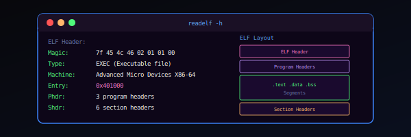

# Kernel Theory

Teoría subyacente del kernel Linux desde una perspectiva ofensiva.

---

## Artículos

<a href="elf-internals/" class="razor-card razor-card--featured">
  

    
  

  ELF Internals
  Qué contiene un binario ELF y cómo se transforma de un fichero a un proceso en ejecución
  

    Kernel
    ★ 60 min
  

</a>

<a href="identity-model/" class="razor-card">
  

    
  

  Identity and Privileges of a Process
  UIDs, GIDs, capabilities, transiciones y mecanismos de retención en struct cred
  

    Kernel
    ★ 45 min
  

</a>

