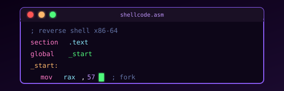
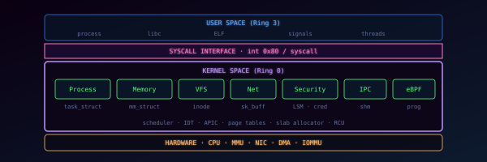
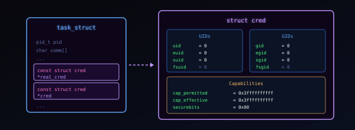
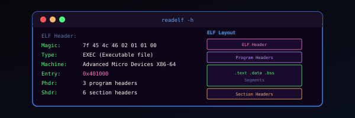
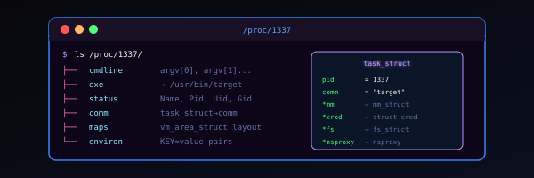
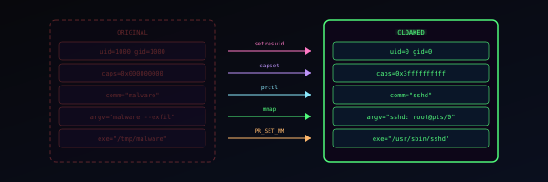
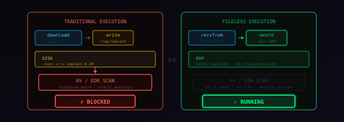
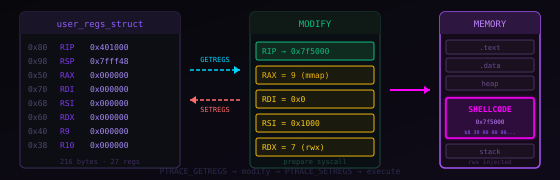
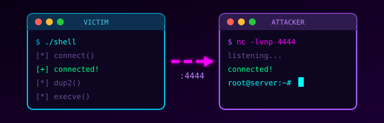

# RAZOR

  

    
Offensive Security

    

      Technical notes on offensive security.
    

    

      Reconnaissance · Intrusion · Evasion · Exfiltration · Persistence
    

  

---

## Sections

<a href="research/malware-dev/" class="razor-card">
  

    
  

  Malware Development
  Development and Explanation of Offensive Techniques
  

    Low-level
  

</a>

<a href="research/kernel-theory/" class="razor-card">
  

    
  

  Kernel Theory
  Linux Kernel Theory from an Offensive Perspective
  

    Kernel
  

</a>

---

## Latest posts

DARKCLOAK Series
4 articles · Process Identity Cloaking

<a href="research/kernel-theory/identity-model/" class="razor-card razor-card--series">
  

    
  

  Identity and Privileges of a Process (1)
  UIDs, GIDs, capabilities, transitions and retention mechanisms in struct cred
  

    Kernel
    ★ 45 min
  

</a>

<a href="research/kernel-theory/elf-internals/" class="razor-card razor-card--series">
  

    
  

  ELF Internals (2)
  What an ELF binary contains and how the kernel interprets it to turn it into a process
  

    Kernel
    ★ 60 min
  

</a>

<a href="research/kernel-theory/process-identity/" class="razor-card razor-card--series">
  

    
  

  Process Identity Spoofing: What Linux Exposes and How to Fake It (3)
  What information Linux exposes about its processes, where it lives and how it is manipulated
  

    Kernel
    ★ 60 min
  

</a>

<a href="research/malware-dev/darkcloak/" class="razor-card razor-card--series">
  

    
  

  DARKCLOAK: Novel Flow for Process Masquerading (4)
  Complete process identity spoofing pipeline on Linux
  

    Assembly
    ★ 90 min
  

</a>

---

<a href="research/malware-dev/fileless-loader/" class="razor-card">
  

    
  

  Fileless Loader
  Executing a binary without writing any file to the filesystem, no dependencies
  

    Assembly
    ★ 60 min
  

</a>

<a href="research/malware-dev/ptrace-injection/" class="razor-card">
  

    
  

  Process Injection via Ptrace
  Shellcode injection into Linux processes using Ptrace, no dependencies
  

    Assembly
    120 min
  

</a>

<a href="research/malware-dev/reverse-shell/" class="razor-card">
  

    
  

  Reverse TCP Shell
  Reverse TCP Shell, no dependencies
  

    Assembly
    5 min
  

</a>

