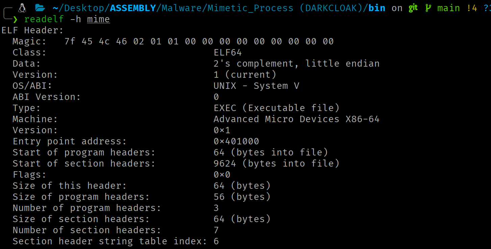
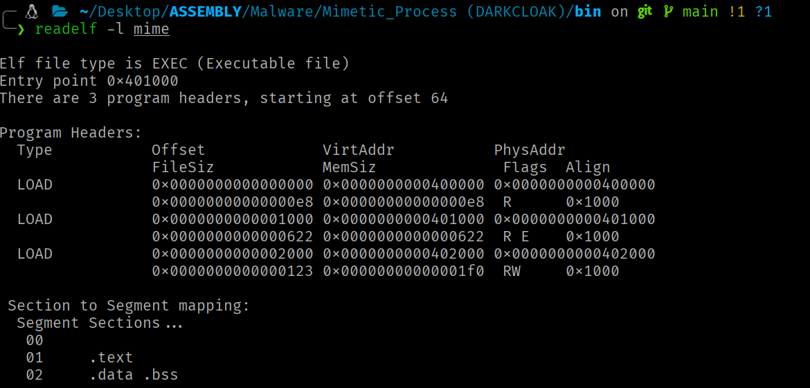
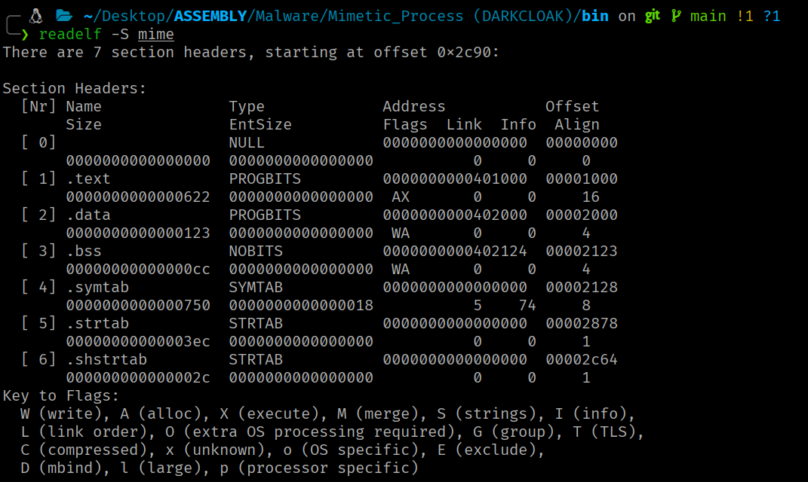

<div class="article-header">
<h1>ELF Internals</h1>
<span class="article-meta">27/05/2026 · 60 min</span>
</div>

What an ELF binary contains and how the kernel interprets it to turn it into a process

---

!!! info "Context"
 This article covers the internal structure of Linux's native binary format. Understanding how the kernel interprets and loads an ELF is a prerequisite for any offensive technique that manipulates binaries, injects code or implements custom loaders.

## Introduction

The **Executable and Linkable Format (ELF)** is the native binary format of the Linux ecosystem. Every executable binary, shared library and relocatable object on a Linux system is an ELF file.

## Segment/Section Duality

The ELF architecture presents a fundamental duality. The same file can be described simultaneously through two complementary views:

- The **execution view** organizes content into **segments** (described by the Program Header Table). Segments represent how the kernel maps the binary into virtual memory when the program runs.
- The **linking view** organizes content into **sections** (described by the Section Header Table). Sections are logical units with specific semantics used by the linker during the ELF binary build process and by static analysis tools.

 !!! note ""
 The Section Header Table is dispensable at runtime.

Both views are ways of interpreting the same ELF at different phases of the program's lifecycle (construction (linking) and execution (loading)).

## Physical File Layout

A 64-bit ELF file has the following canonical physical layout:

```
Offset 0x00:     ELF Header (64 bytes)
Offset e_phoff:  Program Header Table (e_phnum × 56 bytes)
    [Segment contents: data, code, etc.]
Offset e_shoff:  Section Header Table (e_shnum × 64 bytes)
```

The ELF Header invariably begins at offset 0 of the file. The Program Header Table is usually placed immediately after the header (offset `0x40` in 64-bit binaries), although the specification does not impose this constraint. The Section Header Table is conventionally placed at the end of the file, but can equally reside at any valid offset. The actual contents (code, data, symbol tables) occupy the intermediate regions, referenced via offsets from the header tables.

## ELF Header

**The ELF Header is the first structure of every ELF file and acts as the entry point for interpreting the entire binary.** It occupies the first 64 bytes of the file in the 64-bit variant and provides the kernel, linker and analysis tools with all the information needed to locate and decode the rest of the content.

### `Elf64_Ehdr` Structure

```c
typedef struct elf64_hdr {
    unsigned char e_ident[EI_NIDENT];   /* ELF "magic number"                 */
    Elf64_Half    e_type;               /* File type                          */
    Elf64_Half    e_machine;            /* Target architecture                */
    Elf64_Word    e_version;            /* ELF format version                 */
    Elf64_Addr    e_entry;              /* Entry point virtual address        */
    Elf64_Off     e_phoff;              /* Program header table file offset   */
    Elf64_Off     e_shoff;              /* Section header table file offset   */
    Elf64_Word    e_flags;              /* Architecture-specific flags        */
    Elf64_Half    e_ehsize;             /* Size of this header in bytes       */
    Elf64_Half    e_phentsize;          /* Size of each program header entry  */
    Elf64_Half    e_phnum;              /* Number of program header entries   */
    Elf64_Half    e_shentsize;          /* Size of each section header entry  */
    Elf64_Half    e_shnum;              /* Number of section header entries   */
    Elf64_Half    e_shstrndx;           /* Index of the .shstrtab section     */
} Elf64_Ehdr;
```

!!! note ""
 The data types used in the 64-bit variant are: `Elf64_Half` = `__u16` (2 bytes), `Elf64_Word` = `__u32` (4 bytes), `Elf64_Addr` = `__u64` (8 bytes), `Elf64_Off` = `__u64` (8 bytes).

To inspect the ELF header fields:

```bash
readelf -h <program>
```



### Relevant Structure Fields

<div class="field-list" markdown>

- **`e_ident`**

 The first 16 bytes encode the binary's identification and fundamental properties:

    | Index | Constant | x86-64 value | Meaning |
    |--------|-----------|--------------|---------|
    | 0 | `EI_MAG0` | `0x7f` | First byte of the magic number |
    | 1 | `EI_MAG1` | `0x45 ('E')` | Second byte of the magic number |
    | 2 | `EI_MAG2` | `0x4c ('L')` | Third byte of the magic number |
    | 3 | `EI_MAG3` | `0x46 ('F')` | Fourth byte of the magic number |
    | 4 | `EI_CLASS` | `2 (ELFCLASS64)` | Class: 64-bit |
    | 5 | `EI_DATA` | `1 (ELFDATA2LSB)` | Endianness: little-endian |
    | 6 | `EI_VERSION` | `1 (EV_CURRENT)` | Format version |
    | 7 | `EI_OSABI` | `0 (ELFOSABI_NONE)` | OS ABI |
    | 8 | `EI_PAD` | `0` | Padding (bytes 8–15 set to zero) |

 !!! note ""
 The kernel performs the following validations with the ELF Header data: magic bytes = `\177ELF` (`0x7f 0x45 0x4c 0x46`), `e_type` ∈ {`ET_EXEC`, `ET_DYN`}, `e_machine` compatible with the architecture (`EM_X86_64` = 62 on x86-64), and `e_phentsize` = 56. If any check fails, it returns `-ENOEXEC`.

- **`e_type`**

 Nature of the file. `ET_REL` (1) = relocatable object (.o), `ET_EXEC` (2) = executable with absolute addresses, `ET_DYN` (3) = shared object / PIE executable, `ET_CORE` (4) = core dump.

- **`e_machine`**

 Architecture. For x86-64: `62` (`EM_X86_64`).

- **`e_entry`**

 Virtual address of the entry point (`_start`). In non-PIE binaries (`ET_EXEC`), this is a fixed absolute address. In PIE binaries (`ET_DYN`), it is an offset relative to the load base, which the kernel adds to the base address established by ASLR.

- **`e_phoff`** and **`e_shoff`**

 Byte offsets of the PHT and SHT within the file.

- **`e_phentsize`**

 Size of each PHT entry (56 bytes for ELF64).

- **`e_shentsize`**

 Size of each SHT entry (64 bytes for ELF64).

- **`e_phnum`**

 Number of entries in the PHT.

- **`e_shnum`**

 Number of sections in the SHT.

- **`e_shstrndx`**

 Index of the `.shstrtab` section (contains section names as null-terminated strings).

    ```asm
    ; .shstrtab

    00                                           
    2e 74 65 78 74 00                      ; ".text"               
    2e 64 61 74 61 00                      ; ".data"               
    2e 62 73 73 00                         ; ".bss"                
    2e 73 68 73 74 72 74 61 62 00          ; ".shstrtab"    
 ```

- **`e_flags`**

 Architecture-specific flags. On x86-64, always `0`.

</div>

## Program Headers

With the ELF Header covered, the next critical structure for loading the binary into memory is the Program Header Table (PHT). This table describes the binary's segments, contiguous blocks of data that the kernel maps directly into the process's virtual address space.

### `Elf64_Phdr` Structure

Each PHT entry is 56 bytes:

```c
typedef struct elf64_phdr {
    Elf64_Word  p_type;     /* Segment type                            */
    Elf64_Word  p_flags;    /* Permission flags (RWX)                  */
    Elf64_Off   p_offset;   /* Offset of the segment in the file       */
    Elf64_Addr  p_vaddr;    /* Virtual load address                    */
    Elf64_Addr  p_paddr;    /* Physical address (unused on Linux)      */
    Elf64_Xword p_filesz;   /* Size of the segment in the file         */
    Elf64_Xword p_memsz;    /* Size of the segment in memory           */
    Elf64_Xword p_align;    /* Segment alignment                       */
} Elf64_Phdr;
```

!!! note ""
 Entry N is located at: `e_phoff + (N × 56)`. In memory (via `auxv`): `AT_PHDR + (N × AT_PHENT)`.

To inspect the PHT data of an ELF file:

```bash
readelf -l <program>
```



### Relevant Structure Fields

<div class="field-list" markdown>

- **Segment types (`p_type`)**

 - **`PT_LOAD`**

 Loadable segment. Each `PT_LOAD` defines a region that the kernel maps into the process's virtual address space via `mmap`. A typical binary contains two or three `PT_LOAD` segments: one for code (RX), one for data (RW) and optionally one for read-only constants (R).

 - **`PT_DYNAMIC`**

 Points to the information needed for dynamic linking. It typically contains the `.dynamic` section, which consists of an array of `Elf64_Dyn` structures and serves as the main table used by the dynamic linker (usually `ld-linux.so`).

 - **`PT_INTERP`**

 Path to the ELF interpreter (dynamic linker). The kernel reads this path and loads the interpreter as a second ELF binary before transferring control. A statically linked executable lacks this segment.

 - **`PT_PHDR`**

 Indicates where the PHT itself is loaded in memory. This allows the ELF interpreter to directly locate the segment table during dynamic loading of the executable, without needing to re-read the ELF Header from disk.

 - **`PT_NOTE`**

 Auxiliary information (notes).

 - **`PT_TLS`**

 Template for Thread-Local Storage. Defines the data block that each thread receives as a private copy.

- **Permissions (`p_flags`)**

    ```c
    #define PF_X  0x1   /* Execute */
    #define PF_W  0x2   /* Write   */
    #define PF_R  0x4   /* Read    */
 ```

 The kernel translates these flags to page protections (minimum granularity):

    | ELF combination (`p_flags`) | Page protection | Use | Relevant sections |
    |---|---|---|---|
    | `PF_R` &#124; `PF_X` | `PROT_READ` &#124; `PROT_EXEC` | Executable code | `.text` |
    | `PF_R` &#124; `PF_W` | `PROT_READ` &#124; `PROT_WRITE` | Modifiable data | `.data` and `.bss` |
    | `PF_R` | `PROT_READ` | Read-only data | `.rodata` |

</div>

### Alignment and Range Calculation

The actual memory range of a segment is rounded up to the next multiple of `p_align`:

```c
end = (p_vaddr + p_memsz + (p_align - 1)) & ~(p_align - 1)
```

The `mmap`, `munmap`, `mremap` and `mprotect` syscalls operate at page granularity. Any operation on segment mappings must use aligned ranges.

## Loading an ELF Binary by the Kernel

When a process invokes the `execve` syscall, the kernel does not know in advance what format the binary has. Linux supports multiple binary formats, each linked to a handler in a linked list. The kernel iterates that list and passes the file to each handler until one accepts it.

For ELF, the handler is `load_elf_binary`. The function begins by validating the ELF Header (magic bytes, `e_type`, `e_machine`, `e_phentsize`). If validation fails, it returns `-ENOEXEC` and the kernel continues trying the next handler in the list.

Once validation passes, the kernel iterates the PHT looking for two segment types:

- **Detection of `PT_INTERP`**<br>If the PHT contains a `PT_INTERP` segment, the kernel reads the dynamic interpreter's path and maps it into the new address space alongside the main binary's segments. A statically linked binary has no `PT_INTERP`, so the kernel transfers control directly to its entry point.

 !!! note ""
 `execve` does not create a new process. It replaces the image of the process that invokes it. The PID remains the same. The kernel discards the invoking process's address space and builds a new one where it maps the segments of the binary to execute.

- **Mapping `PT_LOAD` segments**<br>Each `PT_LOAD` segment in the PHT describes a byte range of the ELF file (`p_offset`, `p_filesz`), the address in virtual memory where those bytes should be placed (`p_vaddr`) and the permissions for that region (`p_flags`). If the segment requires more memory than it occupies in the file (`p_memsz > p_filesz`), the kernel extends the region with zero-initialized memory. This difference corresponds to the `.bss` region, global variables with no initial value.

 !!! note ""
 Each `PT_LOAD` generates one or more VMAs in the process's `mm_struct`.

 The address calculation depends on the binary type:

 - In `ET_EXEC` (non-PIE): `p_vaddr` is an absolute virtual address. The kernel maps the segment exactly at that address. Each execution produces the same memory layout.
 - In `ET_DYN` (PIE): the kernel selects a random base address (due to ASLR) and adds `p_vaddr` as an offset. Each execution produces a different layout. The randomization makes attacks that depend on knowing code or data addresses harder.

## Auxiliary Vector

After mapping the segments, the kernel builds the process's initial stack, placing `argc`, `argv[]` pointers, `envp[]` pointers and the auxiliary vector on it. The `auxv` is an array of key-value pairs that conveys to user space the information the kernel knows at load time: the address of the PHT in memory (`AT_PHDR`), the size of each entry (`AT_PHENT`), the number of entries (`AT_PHNUM`), the program's entry point (`AT_ENTRY`) and the interpreter's base address (`AT_BASE`).

**These values allow the dynamic interpreter (and the process itself) to locate the binary's structures without accessing the file on disk. Without them, the interpreter would have no way to locate the PHT of the program it must process.**

### Initial Stack Layout

```
[ high end ]
+----------------------------------+
| argv, envp, filename strings     |  NULL-terminated bytes
+----------------------------------+
| alignment padding (16 B)         |
+----------------------------------+
| AT_NULL  (0x00, 0x00)            |  16-byte NULL: auxv terminator
| ...                              |
| AT_ENTRY (0x09, address)         |  16 bytes per entry
| AT_PHNUM (0x05, value)           |
| AT_PHENT (0x04, value)           |
| AT_PHDR  (0x03, address)         |  start of auxv
+----------------------------------+
| NULL                             |  8-byte NULL: envp[] terminator
| envp[n-1]  (pointer)             |
| ...                              |
| envp[0]    (pointer)             |
+----------------------------------+
| NULL                             |  8-byte NULL: argv[] terminator
| argv[argc-1] (pointer)           |
| ...                              |
| argv[0]      (pointer)           |
+----------------------------------+
| argc                             |  8 bytes (unsigned long)
+----------------------------------+
↑ RSP points here at the entry point
```

Each `auxv` entry consists of two consecutive `unsigned long` values (16 bytes):

```c
typedef struct {
  uint64_t a_type;    /* AT_PHDR, AT_ENTRY, AT_RANDOM, etc. */
  uint64_t a_val;     /* associated value                    */
} Elf64_auxv_t;
```

The array terminates when `a_type == AT_NULL`.

### Relevant Entries

| `a_type` | Constant | Content |
|----------|-----------|---------| 
| 3 | `AT_PHDR` | In-memory address of the executable's PHT |
| 4 | `AT_PHENT` | Size of each `Elf64_Phdr` (56 bytes) |
| 5 | `AT_PHNUM` | Number of program headers |
| 6 | `AT_PAGESZ` | System page size (4096 bytes) |
| 7 | `AT_BASE` | Load base address of the dynamic interpreter |
| 9 | `AT_ENTRY` | Entry point of the executable |
| 23 | `AT_SECURE` | `1` if the binary is `setuid/setgid` |
| 25 | `AT_RANDOM` | Pointer to 16 random bytes (stack canary seed) |
| 33 | `AT_SYSINFO_EHDR` | Address of the vDSO mapped in the process |

!!! note ""
 The kernel generates exactly one entry per `a_type`, with no duplicates. The `auxv` is not optional. The kernel generates it unconditionally for every ELF process, static or dynamic.

### Introspection via `auxv`

With the values of `AT_PHDR`, `AT_PHENT` and `AT_PHNUM`, the process can traverse its own PHT in memory and locate any segment.

In a PIE binary, the `p_vaddr` addresses of each segment are offsets relative to a load base that the kernel chooses randomly (ASLR). The `auxv` does not contain that base directly, but it can be derived, `AT_PHDR` indicates where the PHT ended up in memory after loading, and `p_offset` of the first segment indicates how far from the start of the file the PHT was. Since the kernel maps the file from the base, the relationship is `base = AT_PHDR - p_offset`. With the base known, the real address of any segment is `base + p_vaddr`. In non-PIE binaries (`ET_EXEC`), `p_vaddr` addresses are absolute and this calculation is not needed.

This mechanism allows code to resolve the process's memory layout without accessing `/proc/self/maps`, avoiding the `openat`/`read`/`close` syscalls that a security monitor might detect. The `auxv` data is already on the process's stack, so accessing it is a simple memory read, invisible to any syscall-level tracing mechanism.

## Section Headers

While segments define the execution view, sections provide the linking and analysis view. The SHT is not needed for execution, but is indispensable for linkers, debuggers and static analyzers.

### `Elf64_Shdr` Structure

Each entry is 64 bytes:

```c
typedef struct elf64_shdr {
  Elf64_Word  sh_name;       /* Index in .shstrtab for the name      */
  Elf64_Word  sh_type;       /* Section type                         */
  Elf64_Xword sh_flags;      /* Section attributes                   */
  Elf64_Addr  sh_addr;       /* Virtual address at execution         */
  Elf64_Off   sh_offset;     /* Offset of the section in the file    */
  Elf64_Xword sh_size;       /* Size of the section in bytes         */
  Elf64_Word  sh_link;       /* Index of a related section           */
  Elf64_Word  sh_info;       /* Additional information               */
  Elf64_Xword sh_addralign;  /* Alignment requirement                */
  Elf64_Xword sh_entsize;    /* Entry size (if a table)              */
} Elf64_Shdr;
```

The `sh_addr` field of the section, when non-zero, indicates the virtual address the section occupies in memory. Comparing with the ranges `[p_vaddr, p_vaddr + p_memsz)` of each `PT_LOAD` segment determines which sections belong to which segment.

To inspect the SHT data of an ELF file:

```bash
readelf -S <program>
```



### Relevant Structure Fields

<div class="field-list" markdown>

- **Section types (`sh_type`)**

    | Value | Constant | Description |
    |-------|-----------|-------------|
    | 0 | `SHT_NULL` | Inactive entry |
    | 1 | `SHT_PROGBITS` | Program-defined content (code, data) |
    | 2 | `SHT_SYMTAB` | Full symbol table (linking) |
    | 3 | `SHT_STRTAB` | String table |
    | 4 | `SHT_RELA` | Relocation entries with explicit addend |
    | 6 | `SHT_DYNAMIC` | Dynamic linking information |
    | 7 | `SHT_NOTE` | Auxiliary information |
    | 8 | `SHT_NOBITS` | Section with no file content (`.bss`) |
    | 9 | `SHT_REL` | Relocation entries without addend |
    | 11 | `SHT_DYNSYM` | Dynamic symbol table |

- **Section flags (`sh_flags`)**

    | Value | Constant | Meaning |
    |-------|-----------|---------|
    | `0x1` | `SHF_WRITE` | Writable during execution |
    | `0x2` | `SHF_ALLOC` | Occupies memory during execution |
    | `0x4` | `SHF_EXECINSTR` | Contains executable instructions |
    | `0x10` | `SHF_MERGE` | Can be merged to eliminate duplicates |
    | `0x20` | `SHF_STRINGS` | Contains null-terminated strings |
    | `0x400` | `SHF_TLS` | Thread-local data |

 Kernel-specific flags: `SHF_RELA_LIVEPATCH` (`0x00100000`) marks relocation sections for live patching, `SHF_RO_AFTER_INIT` (`0x00200000`) marks sections that become read-only after kernel initialization.

</div>

## Fundamental Sections

### Executable Code `.text`

<div class="field-list" markdown>

- **Type:** `SHT_PROGBITS`
- **Attributes:** `SHF_ALLOC | SHF_EXECINSTR`
- **Segment:** `PT_LOAD` with permissions `PF_R | PF_X`
- Contains the program's machine code. The entry point (`e_entry`) normally points inside `.text`.

</div>

### Read-only Data `.rodata`

<div class="field-list" markdown>

- **Type:** `SHT_PROGBITS`
- **Attributes:** `SHF_ALLOC`
- **Segment:** `PT_LOAD` with permissions `PF_R`
- Constants: text strings, lookup tables, numeric constants…

</div>

### Initialized Data `.data`

<div class="field-list" markdown>

- **Type:** `SHT_PROGBITS`
- **Attributes:** `SHF_ALLOC | SHF_WRITE`
- **Segment:** `PT_LOAD` with permissions `PF_R | PF_W`
- Static and global variables initialized with non-null values. The initial values are copied from the file into the memory mapping during loading.

</div>

### Uninitialized Data `.bss`

<div class="field-list" markdown>

- **Type:** `SHT_NOBITS`
- **Attributes:** `SHF_ALLOC | SHF_WRITE`
- **Segment:** Located in the data `PT_LOAD` (`PF_R | PF_W`)
- Global and static variables initialized to zero or left uninitialized.

</div>

### Global Offset Table `.got` and `.got.plt`

<div class="field-list" markdown>

- **Type:** `SHT_PROGBITS`
- **Attributes:** `SHF_ALLOC | SHF_WRITE`
- **Segment:** `PT_LOAD` with permissions `PF_R | PF_W`
- The GOT is the central structure for dynamic linking when accessing external data and functions.

 On x86-64 it is split into:

</div>

<div style="padding-left: 1.5em" markdown>

- **`.got`**

 Entries for imported global variables and addresses resolved via eager binding.

- **`.got.plt`**

 Entries for imported functions, resolved via lazy binding.

</div>

### Procedure Linkage Table `.plt`, `.plt.sec` and `.plt.got`

<div class="field-list" markdown>

- **Type:** `SHT_PROGBITS`
- **Attributes:** `SHF_ALLOC | SHF_EXECINSTR`
- **Segment:** `PT_LOAD` with permissions `PF_R | PF_X`
- Code section with trampoline stubs for each imported function:

</div>

<div style="padding-left: 1.5em" markdown>

- **`.plt`**

 Fallback stubs for lazy binding (not called directly by program code).

- **`.plt.sec`**

 Stubs that program code calls directly when invoking an imported function.

- **`.plt.got`**

 Stubs for imported functions whose address is stored in a variable (function pointer) rather than called directly.

</div>

### Symbol Tables

Symbol tables associate names with addresses, sizes and attributes.

#### `Elf64_Sym` Structure

Each entry is 24 bytes:

```c
typedef struct elf64_sym {
  Elf64_Word    st_name;    /* Index in the string table     (4 bytes)  */
  unsigned char st_info;    /* Symbol type and binding       (1 byte)   */
  unsigned char st_other;   /* Visibility                    (1 byte)   */
  Elf64_Half    st_shndx;   /* Index of associated section   (2 bytes)  */
  Elf64_Addr    st_value;   /* Symbol value (address)        (8 bytes)  */
  Elf64_Xword   st_size;    /* Size of the associated object (8 bytes)  */
} Elf64_Sym;
```

A binary can contain two distinct tables:

- **`.symtab`** (type `SHT_SYMTAB`)

 Contains all symbols: local functions, static variables, internal labels…

- **`.dynsym`** (type `SHT_DYNSYM`)

 Contains only the symbols needed for dynamic linking: imported/exported functions and variables.

## Acknowledgements

Thanks for making it this far.

If you find errors or want to improve/extend the article, the blog content is open to Pull Requests. All contributions are welcome.

See you in the next article! ;)
